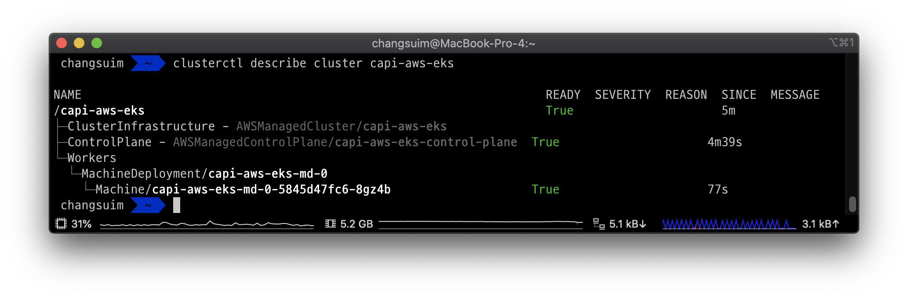
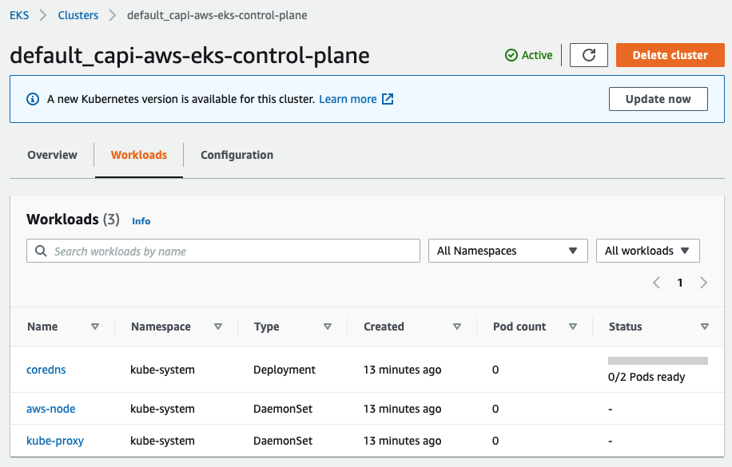

# EKS 기반의 workload cluster 생성하기

- [Enabling EKS Support](https://cluster-api-aws.sigs.k8s.io/topics/eks/enabling.html)

```bash
export EXP_EKS=true
export EXP_EKS_IAM=true
export EXP_EKS_ADD_ROLES=true
```

- [CloudFormation](https://docs.aws.amazon.com/ko_kr/AWSCloudFormation/latest/UserGuide/Welcome.html) 스택 생성

```bash
clusterawsadm bootstrap iam \
  create-cloudformation-stack \
  --config ./bootstrap-config.yaml
# Attempting to create AWS CloudFormation stack cluster-api-provider-aws-sigs-k8s-io
#
# Following resources are in the stack:
#
# Resource                  |Type                                                                                |Status
# AWS::IAM::InstanceProfile |control-plane.cluster-api-provider-aws.sigs.k8s.io                                  |CREATE_COMPLETE
# AWS::IAM::InstanceProfile |controllers.cluster-api-provider-aws.sigs.k8s.io                                    |CREATE_COMPLETE
# AWS::IAM::InstanceProfile |nodes.cluster-api-provider-aws.sigs.k8s.io                                          |CREATE_COMPLETE
# AWS::IAM::ManagedPolicy   |arn:aws:iam::332836983230:policy/control-plane.cluster-api-provider-aws.sigs.k8s.io |CREATE_COMPLETE
# AWS::IAM::ManagedPolicy   |arn:aws:iam::332836983230:policy/nodes.cluster-api-provider-aws.sigs.k8s.io         |CREATE_COMPLETE
# AWS::IAM::ManagedPolicy   |arn:aws:iam::332836983230:policy/controllers.cluster-api-provider-aws.sigs.k8s.io   |CREATE_COMPLETE
# AWS::IAM::Role            |control-plane.cluster-api-provider-aws.sigs.k8s.io                                  |CREATE_COMPLETE
# AWS::IAM::Role            |controllers.cluster-api-provider-aws.sigs.k8s.io                                    |CREATE_COMPLETE
# AWS::IAM::Role            |eks-controlplane.cluster-api-provider-aws.sigs.k8s.io                               |CREATE_COMPLETE
# AWS::IAM::Role            |eks-nodegroup.cluster-api-provider-aws.sigs.k8s.io                                  |CREATE_COMPLETE
# AWS::IAM::Role            |nodes.cluster-api-provider-aws.sigs.k8s.io                                          |CREATE_COMPLETE                                        |CREATE_COMPLETE
```

- 반대로 삭제하려면 아래 명령어를 실행합니다.

```bash
clusterawsadm bootstrap iam \
  delete-cloudformation-stack \
  --config bootstrap-config.yaml
```

```bash
clusterctl init --infrastructure aws --control-plane aws-eks --bootstrap aws-eks -v 4
```

```bash
kubectl get providers -A
# NAMESPACE                       NAME                    TYPE                     PROVIDER      VERSION   WATCH NAMESPACE
# capa-eks-bootstrap-system       bootstrap-aws-eks       BootstrapProvider        aws-eks       v0.6.4    
# capa-eks-control-plane-system   control-plane-aws-eks   ControlPlaneProvider     aws-eks       v0.6.4    
# capa-system                     infrastructure-aws      InfrastructureProvider   aws           v0.6.4    
# capi-system                     cluster-api             CoreProvider             cluster-api   v0.3.14 
```

```bash
clusterctl config cluster capi-eks \
  --flavor eks \
  --kubernetes-version v1.18.15 \
  --worker-machine-count=2 \
  > capi-aws/capi-eks.yaml

# Error: failed to get repository client for the InfrastructureProvider with name aws: error creating the GitHub repository client: failed to get GitHub latest version: failed to get the list of versions: rate limit for github api has been reached. Please wait one hour or get a personal API tokens a assign it to the GITHUB_TOKEN environment variable
```

```bash
sudo kubectl apply -f capi-aws/capi-eks.yaml
# cluster.cluster.x-k8s.io/capi-eks created
# awsmanagedcluster.infrastructure.cluster.x-k8s.io/capi-eks created
# awsmanagedcontrolplane.controlplane.cluster.x-k8s.io/capi-eks-control-plane created
# machinedeployment.cluster.x-k8s.io/capi-eks-md-0 created
# awsmachinetemplate.infrastructure.cluster.x-k8s.io/capi-eks-md-0 created
# eksconfigtemplate.bootstrap.cluster.x-k8s.io/capi-eks-md-0 created
```

- 컨트롤 플레인 1, 워커 노드 1 만드는 데 대략 17분 걸렸습니다.

```bash
kubectl get ev
# LAST SEEN   TYPE     REASON                       OBJECT                                              MESSAGE
# 17m         Normal   SuccessfulCreateNATGateway   awsmanagedcontrolplane/capi-aws-eks-control-plane   Created new NAT Gateway "nat-0c8c862e2797e3447"
# 17m         Normal   SuccessfulCreateNATGateway   awsmanagedcontrolplane/capi-aws-eks-control-plane   Created new NAT Gateway "nat-00c9e62d251b0547e"
# 17m         Normal   SuccessfulCreateNATGateway   awsmanagedcontrolplane/capi-aws-eks-control-plane   Created new NAT Gateway "nat-0699cc0d3678ed111"
# 15m         Normal   SuccessfulCreateRouteTable   awsmanagedcontrolplane/capi-aws-eks-control-plane   Created managed RouteTable "rtb-08376d72ee2a567ae"
# 15m         Normal   SuccessfulCreateRoute        awsmanagedcontrolplane/capi-aws-eks-control-plane   Created route {
#   DestinationCidrBlock: "0.0.0.0/0",
#   GatewayId: "igw-0b64dbd82391ff5f2"
# } for RouteTable "rtb-08376d72ee2a567ae"
# 15m         Normal   SuccessfulAssociateRouteTable   awsmanagedcontrolplane/capi-aws-eks-control-plane   Associated managed RouteTable "rtb-08376d72ee2a567ae" with subnet "subnet-06e5d5ad94e1ffa2c"
# 15m         Normal   SuccessfulCreateRouteTable      awsmanagedcontrolplane/capi-aws-eks-control-plane   Created managed RouteTable "rtb-01b85240a3aaa67a3"
# 15m         Normal   SuccessfulCreateRoute           awsmanagedcontrolplane/capi-aws-eks-control-plane   Created route {
#   DestinationCidrBlock: "0.0.0.0/0",
#   NatGatewayId: "nat-0c8c862e2797e3447"
# } for RouteTable "rtb-01b85240a3aaa67a3"
# 15m         Normal   SuccessfulAssociateRouteTable   awsmanagedcontrolplane/capi-aws-eks-control-plane   Associated managed RouteTable "rtb-01b85240a3aaa67a3" with subnet "subnet-020f9761107583bb1"
# 15m         Normal   SuccessfulCreateRouteTable      awsmanagedcontrolplane/capi-aws-eks-control-plane   Created managed RouteTable "rtb-0e5b8a1439a4f5af7"
# 15m         Normal   SuccessfulCreateRoute           awsmanagedcontrolplane/capi-aws-eks-control-plane   Created route {
#   DestinationCidrBlock: "0.0.0.0/0",
#   GatewayId: "igw-0b64dbd82391ff5f2"
# } for RouteTable "rtb-0e5b8a1439a4f5af7"
# 15m         Normal   SuccessfulAssociateRouteTable   awsmanagedcontrolplane/capi-aws-eks-control-plane   Associated managed RouteTable "rtb-0e5b8a1439a4f5af7" with subnet "subnet-0241d636a1cb9bb4f"
# 15m         Normal   SuccessfulCreateRouteTable      awsmanagedcontrolplane/capi-aws-eks-control-plane   Created managed RouteTable "rtb-0ce69dc8fca9298a1"
# 15m         Normal   SuccessfulCreateRoute           awsmanagedcontrolplane/capi-aws-eks-control-plane   Created route {
#   DestinationCidrBlock: "0.0.0.0/0",
#   NatGatewayId: "nat-00c9e62d251b0547e"
# } for RouteTable "rtb-0ce69dc8fca9298a1"
# 15m         Normal   SuccessfulAssociateRouteTable   awsmanagedcontrolplane/capi-aws-eks-control-plane   Associated managed RouteTable "rtb-0ce69dc8fca9298a1" with subnet "subnet-0092ad4043313bee9"
# 15m         Normal   SuccessfulCreateRouteTable      awsmanagedcontrolplane/capi-aws-eks-control-plane   Created managed RouteTable "rtb-0534122a969752cc0"
# 15m         Normal   SuccessfulCreateRoute           awsmanagedcontrolplane/capi-aws-eks-control-plane   Created route {
#   DestinationCidrBlock: "0.0.0.0/0",
#   GatewayId: "igw-0b64dbd82391ff5f2"
# } for RouteTable "rtb-0534122a969752cc0"
# 15m         Normal   SuccessfulAssociateRouteTable   awsmanagedcontrolplane/capi-aws-eks-control-plane   Associated managed RouteTable "rtb-0534122a969752cc0" with subnet "subnet-054ec486238c92c9c"
# 15m         Normal   SuccessfulCreateRouteTable      awsmanagedcontrolplane/capi-aws-eks-control-plane   Created managed RouteTable "rtb-0819ec2016087ddca"
# 15m         Normal   SuccessfulCreateRoute           awsmanagedcontrolplane/capi-aws-eks-control-plane   Created route {
#   DestinationCidrBlock: "0.0.0.0/0",
#   NatGatewayId: "nat-0699cc0d3678ed111"
# } for RouteTable "rtb-0819ec2016087ddca"
# 15m         Normal   SuccessfulAssociateRouteTable                  awsmanagedcontrolplane/capi-aws-eks-control-plane   Associated managed RouteTable "rtb-0819ec2016087ddca" with subnet "subnet-09ef39a726fb61078"
# 15m         Normal   SuccessfulCreateSecurityGroup                  awsmanagedcontrolplane/capi-aws-eks-control-plane   Created managed SecurityGroup "sg-0f41d9787a1bff13f" for Role "bastion"
# 15m         Normal   SuccessfulCreateSecurityGroup                  awsmanagedcontrolplane/capi-aws-eks-control-plane   Created managed SecurityGroup "sg-00b2e5b2c40f93db1" for Role "node-eks-additional"
# 15m         Normal   SuccessfulAuthorizeSecurityGroupIngressRules   awsmanagedcontrolplane/capi-aws-eks-control-plane   Authorized security group ingress rules [protocol=tcp/range=[22-22]/description=SSH] for SecurityGroup "sg-0f41d9787a1bff13f"
# 15m         Normal   SuccessfulAuthorizeSecurityGroupIngressRules   awsmanagedcontrolplane/capi-aws-eks-control-plane   Authorized security group ingress rules [protocol=tcp/range=[22-22]/description=SSH] for SecurityGroup "sg-00b2e5b2c40f93db1"
# 15m         Normal   SucessfulIAMRoleCreation                       awsmanagedcontrolplane/capi-aws-eks-control-plane   Created control plane IAM role "capi-aws-eks-iam-service-role"
# 15m         Normal   SuccessfulCreateEKSCluster                     awsmanagedcontrolplane/capi-aws-eks-control-plane   Created a new EKS cluster "capi-aws-eks"
# 2m59s       Normal   SucessfulCreateKubeconfig                      awsmanagedcontrolplane/capi-aws-eks-control-plane   Created kubeconfig for cluster "capi-aws-eks"
# 2m59s       Normal   SucessfulCreateUserKubeconfig                  awsmanagedcontrolplane/capi-aws-eks-control-plane   Created user kubeconfig for cluster "capi-aws-eks"
# 17m         Normal   SuccessfulCreate                               machineset/capi-aws-eks-md-0-5845d47fc6             Created machine "capi-aws-eks-md-0-5845d47fc6-8gz4b"
# 17m         Normal   SuccessfulCreate                               machinedeployment/capi-aws-eks-md-0                 Created MachineSet "capi-aws-eks-md-0-5845d47fc6"
```


```bash
clusterctl describe cluster capi-eks
```





```bash
kubectl api-resources | grep cluster.x-k8s.io
# NAME                              SHORTNAMES   APIVERSION                                 NAMESPACED   KIND
# clusterresourcesetbindings                     addons.cluster.x-k8s.io/v1alpha3           true         ClusterResourceSetBinding
# clusterresourcesets                            addons.cluster.x-k8s.io/v1alpha3           true         ClusterResourceSet
# eksconfigs                                     bootstrap.cluster.x-k8s.io/v1alpha3        true         EKSConfig
# eksconfigtemplates                             bootstrap.cluster.x-k8s.io/v1alpha3        true         EKSConfigTemplate
# clusters                          cl           cluster.x-k8s.io/v1alpha3                  true         Cluster
# machinedeployments                md           cluster.x-k8s.io/v1alpha3                  true         MachineDeployment
# machinehealthchecks               mhc,mhcs     cluster.x-k8s.io/v1alpha3                  true         MachineHealthCheck
# machines                          ma           cluster.x-k8s.io/v1alpha3                  true         Machine
# machinesets                       ms           cluster.x-k8s.io/v1alpha3                  true         MachineSet
# providers                                      clusterctl.cluster.x-k8s.io/v1alpha3       true         Provider
# awsmanagedcontrolplanes           awsmcp       controlplane.cluster.x-k8s.io/v1alpha3     true         AWSManagedControlPlane
# machinepools                      mp           exp.cluster.x-k8s.io/v1alpha3              true         MachinePool
# awsclusters                                    infrastructure.cluster.x-k8s.io/v1alpha3   true         AWSCluster
# awsmachinepools                                infrastructure.cluster.x-k8s.io/v1alpha3   true         AWSMachinePool
# awsmachines                                    infrastructure.cluster.x-k8s.io/v1alpha3   true         AWSMachine
# awsmachinetemplates                            infrastructure.cluster.x-k8s.io/v1alpha3   true         AWSMachineTemplate
# awsmanagedclusters                awsmc        infrastructure.cluster.x-k8s.io/v1alpha3   true         AWSManagedCluster
# awsmanagedmachinepools                         infrastructure.cluster.x-k8s.io/v1alpha3   true         AWSManagedMachinePool
```

```bash
kubectl get awsmanagedclusters -A
# NAMESPACE   NAME           CLUSTER        READY   VPC
# default     capi-aws-eks   capi-aws-eks   true

kubectl get awsmanagedcontrolplanes
# NAME                         CLUSTER        READY   VPC                     BASTION IP
# capi-aws-eks-control-plane   capi-aws-eks   true    vpc-0142574c56ec48969

kubectl get machinedeployments -A
# NAMESPACE   NAME                PHASE     REPLICAS   READY   UPDATED   UNAVAILABLE
# default     capi-aws-eks-md-0   Running   1          1       1
```

### kubeconfig

- https://cluster-api-aws.sigs.k8s.io/topics/eks/creating-a-cluster.html#kubeconfig

```bash
kubectl --namespace=default get secret capi-eks-kubeconfig \
  -o jsonpath={.data.value} | base64 --decode \
  > capi-aws/eks.kubeconfig
```

```bash
kubectl --kubeconfig=capi-aws/eks.kubeconfig get nodes --show-labels
# NAME                                             STATUS   ROLES    AGE   VERSION              LABELS
# ip-10-0-119-49.ap-northeast-2.compute.internal   Ready    <none>   21m   v1.18.9-eks-d1db3c   beta.kubernetes.io/arch=amd64,beta.kubernetes.io/instance-type=t3.small,beta.kubernetes.io/os=linux,failure-domain.beta.kubernetes.io/region=ap-northeast-2,failure-domain.beta.kubernetes.io/zone=ap-northeast-2a,kubernetes.io/arch=amd64,kubernetes.io/hostname=ip-10-0-119-49.ap-northeast-2.compute.internal,kubernetes.io/os=linux,node.kubernetes.io/instance-type=t3.small,topology.kubernetes.io/region=ap-northeast-2,topology.kubernetes.io/zone=ap-northeast-2a
kubectl --kubeconfig=capi-aws/eks.kubeconfig get pods -A -o wide
# NAMESPACE     NAME                       READY   STATUS    RESTARTS   AGE   IP            NODE                                             NOMINATED NODE   READINESS GATES
# kube-system   aws-node-c7grx             1/1     Running   0          20m   10.0.119.49   ip-10-0-119-49.ap-northeast-2.compute.internal   <none>           <none>
# kube-system   coredns-6fb4cf484b-w9krz   1/1     Running   0          26m   10.0.99.233   ip-10-0-119-49.ap-northeast-2.compute.internal   <none>           <none>
# kube-system   coredns-6fb4cf484b-x8r8m   1/1     Running   0          26m   10.0.95.191   ip-10-0-119-49.ap-northeast-2.compute.internal   <none>           <none>
# kube-system   kube-proxy-8m5fv           1/1     Running   0          20m   10.0.119.49   ip-10-0-119-49.ap-northeast-2.compute.internal   <none>           <none>
```

### CNI 솔루션 배포

```bash
kubectl --kubeconfig=capi-aws/eks.kubeconfig \
  apply -f https://docs.projectcalico.org/v3.15/manifests/calico.yaml

kubectl --kubeconfig=capi-aws/eks.kubeconfig get nodes
# NAME                                              STATUS   ROLES    AGE    VERSION
# ip-10-0-123-138.ap-northeast-2.compute.internal   Ready    <none>   101m   v1.18.15
# ip-10-0-127-50.ap-northeast-2.compute.internal    Ready    <none>   101m   v1.18.15
# ip-10-0-220-242.ap-northeast-2.compute.internal   Ready    master   103m   v1.18.15
```

### 컨트롤 플레인 로깅

- https://docs.aws.amazon.com/ko_kr/eks/latest/userguide/control-plane-logs.html

## Clean up

- 5분도 안걸렸습니다.

```bash
kubectl delete cluster capi-eks
```


```bash
# clusterctl delete --infrastructure aws --control-plane aws-eks --bootstrap aws-eks
clusterctl delete --infrastructure aws
# Error: Unable to find default namespace for the "infrastructure-aws" provider. Please specify the provider's namespace
clusterctl delete --control-plane aws-eks --bootstrap aws-eks
```

```bash
kind delete cluster --name clusterapi
```

## 트러블슈팅

- [문서](https://cluster-api-aws.sigs.k8s.io/topics/troubleshooting.html)

```bash
export EXP_EKS=true
export EXP_EKS_IAM=true
export EXP_EKS_ADD_ROLES=true
```

```bash
# 위 환경변수들을 설정하지 않고 EKS 클러스터를 생성하면 워커 노드가 생성되지 않습니다.
kubectl get events
# ...
# 36m         Warning   readOnlySysFS                                  node/clusterapi-worker                          CRI error: /sys is read-only: cannot modify conntrack limits, problems may arise later (If running Docker, see docker issue #24000)

clusterctl describe cluster capi-eks
# NAME                                                              READY  SEVERITY  REASON                           SINCE  MESSAGE
# /capi-eks                                                         False  Info      WaitingForInfrastructure         11m
# ├─ClusterInfrastructure - AWSManagedCluster/capi-eks
# ├─ControlPlane - AWSManagedControlPlane/capi-eks-control-plane  True                                              11m
# └─Workers
#   └─MachineDeployment/capi-eks-md-0
#     └─2 Machines...                                             False  Info      WaitingForClusterInfrastructure  25m    See capi-eks-md-0-667944fb9b-4lqxd, capi-eks-md-0-667944fb9b-xksbx
```
