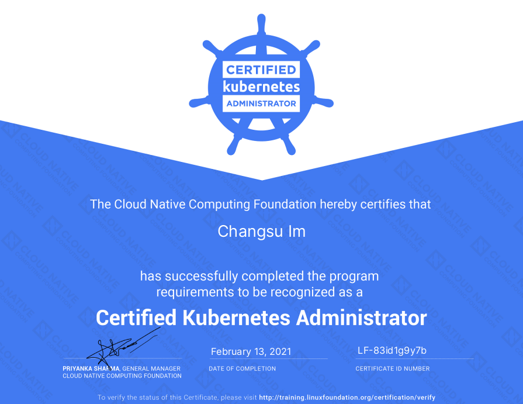
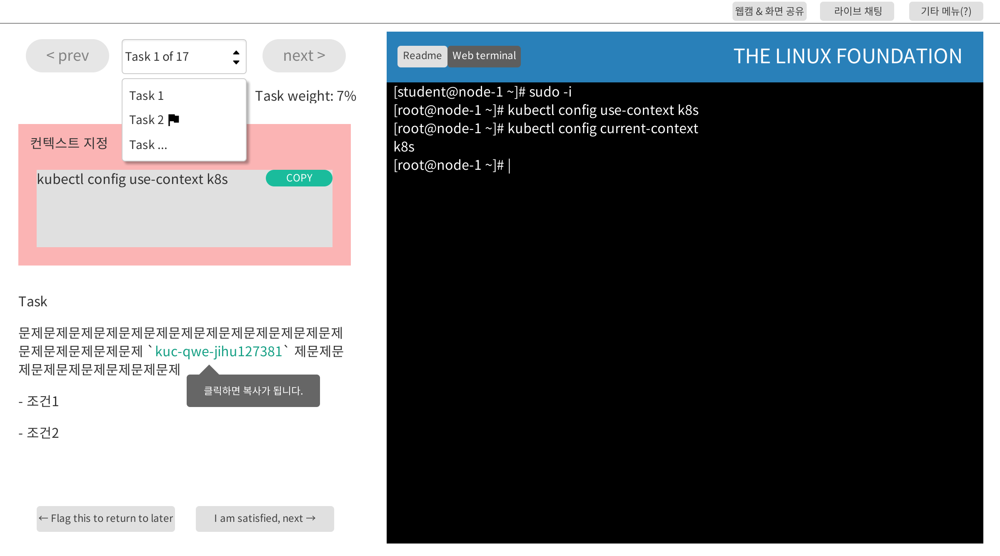

# CKA 시험 전 궁금했었던 것들

- [CKA 시험 전 궁금했었던 것들](#cka-시험-전-궁금했었던-것들)
  - [Linux Foundation](#linux-foundation)
  - [추천 자료](#추천-자료)
    - [참고](#참고)
  - [알아두면 쓸모 있는 내용](#알아두면-쓸모-있는-내용)

CKA를 취득한다고 해서 Kubernetes를 잘 안다고 할 순 없기 때문에
그저 취득을 목적으로 준비했습니다.

_**2021-02-13 취득**_

## Linux Foundation

- [CKA 공식 안내](https://www.cncf.io/certification/cka/)
- [CKA 공식 지침](https://docs.linuxfoundation.org/tc-docs/certification/tips-cka-and-ckad)
- [LF 공식 핸드북](https://docs.linuxfoundation.org/tc-docs/certification/lf-candidate-handbook)
- [CKA(D) 자주 묻는 질문](https://docs.linuxfoundation.org/tc-docs/certification/faq-cka-ckad-cks)
- 열람 가능한 페이지 (시험 페이지 외 추가탭 1개만 허용)
  - `https://kubernetes.io/docs/`
  - `https://kubernetes.io/ko/docs/`
  - `https://github.com/kubernetes/`
  - `https://kubernetes.io/blog/`
- 저는 문서를 빨리 찾을 수 있도록 필요한 문서는 북마크를 해두었습니다.
- 그 외에 필요한 건 검색 기능을 사용했습니다. (위 도메인에 포함되진 않았지만 지적은 없었습니다: `https://kubernetes.io/search/`)
- [2020년 9월 이후 변경된 부분](https://training.linuxfoundation.org/cka-program-changes-2020/)
  - 도메인별 비중 변경
  - CKA 시험은 66점 이상 합격 (변경 전 74점 이상)
  - 2시간 동안 15-20개 문제 => 후기들을 보면 모두 17문제 (변경 전 3시간 동안 24개 문제)
  - 2021년 2월 기준 k8s v1.20 (아마 가장 최근 버전이 배포되는 것 같습니다)
- 제가 봤던 시험 환경 (감독관마다 다를 수 있습니다)
  - 책상이나 벽에 아무것도 없어야 한다는 글을 많이 봤는데 제 방은 책상을 중심으로 사방이 책장입니다. 실제로는 키보드 주변(책상 위)에만 비어있으면 지적하지 않는 것 같습니다.
  - 중간에 화장실을 가겠다고 했는데 흔쾌히 허락을 받았습니다. 시험을 일시 중지(시간은 흘러감) 해놓고는 천천히 다녀왔습니다.

## 추천 자료

- [Certified Kubernetes Administrator (CKA) with Practice Tests - Udemy](https://www.udemy.com/course/certified-kubernetes-administrator-with-practice-tests/)
  - [GitHub](https://github.com/kodekloudhub/certified-kubernetes-administrator-course)
- [<쿠버네티스 인 액션>](http://www.acornpub.co.kr/book/k8s-in-action-new): 아키텍처를 이해하는 데 도움 된 책입니다.

### 참고

보기 편하신 걸로 취사선택하시면 됩니다.

- [kubernetes the hard way](https://github.com/kelseyhightower/kubernetes-the-hard-way): 좋은 내용이지만 시험용은 아닙니다
- [실제 시험중 터미널](https://www.certshero.com/linux-foundation/cka/practice-test)
- [CKA - notes and 20 tips (May 2020)](https://prashix.medium.com/certified-kubernetes-administrator-cka-notes-and-20-tips-may-2020-692b0df1b1c6)
- [rudimartinsen](https://rudimartinsen.com/cka-resources/)
  - [CKA Study Guide](https://rudimartinsen.com/2020/12/28/cka-study-guide/)
  - [트러블슈팅](https://rudimartinsen.com/2021/01/14/cka-notes-troubleshooting/)
- [scriptcrunch](https://scriptcrunch.com/kubernetes-exam-guide/)
- [CKA(D) 연습 문제](https://medium.com/@sensri108/practice-examples-dumps-tips-for-cka-ckad-certified-kubernetes-administrator-exam-by-cncf-4826233ccc27)
- [CKAD 연습 문제](https://github.com/dgkanatsios/CKAD-exercises)
- [chadmcrowell/CKA-Exercises](https://github.com/chadmcrowell/CKA-Exercises)
- [David-VTUK/CKA-StudyGuide](https://github.com/David-VTUK/CKA-StudyGuide)
- [mgonzalezo/CKA-Preparation](https://github.com/mgonzalezo/CKA-Preparation)
- [Bes0n/CKA](https://github.com/Bes0n/CKA)

## 알아두면 쓸모 있는 내용

_시험 환경을 최대한 복원해봤습니다..._

- 시험에는 선언형(declarative)보다 명령형(imperative)에 익숙한 것이 효율적입니다.
- 시작하면 바로 `sudo -i` 명령을 통해 root로 접속합니다.
- [치트 시트](https://kubernetes.io/ko/docs/reference/kubectl/cheatsheet/) 문서를 북마크 해뒀다가 참고합니다.
- 문제마다 풀어야 할 컨텍스트를 명시하고 있습니다. 잊지 말고 컨텍스트를 바꾸세요.
- 평소에 `k`로 alias를 지정하는 것보다 `kubectl`을 사용하셨다면 익숙한 것을 그대로 사용하세요.
- 명령형을 주로 사용하고 문서에서 example을 복붙하는 등 vim 편집이 많지 않아서 `.vimrc` 설정을 딱히 바꿀 필요는 못 느꼈습니다.
- 복사는 `Ctrl`+`Ins`, 붙여넣기는 `Shift`+`Ins`입니다.
- tmux는 이미 설치되어 있었습니다.
- `kubectl` 하위 커맨드 중 `create`, `run`, `apply`를 혼동하지 않도록 ~~주의합니다~~(`help`가 굉장히 친절합니다).
- 관련 내용을 외우고 있지 않아도 문서를 빠르게 찾을 수 있다면 풀 수 있는 문제들입니다.
- 생각보다 [깃헙](https://github.com/kubernetes/website/tree/master/content/ko/examples)에 있는 매니페스트 파일들이 문서보다 도움될 때가 있습니다.
  여기 있는 example 들이 홈페이지 문서에 포함되는 example들이기 때문에 실제 정답이 되기도 합니다.
- 로컬에서 연습하실 땐 [Kind](../bootstrap/kind.md)를 사용하면 편합니다.
