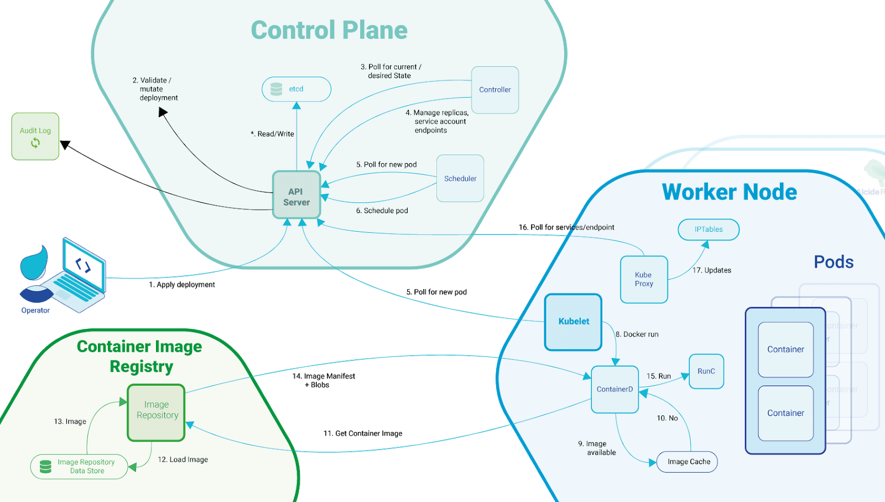
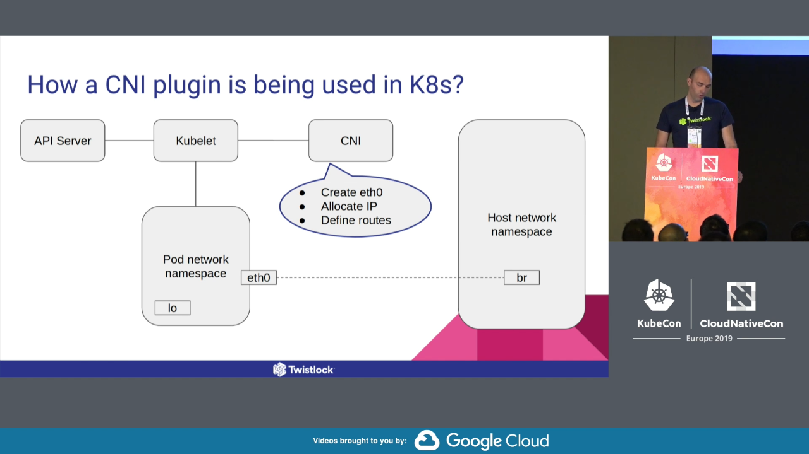
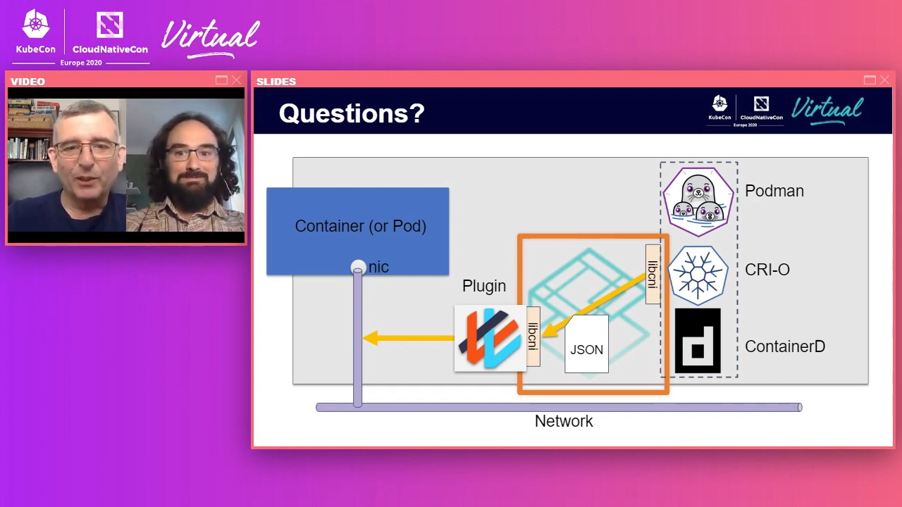
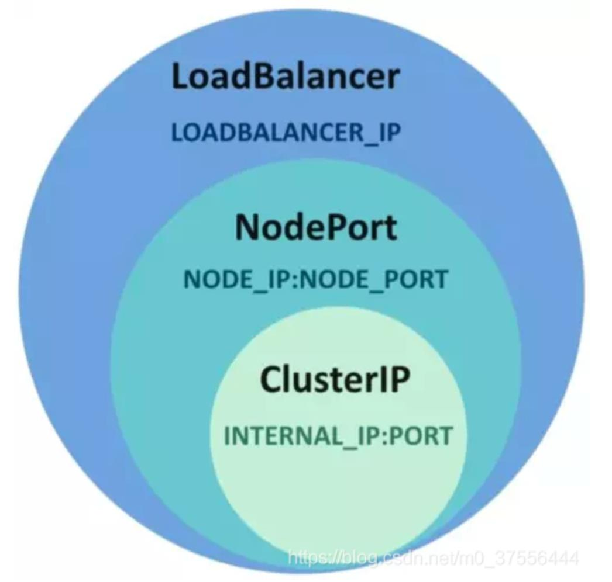
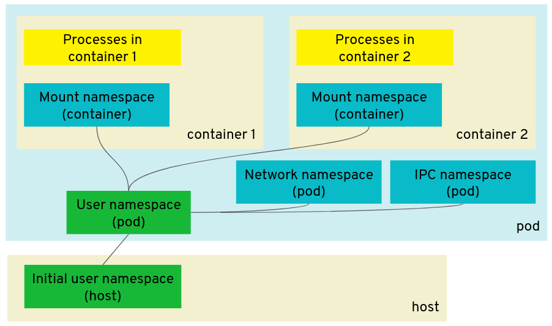
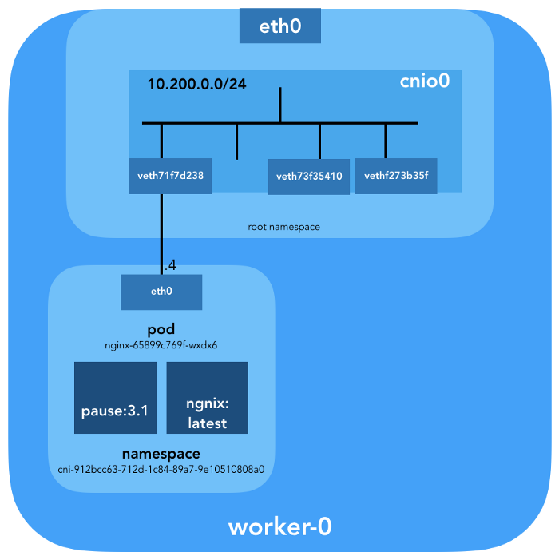

# 쿠버네티스 네트워킹 톺아보기

- [쿠버네티스 네트워킹 톺아보기](#쿠버네티스-네트워킹-톺아보기)
  - [쿠버네티스를 사용하는 이유](#쿠버네티스를-사용하는-이유)
  - [쿠버네티스가 도커의 CNM(Container Network Model)을 사용하지 않는 이유](#쿠버네티스가-도커의-cnmcontainer-network-model을-사용하지-않는-이유)
  - [CNI](#cni)
    - [kubernetes-cni](#kubernetes-cni)
    - [규격 (specification)](#규격-specification)
    - [컨테이너 런타임과 쓰이는 CNI](#컨테이너-런타임과-쓰이는-cni)
    - [Network Configuration `.conf`](#network-configuration-conf)
    - [Network Configuration List `.conflist`](#network-configuration-list-conflist)
    - [Third-party CNI Plugins](#third-party-cni-plugins)
  - [쿠버네티스 서비스(Service)를 사용하는 이유](#쿠버네티스-서비스service를-사용하는-이유)
    - [서비스 유형](#서비스-유형)
  - [DNS (Domain Name Server)](#dns-domain-name-server)
  - [kube-proxy](#kube-proxy)
    - [Proxy Modes](#proxy-modes)
  - [Ingress](#ingress)
  - [더 읽을 거리](#더-읽을-거리)
  - [Q&A](#qa)
    - [파드의 서로 다른 컨테이너끼리 어떻게 통신하나요?](#파드의-서로-다른-컨테이너끼리-어떻게-통신하나요)
    - [pause 컨테이너의 역할은 뭔가요?](#pause-컨테이너의-역할은-뭔가요)
    - [컨테이너 뿐만 아니라 호스트에도 `cbr0`라는 네트워크 인터페이스 생기던데 왜 생기는 건가요?](#컨테이너-뿐만-아니라-호스트에도-cbr0라는-네트워크-인터페이스-생기던데-왜-생기는-건가요)

## [쿠버네티스를 사용하는 이유](https://kubernetes.io/ko/docs/concepts/overview/what-is-kubernetes/#why-you-need-kubernetes-and-what-can-it-do)

| 쿠버네티스 기능                    | 설명                                                                                                                                                                                                                                                                     |
| ---------------------------------- | ------------------------------------------------------------------------------------------------------------------------------------------------------------------------------------------------------------------------------------------------------------------------ |
| 🎯 서비스 디스커버리와 로드 밸런싱 | 쿠버네티스는 DNS 이름을 사용하거나 자체 IP 주소를 사용하여 컨테이너를 노출할 수 있다. 컨테이너에 대한 트래픽이 많으면 쿠버네티스는 네트워크 트래픽을 로드밸런싱하고 배포하여 배포가 안정적으로 이루어질 수 있다.                                                         |
| 스토리지 오케스트레이션            | 쿠버네티스를 사용하면 로컬 저장소, 공용 클라우드 공급자 등과 같이 원하는 저장소 시스템을 자동으로 탑재할 수 있다.                                                                                                                                                        |
| 자동화된 롤아웃과 롤백             | 쿠버네티스를 사용하여 배포된 컨테이너의 원하는 상태를 서술할 수 있으며 현재 상태를 원하는 상태로 설정한 속도에 따라 변경할 수 있다. 예를 들어 쿠버네티스를 자동화해서 배포용 새 컨테이너를 만들고, 기존 컨테이너를 제거하고, 모든 리소스를 새 컨테이너에 적용할 수 있다. |
| 자동화된 빈 패킹(bin packing)      | 컨테이너화된 작업을 실행하는데 사용할 수 있는 쿠버네티스 클러스터 노드를 제공한다. 각 컨테이너가 필요로 하는 CPU와 메모리(RAM)를 쿠버네티스에게 지시한다. 쿠버네티스는 컨테이너를 노드에 맞추어서 리소스를 가장 잘 사용할 수 있도록 해준다.                              |
| 자동화된 복구(self-healing)        | 쿠버네티스는 실패한 컨테이너를 다시 시작하고, 컨테이너를 교체한다. '사용자 정의 상태 검사'에 응답하지 않는 컨테이너를 죽인다. 서비스 준비가 끝날 때까지 이러한 과정을 클라이언트에 보여주지 않는다.                                                                      |
| 시크릿과 구성 관리                 | 쿠버네티스를 사용하면 암호, OAuth 토큰, SSH 키와 같은 중요한 정보를 저장하고 관리 할 수 있다. 컨테이너 이미지를 재구성하지 않고 스택 구성에 시크릿을 노출하지 않고도 시크릿 및 애플리케이션 구성을 배포 및 업데이트 할 수 있다.                                          |



_출처: [alcide](https://www.alcide.io/new-kubernetes-node-vulnerability-cve-2020-8558-bypasses-localhost-boundary/)_

## 쿠버네티스가 도커의 CNM(Container Network Model)을 사용하지 않는 이유

TODO: 정리

- [Why Kubernetes doesn’t use libnetwork](https://kubernetes.io/blog/2016/01/why-kubernetes-doesnt-use-libnetwork/)

## CNI

리눅스 컨테이너의 네트워크 인터페이스를 구성하는 플러그인(CNI Plugin)을 작성하기 위한 규격 및 라이브러리입니다.
CNI는 컨테이너 네트워크 연결 및 컨테이너 삭제 시 할당 된 리소스 제거에만 관여하기 때문에 확장하기 용이합니다.



_출처: [Kubernetes Networking: How to Write a CNI Plugin From Scratch](https://youtu.be/zmYxdtFzK6s)_ - Eran Yanay, Twistlock

- 플러거블(pluggable): 같은 인터페이스를 제공한다면 어떤 플러그라도 뽑았다 뺐다 할 수 있듯이 확장 기능을 제공할 수 있는 것을 일컫습니다.
- [공식 홈페이지](https://www.cni.dev/plugins/)
- `kubeadm` 설치 시 `kubernetes-cni`를 같이 설치합니다.
- `kubernetes-cni` 설치 시 [containernetworking 팀에서 관리하는 플러그인들](https://github.com/containernetworking/plugins)이 `/opt/cni/bin` 경로에 설치됩니다.

### kubernetes-cni

```bash
apt install -y kubeadm
# ...
# The following NEW packages will be installed:
#    conntrack cri-tools kubeadm kubectl kubelet kubernetes-cni socat
```

- Main: 인터페이스 생성
  - [`bridge`](https://github.com/containernetworking/cni.dev/blob/release-0.9.0/content/plugins/main/bridge.md): bridge 인터페이스를 생성하고 호스트 및 컨테이너를 bridge에 추가합니다.
  - [`ipvlan`](https://github.com/containernetworking/cni.dev/blob/release-0.9.0/content/plugins/main/ipvlan.md): 컨테이너에 [ipvlan](https://www.kernel.org/doc/Documentation/networking/ipvlan.txt) 인터페이스를 추가합니다.
  - `loopback`: loopback 인터페이스의 상태를 up으로 설정합니다.
  - [`macvlan`](https://github.com/containernetworking/cni.dev/blob/release-0.9.0/content/plugins/main/macvlan.md): 새로운 MAC 주소를 생성하고 해당 주소로 오는 모든 트래픽을 컨테이너로 전달합니다.
  - [`ptp`](https://github.com/containernetworking/cni.dev/blob/release-0.9.0/content/plugins/main/ptp.md): veth 쌍을 생성합니다.
  - `vlan`: vlan 디바이스를 할당합니다.
  - [`host-device`](https://github.com/containernetworking/cni.dev/blob/release-0.9.0/content/plugins/main/host-device.md): 호스트에 이미 존재하는 디바이스를 컨테이너로 이동시킵니다.
- IPAM: IP 주소 할당
  - [`dhcp`](https://github.com/containernetworking/cni.dev/blob/release-0.9.0/content/plugins/ipam/dhcp.md): 컨테이너 대신 DHCP 요청을 생성하기 위해 호스트에 데몬을 실행합니다.
  - [`host-local`](https://github.com/containernetworking/cni.dev/blob/release-0.9.0/content/plugins/ipam/host-local.md): 할당된 IP들의 로컬 데이터베이스를 관리합니다.
  - [`static`](https://github.com/containernetworking/cni.dev/blob/release-0.9.0/content/plugins/ipam/static.md): 고정(static) IPv4/IPv6 주소를 컨테이너에 할당합니다. 디버깅 목적에 유용합니다.
- Meta: 기타 플러그인
  - [`flannel`](https://github.com/containernetworking/cni.dev/blob/release-0.9.0/content/plugins/meta/flannel.md): flannel 구성 파일에 해당하는 인터페이스를 생성합니다.
  - [`tuning`](https://github.com/containernetworking/cni.dev/blob/release-0.9.0/content/plugins/meta/tuning.md): 기존 인터페이스의 sysctl 파라미터를 조정합니다.
  - [`portmap`](https://github.com/containernetworking/cni.dev/blob/release-0.9.0/content/plugins/meta/portmap.md): iptables 기반 포트 매핑 플러그인입니다. 호스트의 주소 공간(address space)에서 컨테이너로 포트를 매핑합니다.
  - [`bandwidth`](https://github.com/containernetworking/cni.dev/blob/release-0.9.0/content/plugins/meta/bandwidth.md): 트래픽 제어 tbf(ingress/egress)를 사용하여 대역폭을 제한할 수 있습니다. (tbf: Token Bucket Filter)
  - [`sbr`](https://github.com/containernetworking/cni.dev/blob/release-0.9.0/content/plugins/meta/sbr.md): 연결된 인터페이스에 대한 소스 기반 라우팅(Source Based Routing)을 구성하는 플러그인입니다.
  - [`firewall`](https://github.com/containernetworking/cni.dev/blob/release-0.9.0/content/plugins/meta/firewall.md): iptables 또는 firewalld를 사용하여 컨테이너로 들어오고 나가는 트래픽 규칙을 추가하는 방화벽 플러그인입니다.
  - [`vrf`](https://github.com/containernetworking/cni.dev/blob/release-0.9.0/content/plugins/meta/vrf.md): 네트워크 네임스페이스에 VRF를 생성하고 인자로 전달 된 인터페이스를 할당합니다.
- Windows: 윈도우 전용
  - [`win-bridge`](https://github.com/containernetworking/cni.dev/blob/release-0.9.0/content/plugins/main/win-bridge.md): bridge 인터페이스를 생성하고 호스트 및 컨테이너를 bridge에 추가합니다.
  - [`win-overlay`](https://github.com/containernetworking/cni.dev/blob/release-0.9.0/content/plugins/main/win-overlay.md): 컨테이너에 overlay 인터페이스를 생성합니다.

### 규격 (specification)

- CNI 플러그인이 필수로 지원해야 하는(MUST) 명령어 명시: `ADD`, `DEL`, `CHECK`, `VERSION`
- Container Runtime은 인스턴스를 생성할 때 Network Configuration에서 CNI 플러그인의 실행 파일(executable) 경로를 찾습니다.
- 실행 파일을 찾으면 다음과 같은 환경 변수를 지정해 파라미터 값(args)을 전달합니다.

| 환경 변수       | 설명                                                                                                                        |
| --------------- | --------------------------------------------------------------------------------------------------------------------------- |
| CNI_COMMAND     | 실행할 명령어                                                                                                               |
| CNI_CONTAINERID | 컨테이너 ID                                                                                                                 |
| CNI_NETNS       | 네트워크 네임스페이스 파일의 경로                                                                                           |
| CNI_IFNAME      | 설정할 인터페이스 이름. 사용할 수 없는 이름이라면 에러를 반환한다.                                                          |
| CNI_ARGS        | 선택적 Arguments. 예를 들어 `"FOO=BAR;ABC=123"`                                                                             |
| CNI_PATH        | CNI 플러그인 실행 파일의 경로. 여러개라면 리눅스는 colon(:) 윈도우는 semicolon(;)으로 구분한다. 기본 경로는 `/opt/cni/bin/` |

### 컨테이너 런타임과 쓰이는 CNI



_출처: [Introduction to CNI, the Container Network Interface Project](https://youtu.be/YWXucnygGmY)_ - Casey Callendrello & Bryan Boreham

- JSON 파일? Network Configurations

```bash
/etc/cni/net.d/00-xxx.conf
/etc/cni/net.d/00-xxx.conflist
```

- libcni? Go code to help implement runtime and plugins
- 아래 그림은 쿠버네티스 환경에서 컨테이너 런타임과 Cilium 플러그인이 상호 작용하는 플로우를 나타냅니다.


_출처: [Cilium Container Networking Control Flow](https://docs.cilium.io/en/v1.9/concepts/networking/ipam/deep_dive/#cilium-container-networking-control-flow)_

### Network Configuration `.conf`

| configuration  | type            | optional | description                                                                                                                                                                              |
| -------------- | --------------- | -------- | ---------------------------------------------------------------------------------------------------------------------------------------------------------------------------------------- |
| cniVersion     | string          |          | CNI 스펙 버전                                                                                                                                                                            |
| name           | string          |          | 네트워크 이름                                                                                                                                                                            |
| type           | string          |          | CNI 플러그인 실행 파일명                                                                                                                                                                 |
| args           | dictionary      | optional | 컨테이너 런타임에서 제공하는 추가 인자                                                                                                                                                   |
| ipMasq         | boolean         | optional | CNI 플러그인에서 지원하는 경우, 호스트 머신에 IP 매스커레이드를 지정할 수 있다. 호스트가 컨테이너에 할당된 IP로 라우팅할 수 없는 서브넷에 대한 게이트웨이 역할을 하는 경우에 필요합니다. |
| ipam           | dictionary      | optional | IPAM 값이 들어있는 딕셔너리 컬렉션                                                                                                                                                       |
| └─ type        | string          |          | IPAM 플러그인 실행 파일명                                                                                                                                                                |
| dns            | dictionary      | optional | DNS 값이 들어있는 딕셔너리 컬렉션                                                                                                                                                        |
| └─ nameservers | list of strings | optional | 해당 네트워크가 인식하는 DNS 이름 서버의 우선 순위 목록입니다. 목록의 각 항목은 IPv4 또는 IPv6 주소를 포함하는 문자열입니다.                                                             |
| └─ domain      | string          | optional | 짧은 호스트 이름 조회를 위한 로컬 도메인                                                                                                                                                 |
| └─ search      | list of strings | optional | 짧은 호스트 이름 조회를 위한 우선 순위 검색 도메인 목록입니다. 대부분의 resolver가 domain보다 선호합니다.                                                                                |
| └─ options     | list of strings | optional | resolver에 전달할 수 있는 옵션 목록                                                                                                                                                      |

- [`.conf` 예](spec/cni-spec-v0.4.0.md#네트워크-구성-예)

### Network Configuration List `.conflist`

- 정의된 순서로 단일 컨테이너에 여러 CNI 플러그인을 실행하는 메커니즘을 제공합니다.
- 각 플러그인의 결과는 다음 플러그인에 전달됩니다.

```bash
kubectl apply -f https://docs.projectcalico.org/manifests/calico.yaml
# /etc/cni/net.d/10-calico.conflist
```

- [`.conflist` 예](spec/cni-spec-v0.4.0.md#네트워크-구성-목록-예)

### Third-party CNI Plugins

플러그인마다 특징이 다르기 때문에 꼼꼼히 따져보고 사용해야 합니다.


_출처: [Benchmark results of Kubernetes network plugins (CNI) over 10Gbit/s network](https://itnext.io/benchmark-results-of-kubernetes-network-plugins-cni-over-10gbit-s-network-36475925a560)_

## 쿠버네티스 서비스(Service)를 사용하는 이유

- [공식 문서](https://kubernetes.io/ko/docs/concepts/services-networking/service/)
- 쿠버네티스 파드는 Desired State와 일치하도록 끊임없이 생성되고 삭제됩니다(Reconciliation). 그리고 파드의 IP는 생성될 때마다 바뀝니다.
- 예를 들어, 프론트엔드 서비스가 특정 워크로드의 백엔드 API를 사용하기 위해 어떻게 IP 주소를 찾아서 추적할 수 있을까요?
- 쿠버네티스 서비스는 논리적 파드 집합을 정의하고 외부 트래픽 노출, 로드밸런싱 그리고 해당 파드 집합에 대한 서비스 디스커버리를 가능하게 해주는 추상 계층입니다.

### 서비스 유형

- [공식 문서](https://kubernetes.io/ko/docs/concepts/services-networking/service/#publishing-services-service-types)



| Type         | Description                                                                                                                                                          |
| ------------ | -------------------------------------------------------------------------------------------------------------------------------------------------------------------- |
| ClusterIP    | 클러스터 내부 IP에 노출시킨다. 클러스터 외부 노드에서 접근할 수 없다.                                                                                                |
| NodePort     | 고정 포트(NodePort)로 각 노드의 IP에 서비스를 노출시킨다.                                                                                                            |
| LoadBalancer | 클라우드 프로바이더의 로드 밸런서(ex: MetalLB)를 사용하여 서비스를 외부에 노출시킨다. 외부 로드 밸런서가 라우팅되는 NodePort와 ClusterIP 서비스가 자동으로 생성된다. |
| ExternalName | 값과 함께 CNAME 레코드를 반환하여 서비스를 `externalName` 필드의 콘텐츠 (예: `foo.bar.example.com`)에 매핑한다. 어떤 종류의 프록시도 설정되어 있지 않다.             |

## DNS (Domain Name Server)

- Deployment로 실행되어 전체 클러스터에서 접근합니다.
- 쿠버네티스 1.11 버전에서, `CoreDNS`는 GA(General Availability) 되었으며, 기본적으로 설치됩니다.
- 쿠버네티스 1.18 버전에서, kubeadm을 통한 `kube-dns`는 사용 중단되었으며, 향후 버전에서 제거될 예정입니다.
- CoreDNS와 같은 cluster-aware DNS 서버는 새로운 서비스를 위해 쿠버네티스 API를 감시하고 각각에 대한 DNS 레코드 세트를 생성합니다.
- 클러스터 전체에서 DNS가 활성화된 경우 모든 파드는 DNS 이름으로 서비스를 자동으로 확인할 수 있어야 합니다.
- [dnsutils](https://kubernetes.io/docs/tasks/administer-cluster/dns-debugging-resolution/) 컨테이너로 DNS Resolution을 디버깅할 수 있습니다.
- 참고 자료
  - [서비스 디스커버리하기](https://kubernetes.io/ko/docs/concepts/services-networking/service/#dns) - 공식 문서
  - [서비스 및 파드용 DNS](https://kubernetes.io/ko/docs/concepts/services-networking/dns-pod-service/) - 공식 문서
  - [서비스 디스커버리를 위해 CoreDNS 사용하기](https://kubernetes.io/ko/docs/tasks/administer-cluster/coredns/) - 공식 문서
  - [Kubernetes DNS-Based Service Discovery](https://github.com/kubernetes/dns/blob/master/docs/specification.md)
  - [Kubernetes의 DNS, CoreDNS를 알아보자](https://jonnung.dev/kubernetes/2020/05/11/kubernetes-dns-about-coredns/) - 조은우
  - [중국어 문서...구글 번역을 이용함](https://feisky.gitbooks.io/kubernetes/content/components/kube-dns.html)

## kube-proxy

- DaemonSet으로 실행되어 각 노드마다 접근합니다.
- UDP, TCP, SCTP를 이용하여 프록시합니다. 로드 밸런싱을 제공합니다. (L4 로드 밸런서)
- HTTP는 이해하지 못합니다.
- ✅ 서비스에 도달하는데 사용됩니다. (kube-proxy는 파드가 아닌 서비스와 연관된 모듈)
- 고정된 목적지로 라우팅되는 파드 IP 주소와 달리, 서비스 IP는 단일 호스트에서 응답하지 않습니다.
- 대신 kube-proxy는 필요에 따라 리다이렉션되는 Virtual IP(vIP) 주소를 정의하기 위해 리눅스 패킷 처리 로직인 iptables를 사용합니다.
- 클라이언트가 vIP에 연결하면 트래픽이 자동으로 적절한 엔드포인트로 전송됩니다.
- 환경 변수와 서비스 용 DNS는 실제로 서비스의 vIP 주소 (및 포트)로 채워집니다.
- kube-proxy는 조금씩 다르게 작동하는 세 가지 프록시 모드—userspace, iptables, IPVS—를 지원합니다.
- 참고 자료
  - [소스 코드](https://github.com/kubernetes/kubernetes/tree/master/pkg/proxy)
  - [쿠버네티스에서 프락시(Proxy)](https://kubernetes.io/ko/docs/concepts/cluster-administration/proxies/) - 공식 문서
  - [쿠버네티스 서비스](https://arisu1000.tistory.com/27839) - 아리수
  - [Kubernetes Networking Demystified: A Brief Guide](https://www.stackrox.com/post/2020/01/kubernetes-networking-demystified/) - Karen Bruner

### Proxy Modes

TODO: 정리

- userspace
- iptables
- ipvs

## Ingress

- Deployment나 DaemonSet으로 실행되며 클러스터 내부 서비스에 대한 외부 접근을 관리하는 API 오브젝트입니다.
- NetworkPolicy 오브젝트에 있는 ingress, egress 필드와 다릅니다.
- 트래픽 라우팅은 인그레스 리소스에 정의된 규칙에 의해 제어됩니다.
- kube-proxy가 미치는 영향은 노드 단위이고 HTTP를 관리하지 않는 반면 ingress는 클러스터 단위이고 HTTP를 관리합니다. (L7 로드 밸런서)
- 인그레스는 부하 분산, SSL 종료, 명칭 기반의 가상 호스팅을 제공할 수 있습니다.

```yaml
apiVersion: networking.k8s.io/v1
kind: Ingress
metadata:
  name: name-virtual-host-ingress
spec:
  rules:
    - host: foo.bar.com
      http:
        paths:
          - pathType: Prefix
            path: "/"
            backend:
              service:
                name: service1
                port:
                  number: 80
    - host: bar.foo.com
      http:
        paths:
          - pathType: Prefix
            path: "/"
            backend:
              service:
                name: service2
                port:
                  number: 80
```

## 더 읽을 거리

- [오리뎅이의 쿠버네티스 네트워킹](https://www.slideshare.net/InfraEngineer/ss-186475759)

## Q&A

### 파드의 서로 다른 컨테이너끼리 어떻게 통신하나요?

- 네트워크 네임스페이스는 공유하기 때문에 `loopback` 인터페이스로도 통신할 수 있습니다.



*출처: [Improving Kubernetes and container security with user namespaces](https://kinvolk.io/blog/2020/12/improving-kubernetes-and-container-security-with-user-namespaces/)*

### pause 컨테이너의 역할은 뭔가요?

TODO: 정리

- [Pause 컨테이너의 역할과 원리 (원문: The Almighty Pause Container)](https://blog.naver.com/alice_k106/221495126401)
- [소스 코드](https://github.com/kubernetes/kubernetes/blob/master/build/pause/linux/pause.c)



### 컨테이너 뿐만 아니라 호스트에도 `cbr0`라는 네트워크 인터페이스 생기던데 왜 생기는 건가요?

- [Kubenet 플러그인](https://kubernetes.io/ko/docs/concepts/extend-kubernetes/compute-storage-net/network-plugins/)이 생성합니다.
- bridge 와 host-local CNI 플러그인을 사용하여 기본 `cbr0`를 구현합니다.
- 리눅스에서만 사용할 수 있습니다.
- 크로스-노드 네트워킹 또는 네트워크 정책과 같은 고급 기능을 구현하지 않습니다.
- 플러그인을 활성화하려면 Kubelet을 --network-plugin=kubenet 인수와 함께 실행해야 합니다.
- Kubelet은 `--non-masquerade-cidr=<clusterCidr>` 인수와 함께 실행하여 이 범위 밖 IP로의 트래픽이 IP 마스커레이드(masquerade)를 사용하도록 해야 합니다.
- `--pod-cidr kubelet` 커맨드라인 옵션 또는 `--allocate-node-cidrs=true` `--cluster-cidr=<cidr>` 컨트롤러 관리자 커맨드라인 옵션을 통해 노드에 IP 서브넷을 할당해야 합니다.
- `cbr0` 라는 리눅스 브리지를 만들고 각 쌍의 호스트 끝이 `cbr0` 에 연결된 각 파드에 대한 `veth` 쌍을 만듭니다.
- 쌍의 파드 끝에는 구성 또는 컨트롤러 관리자를 통해 노드에 할당된 범위 내에서 할당된 IP 주소가 지정됩니다.
