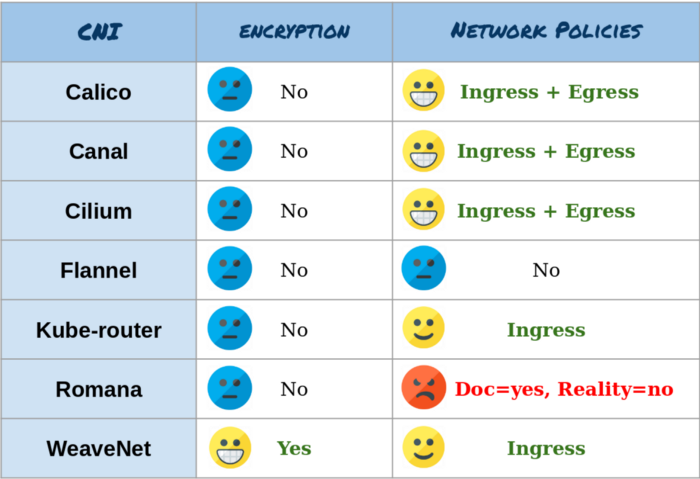

# NetworkPolicy

- [NetworkPolicy](#networkpolicy)
  - [참고](#참고)
  - [개념](#개념)
    - [CNI 플러그인 간 비교](#cni-플러그인-간-비교)
  - [예시](#예시)

## 참고

- [Docs](https://kubernetes.io/ko/docs/concepts/services-networking/network-policies/) - 쿠버네티스 네트워크 정책
- [Kubernetes Best Practices](https://www.amazon.com/Kubernetes-Best-Practices-Blueprints-Applications/dp/1492056472) - Brendan Burns, Eddie Villalba, Dave Strebel, Lachlan Evenson

## 개념

- `NetworkPolicy`는 간단한 방화벽으로 볼 수 있습니다.
  - IP 주소 또는 포트 수준(OSI 계층 3 또는 4)에서 트래픽 흐름을 제어합니다.
- 정책 `spec`으로는 `podSelector`, `ingress`, `egress`, `policyType` 필드가 있습니다.
  - `podSelector`만 필수 필드이며, `matchLabels`를 가진 셀렉터와 동일한 규약을 따릅니다.
  - 네임스페이스 수준(namespaced)의 오브젝트이기 때문에 `spec.podSelector`에 맞는 셀렉터가 없으면 네임스페이스의 모든 파드에 정책이 적용됩니다.
  - `ingress` 또는 `egress` 규칙이 정의되어 있으면 파드에 허용되는 `ingress` 또는 `egress` 화이트리스트가 생성됩니다.
  - `ingress` 필드가 비어있다면 모든 inbound traffic은 차단됩니다.
  - `egress` 필드가 비어있다면 모든 outbound traffic은 차단됩니다.
  - `spec.podSelector`와 일치하는 파드에 정책이 적용되면 `ingress` 또는 `egress` 규칙에 명시되지 않은 모든 트래픽은 차단됩니다.
  - `spec.podSelector`와 일치하지 않는 파드는 아무런 정책에 속하지 않기 때문에 모든 `ingress`와 `egress`가 허용됩니다.
- `NetworkPolicy`은 [네트워크 플러그인](https://kubernetes.io/ko/docs/concepts/extend-kubernetes/compute-storage-net/network-plugins/)으로 구현됩니다. 즉 `NetworkPolicy`를 지원하는 네트워킹 솔루션을 사용해야만 합니다.
  - 이를 구현하는 컨트롤러가 없다면 아무리 `NetworkPolicy` 리소스를 생성해도 아무런 효과가 없습니다.

### CNI 플러그인 간 비교



_[출처](https://itnext.io/benchmark-results-of-kubernetes-network-plugins-cni-over-10gbit-s-network-36475925a560) - Alexis Ducastel, 2018_

## 예시

```yaml
apiVersion: networking.k8s.io/v1
kind: NetworkPolicy
metadata:
  name: test-network-policy
  namespace: default
spec:
  podSelector:
    matchLabels:
      role: db
  policyTypes:
    - Ingress
    - Egress
  ingress:
    - from:
        - ipBlock:
            cidr: 172.17.0.0/16
            except:
              - 172.17.1.0/24
        - namespaceSelector:
            matchLabels:
              project: myproject
        - podSelector:
            matchLabels:
              role: frontend
      ports:
        - protocol: TCP
          port: 6379
  egress:
    - to:
        - ipBlock:
            cidr: 10.0.0.0/24
      ports:
        - protocol: TCP
          port: 5978
```

```bash
kubectl explain netpol.spec
# KIND:     NetworkPolicy
# VERSION:  networking.k8s.io/v1
# 
# RESOURCE: spec <Object>
# 
# DESCRIPTION:
#      Specification of the desired behavior for this NetworkPolicy.
# 
#      NetworkPolicySpec provides the specification of a NetworkPolicy
# 
# FIELDS:
#    egress       <[]Object>
#      ...
# 
#    ingress      <[]Object>
#      ...
# 
#    podSelector  <Object> -required-
#      ...
# 
#    policyTypes  <[]string>
#      ...
```
