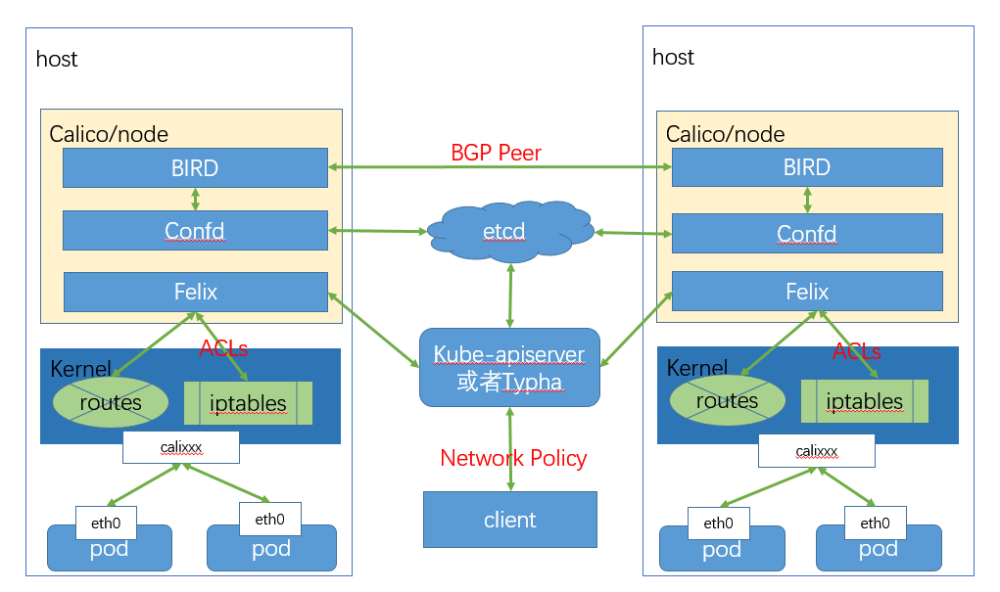

# Calico

- [Calico](#calico)
  - [Quickstart](#quickstart)
    - [50 노드 이하](#50-노드-이하)
    - [50 노드 초과](#50-노드-초과)
    - [etcd datastore](#etcd-datastore)
  - [Components](#components)
    - [Datastore plugin](#datastore-plugin)
    - [calico-node](#calico-node)
    - [Typha](#typha)
    - [kube-controllers](#kube-controllers)
    - [with Istio](#with-istio)
  - [참고자료](#참고자료)

## Quickstart

- [Install Calico networking and network policy for on-premises deployments](https://docs.projectcalico.org/getting-started/kubernetes/self-managed-onprem/onpremises)

### 50 노드 이하

```bash
# curl -LO https://docs.projectcalico.org/manifests/calico.yaml
kubectl apply -f https://docs.projectcalico.org/manifests/calico.yaml
```

### 50 노드 초과

```bash
# curl -LO https://docs.projectcalico.org/manifests/calico-typha.yaml
kubectl apply -f https://docs.projectcalico.org/manifests/calico-typha.yaml
```

### etcd datastore

```bash
# curl -LO https://docs.projectcalico.org/manifests/calico-etcd.yaml
kubectl apply -f https://docs.projectcalico.org/manifests/calico-etcd.yaml
```

## Components


_출처: [Component Architecture](https://docs.projectcalico.org/reference/architecture/overview) - projectcalico_


_출처: [VMware Tanzu](https://tanzu.vmware.com/developer/guides/kubernetes/container-networking-calico-refarch/)_



_출처: [Programmer Sought](https://www.programmersought.com/article/13224884197/)_

### Datastore plugin

- 쿠버네티스에서는 일반적으로 etcd가 데이터스토어에 해당합니다.
- Increases scale by reducing each node’s impact on the datastore.
- It is one of the Calico CNI plugins.

### [calico-node](https://github.com/projectcalico/node)

- [Felix](https://docs.projectcalico.org/archive/v3.18/reference/architecture/overview#felix)
  - [projectcalico/felix](https://github.com/projectcalico/felix)
  - Interface management
  - Route programming
  - ACL programming
  - State reporting
- [BIRD](https://docs.projectcalico.org/archive/v3.18/reference/architecture/overview#bird)
  - [projectcalico/bird](https://github.com/projectcalico/bird)
  - IP-in-IP를 사용해서 다른 노드로 데이터를 라우팅하는 BGP 데몬입니다.
  - Route distribution
  - BGP route reflector configuration
- [confd](https://docs.projectcalico.org/archive/v3.18/reference/architecture/overview#confd)
  - [projectcalico/confd](https://github.com/projectcalico/confd)
  - 데이터스토어를 감시하고 BIRD의 구성 파일을 갱신하기 위한 데몬입니다.

### [Typha](https://docs.projectcalico.org/reference/typha/overview)

- [projectcalico/typha](https://github.com/projectcalico/typha)
- calico-node가 늘어날수록 증가하는 calico-datastore의 부하를 줄여줍니다.
- Felix와 관련이없는 업데이트를 필터링 할 수 있으므로 Felix의 CPU 사용량도 줄입니다.

### [kube-controllers](https://docs.projectcalico.org/archive/v3.18/reference/kube-controllers/)

- policy-controller
- ns-controller
- sa-controller
- pod-controller
- node-controller

### with Istio

- [Dikastes](https://docs.projectcalico.org/archive/v3.18/reference/architecture/overview#dikastes)
  - Enforces network policy for Istio service mesh. Runs on a cluster as a sidecar proxy to Istio Envoy.

## 참고자료

- [VMware Tanzu](https://tanzu.vmware.com/developer/guides/kubernetes/container-networking-calico-refarch/)
- [Programmer Sought](https://www.programmersought.com/article/13224884197/)
- [IBM Cloud Private](https://www.ibm.com/docs/en/cloud-private/3.2.0?topic=calico-preparing-nodes)
