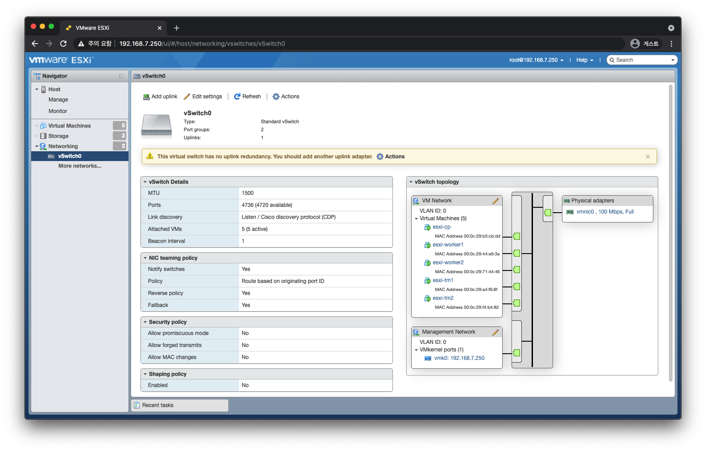
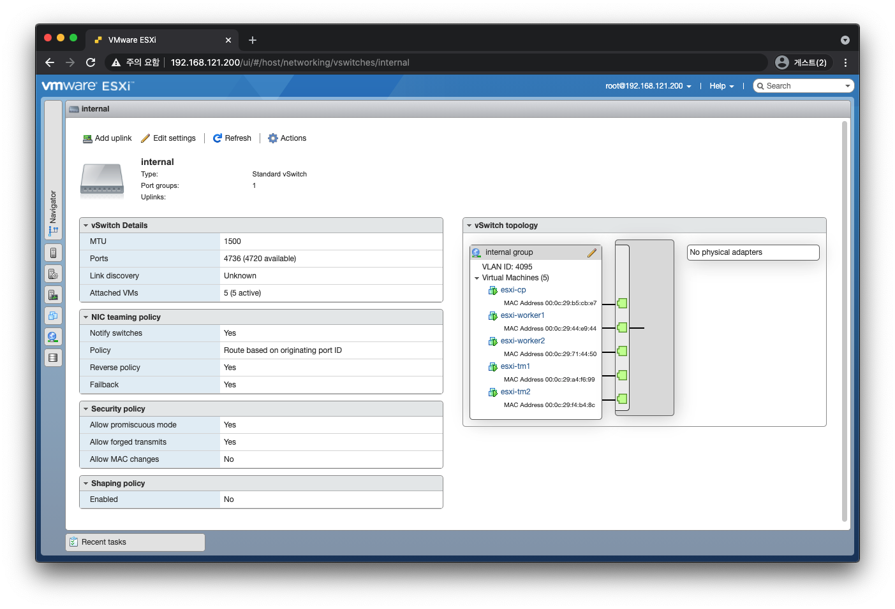
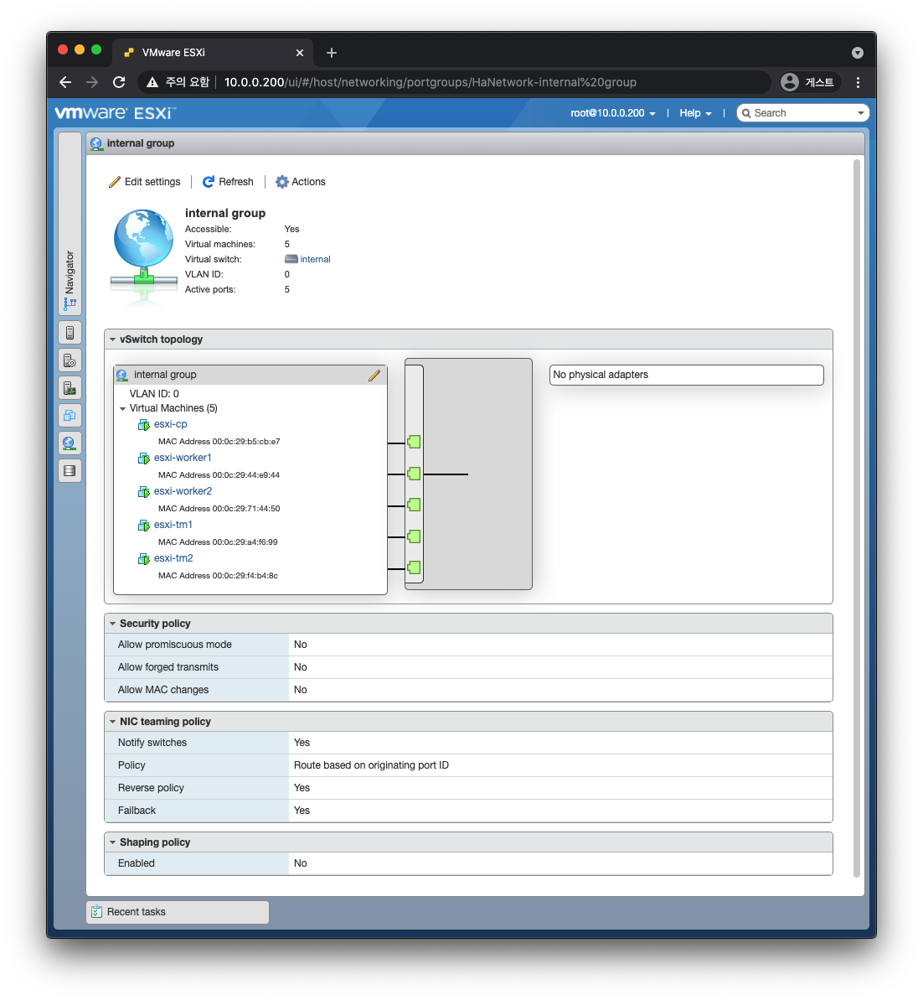
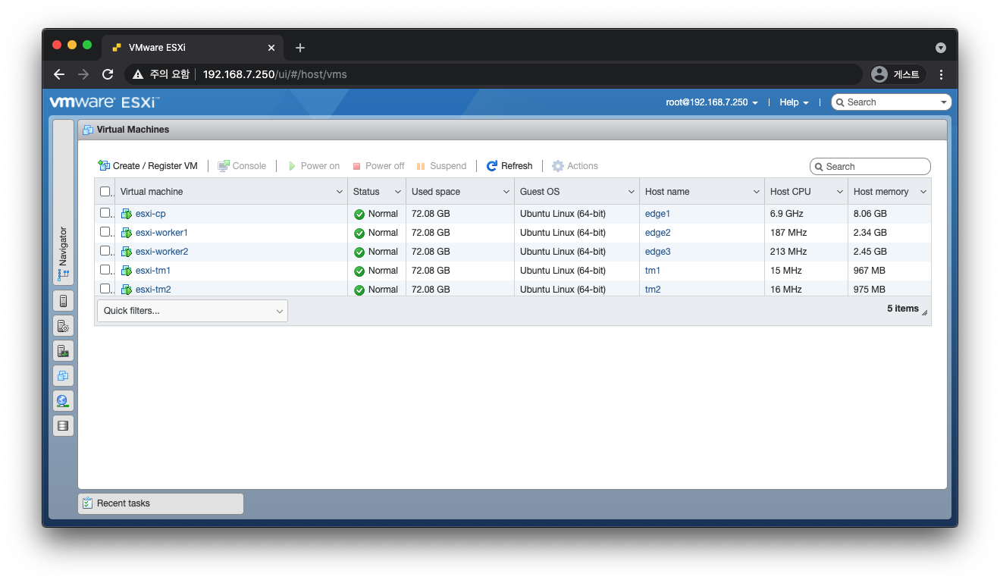

# Test with Vagrant

- [Test with Vagrant](#test-with-vagrant)
  - [Demo](#demo)
    - [Prerequisite](#prerequisite)
    - [Kubernetes 클러스터 구성](#kubernetes-클러스터-구성)
    - [Service Function Chaining Demo](#service-function-chaining-demo)
    - [Clean Up](#clean-up)
      - [graceful](#graceful)
  - [Troubleshooting](#troubleshooting)

## Demo

### Prerequisite

> _CPU 4 | Memory 8192MB | Hard Disk 64GB_


> _`4 Customize settings`-`CD/DVD Drive 1`: Datastore ISO file - CD/DVD Media 선택_


> _`Add network adapter`로 총 네트워크 어댑터 2개 설정, port group: VLAN 4095_

- `Navigator` - `Networking` - `Virtual switches`



> NOTE: `Security Policy`에서
> `Allow promiscuous mode` ([무차별 모드][promiscuous-mode]),
> `Allow forged transmits`([위조 전송][forged-transmits])을
> `Allow`로 변경합니다.
>
> - NSX-T Edge 브리지 노드가 연결된 논리적 스위치의 분산 포트 그룹에서 이러한 두 구성 설정을 사용하도록 지정합니다.
>   무차별 모드를 사용하도록 설정할 때의 단점은 단일 VM이 패킷을 수신하는 경우에도 논리적 스위치의 모든 VM이 패킷에 액세스할 수 있다는 것입니다.
>   따라서 무차별 모드를 사용하도록 설정하면 네트워크 성능에 영향을 줄 수 있습니다.
>   [참고](https://docs.vmware.com/kr/VMware-NSX-T-Data-Center/3.1/migration/GUID-206CF244-3171-4146-9C60-43A797B15043.html)
> - 무차별 모드는 게스트 운영 체제가 유선에서 관찰 된 모든 트래픽을 수신하도록 가상 시스템 어댑터가 수행하는 수신 필터링을 제거합니다. 기본적으로 가상 머신 어댑터는 무차별 모드에서 작동 할 수 없습니다.
> - 위조 전송 모드의 ESXi 출처 유효 MAC 주소와 출발지를 비교하지 않습니다.



- `Navigator` - `Networking` - `Port groups`



> _총 5대 확인_



```yaml
esxi-cp:
  ens160: 10.0.0.13
  ens192: 10.10.10.13
esxi-worker1:
  ens160: 10.0.0.14
  ens192: 10.10.10.14
esxi-worker2:
  ens160: 10.0.0.15
  ens192: 10.10.10.15
esxi-tm1:
  ens160: 10.0.0.16
  ens192: 10.10.10.16
esxi-tm2:
  ens160: 10.0.0.17
  ens192: 10.10.10.17
```

```yaml
# /etc/netplan/00-ens160.yaml
network:
  ethernets:
    ens160:
      addresses:
        - 10.0.0.13/24
      gateway4: 10.0.0.1
      nameservers:
        addresses:
          - 8.8.8.8
  version: 2
  renderer: networkd
```

```yaml
# /etc/netplan/01-ens192.yaml
network:
  ethernets:
    ens192:
      addresses:
        - 10.10.10.13/24
  version: 2
```

```bash
netplan apply
```

편하게 테스트하기 위해 `root` 계정으로 로그인할 수 있게 설정합니다.

```bash
sudo --login
sed --in-place 's/#PermitRootLogin prohibit-password/PermitRootLogin yes/' /etc/ssh/sshd_config
systemctl restart ssh
```

서버 외부에서 SSH로 접속할 수 있게 패스워드를 설정합니다.

```bash
passwd
```

```bash
ssh root@10.0.0.13
ip -br -c a
# lo               UNKNOWN        127.0.0.1/8 ::1/128
# ens160           UP             10.0.0.13/24 fe80::20c:29ff:feb5:cbdd/64
# ens192           UP             10.10.10.13/24 fe80::20c:29ff:feb5:cbe7/64

ssh root@10.0.0.14
ip -br -c a
# lo               UNKNOWN        127.0.0.1/8 ::1/128
# ens160           UP             10.0.0.14/24 fe80::20c:29ff:fe44:e93a/64
# ens192           UP             10.10.10.14/24 fe80::20c:29ff:fe44:e944/64

ssh root@10.0.0.15
ip -br -c a
# lo               UNKNOWN        127.0.0.1/8 ::1/128
# ens160           UP             10.0.0.15/24 fe80::20c:29ff:fe71:4446/64
# ens192           UP             10.10.10.15/24 fe80::20c:29ff:fe71:4450/64

ssh root@10.0.0.16
ip -br -c a
# lo               UNKNOWN        127.0.0.1/8 ::1/128
# ens160           UP             10.0.0.16/24 fe80::20c:29ff:fea4:f68f/64
# ens192           UP             10.10.10.16/24 fe80::20c:29ff:fea4:f699/64

ssh root@10.0.0.17
ip -br -c a
# lo               UNKNOWN        127.0.0.1/8 ::1/128
# ens160           UP             10.0.0.17/24 fe80::20c:29ff:fef4:b482/64
# ens192           UP             10.10.10.17/24 fe80::20c:29ff:fef4:b48c/64
```

iTerm2를 사용하신다면 `Shift`+`Command`+`i`:
"Keyboard input will be sent to multiple sessions."

```bash
apt-get update
apt-get install -y net-tools dnsutils traceroute policycoreutils
```

```bash
#  Warning  DNSConfigForming  31s (x8 over 108s)  kubelet            Nameserver limits were exceeded, some nameservers have been omitted, the applied nameserver line is: 4.2.2.1 4.2.2.2 208.67.220.220

cat /run/systemd/resolve/resolv.conf
# nameserver 8.8.8.8

# vi /etc/resolv.conf
# nameserver 8.8.8.8
# nameserver 8.8.4.4

# vi /etc/systemd/resolved.conf
# 8.8.8.8 8.8.4.4

systemctl restart systemd-resolved.service
```

뒤에서 kubelet 설치 후

```bash
cat /var/lib/kubelet/config.yaml | grep resolvConf
# resolvConf: /run/systemd/resolve/resolv.conf
```

### Kubernetes 클러스터 구성

> `edge1`, `edge2`, `edge3` 3대로 구성합니다.

[kubeadm.md 참고](../../../../bootstrap/kubeadm.md)

```bash
# apt-get remove docker docker-engine docker.io containerd runc
apt-get install \
  curl \
  apt-transport-https \
  ca-certificates \
  docker.io \
  -y

curl -fsSLo /usr/share/keyrings/kubernetes-archive-keyring.gpg https://packages.cloud.google.com/apt/doc/apt-key.gpg

echo "deb [signed-by=/usr/share/keyrings/kubernetes-archive-keyring.gpg] https://apt.kubernetes.io/ kubernetes-xenial main" | sudo tee /etc/apt/sources.list.d/kubernetes.list

apt-get update
```

```bash
swapoff -a
sed -e '/swap/s/^/#/g' -i /etc/fstab

sestatus
# SELinux status:                 disabled

ufw status
# Status: inactive

cat <<EOF | sudo tee /etc/modules-load.d/k8s.conf
br_netfilter
EOF

cat <<EOF | sudo tee /etc/sysctl.d/k8s.conf
net.bridge.bridge-nf-call-iptables = 1
net.bridge.bridge-nf-call-ip6tables = 1
EOF

echo 'net.ipv6.conf.all.disable_ipv6 = 1' >> /etc/sysctl.conf
echo 'net.ipv6.conf.default.disable_ipv6 = 1' >> /etc/sysctl.conf
echo 'net.ipv6.conf.lo.disable_ipv6 = 1' >> /etc/sysctl.conf
sysctl -p
```

```bash
# 1.19+
export KUBERNETES_VERSION=1.19.10
```

```bash
apt-get install \
  kubeadm=${KUBERNETES_VERSION}-00 \
  kubectl=${KUBERNETES_VERSION}-00 \
  kubelet=${KUBERNETES_VERSION}-00 \
  -y
```

네트워크 인터페이스가 2개이기 때문에 모든 노드의 Kubelet에게 어떤 IP를 사용할 것인지 알려줍니다.

```bash
vi /etc/systemd/system/kubelet.service.d/10-kubeadm.conf
# ExecStart=[...] --node-ip 10.0.0.13

systemctl status kubelet
# systemctl daemon-reload
# systemctl restart kubelet
```

Control Plane을 초기화합니다.

```bash
export MASTER_ETH0_ENS160_ADDRESS=10.0.0.13

kubeadm init \
--v 5 \
--kubernetes-version ${KUBERNETES_VERSION} \
--pod-network-cidr 10.233.64.0/18 \
--apiserver-advertise-address ${MASTER_ETH0_ENS160_ADDRESS}
# --apiserver-bind-port 6443

rm -rf $HOME/.kube
mkdir -p $HOME/.kube
sudo cp -i /etc/kubernetes/admin.conf $HOME/.kube/config
sudo chown $(id -u):$(id -g) $HOME/.kube/config
```

노드에 레이블을 지정합니다.

```bash
nodename=$(kubectl get node -o jsonpath='{.items[0].metadata.name}')
# master 노드에도 스케줄할 수 있도록 untaint
kubectl taint node $nodename node-role.kubernetes.io/master:NoSchedule-
# 1번 노드에 레이블 지정
kubectl label --overwrite node $nodename ovn4nfv-k8s-plugin=ovn-control-plane
# 모든 노드에 nfn-operator가 할당될 수 있도록 레이블 지정
kubectl label no --all --overwrite nfnType=operator

kubectl get no -o wide --show-labels
# ...,nfnType=operator
```

### Service Function Chaining Demo


_출처: [opnfv/ovn4nfv-k8s-plugin][ovn4nfv-cni-sfc]_

```bash
# git clone --branch master https://github.com/markruler/ovn4nfv-k8s-plugin.git
# cd ovn4nfv-k8s-plugin/
git clone https://github.com/markruler/icn-ovn4nfv-k8s-network-controller.git --branch refactor-manifests-package
cd icn-ovn4nfv-k8s-network-controller/
```

```bash
# deploy/ovn4nfv-k8s-plugin.yaml 중복
# rm -f deploy/crds/*_cr.yaml
# kubectl apply -f deploy/crds/
```

```bash
kubectl apply -f https://docs.projectcalico.org/manifests/calico.yaml
kubectl set env daemonset/calico-node -n kube-system IP_AUTODETECTION_METHOD=cidr=10.0.0.0/24
# kubectl set env daemonset/calico-node -n kube-system IP_AUTODETECTION_METHOD=interface=ens160

# curl -LO https://docs.projectcalico.org/manifests/calico.yaml
# kubectl apply -f calico.yaml
```

- 멀터스를 설치하지 않아도 동작은 합니다(?).
  - ~~[deploy/multus-daemonset.yml 참고][multus-reference-deployment]~~
  - TODO: 멀터스 동작 방식 이해하기

```diff
diff --git a/deploy/multus-daemonset.yml b/deploy/multus-daemonset.yml
index 08c3d6d..ed05463 100644
--- a/deploy/multus-daemonset.yml
+++ b/deploy/multus-daemonset.yml
@@ -191,9 +192,9 @@ spec:
         - -cex
         - |
           #!/bin/bash
-          sed "s|__KUBERNETES_NODE_NAME__|${KUBERNETES_NODE_NAME}|g" /tmp/multus-conf/00-multus.conf.template > /tmp/multus-conf/00-multus.conf
+          sed "s|__KUBERNETES_NODE_NAME__|${KUBERNETES_NODE_NAME}|g" /tmp/multus-conf/70-multus.conf.template > /tmp/multus-conf/70-multus.conf
           /entrypoint.sh \
-            --multus-conf-file=/tmp/multus-conf/00-multus.conf
+            --multus-conf-file=/tmp/multus-conf/70-multus.conf
         resources:
           requests:
             cpu: "100m"
@@ -209,7 +210,7 @@ spec:
         - name: cnibin
           mountPath: /host/opt/cni/bin
         - name: multus-cfg
-          mountPath: /tmp/multus-conf/00-multus.conf.template
+          mountPath: /tmp/multus-conf/70-multus.conf.template
           subPath: "cni-conf.json"
       volumes:
         - name: cni
```

```bash
# kubectl apply -f deploy/multus-daemonset.yml
```

```bash
kubectl apply -f deploy/cni/calico/
kubectl apply -f deploy/cni/ovn/
kubectl apply -f deploy/nfn/
kubectl apply -f deploy/crds/
```

- 만약 core-dns나 calico-node가 정상적으로 제어되지 않는다면 수동으로 삭제

```bash
kubectl -n kube-system delete po -l k8s-app=calico-node
kubectl -n kube-system delete po -l k8s-app=calico-kube-controllers

kubectl -n kube-system delete po -l k8s-app=kube-dns
```

데모용 `Network`와 `Deployment`를 배포합니다.

```bash
kubectl apply -f demo/minimal/sfc-network.yaml
kubectl apply -f demo/minimal/ms2-4.yaml
kubectl apply -f demo/minimal/ms1.yaml
kubectl apply -f demo/minimal/sfc.yaml
```

IP가 잘 설정되었는지 확인합니다.

```bash
kubectl exec -it $(kubectl get po -l app=slb --no-headers) -- ip -br -c a
# lo               UNKNOWN        127.0.0.1/8
# tunl0@NONE       DOWN
# net0@if38        UP             172.30.10.3/24
# net1@if5         UP             172.30.33.2/24
# eth0@if39        UP             10.233.64.12/18

kubectl get network dync-net1 -o jsonpath-as-json='{.spec.ipv4Subnets}'
# [
#   [
#     {
#       "gateway": "172.30.33.1/24",
#       "name": "subnet1",
#       "subnet": "172.30.33.0/24"
#     }
#   ]
# ]

kubectl exec -it $(kubectl get po -l app=ngfw --no-headers) -- ip -br -c a
# lo               UNKNOWN        127.0.0.1/8
# tunl0@NONE       DOWN
# net0@if45        UP             172.30.33.3/24
# net1@if5         UP             172.30.44.2/24
# eth0@if46        UP             10.233.64.13/18

kubectl get network dync-net2 -o jsonpath-as-json='{.spec.ipv4Subnets}'
# [
#   [
#     {
#       "gateway": "172.30.44.1/24",
#       "name": "subnet1",
#       "subnet": "172.30.44.0/24"
#     }
#   ]
# ]

kubectl exec -it $(kubectl get po -l app=sdwan --no-headers) -- ip -br -c a
# lo               UNKNOWN        127.0.0.1/8
# tunl0@NONE       DOWN
# net0@if40        UP             172.30.44.3/24 fe80::f43c:99ff:fe1e:2c04/64
# net1@if41        UP             172.30.20.3/24 fe80::f43c:99ff:fe1e:1404/64
# eth0@if42        UP             10.233.64.17/18

kubectl get networkchaining example-networkchaining -o jsonpath-as-json='{.spec}'
# [
#   {
#     "chainType": "Routing",
#     "routingSpec": {
#       "leftNetwork": [
#         {
#           "gatewayIp": "172.30.10.2",
#           "networkName": "left-pnetwork",
#           "subnet": "172.30.10.0/24"
#         }
#       ],
#       "namespace": "default",
#       "networkChain": "app=slb,dync-net1,app=ngfw,dync-net2,app=sdwan",
#       "rightNetwork": [
#         {
#           "gatewayIp": "172.30.20.2",
#           "networkName": "right-pnetwork",
#           "subnet": "172.30.20.0/24"
#         }
#       ]
#     }
#   }
# ]
```

ms1 파드에서 `traceroute` 명령어를 통해 트래픽이 잘 지나가는지 확인합니다.

```bash
kubectl exec -it $(kubectl get po -l app=ms1 --no-headers) -- traceroute 8.8.8.8 -m 5
```

테스트를 위해 TM1과 TM2를 설정합니다.

```bash
ssh root@10.0.0.16

ip -br -c a
# lo               UNKNOWN        127.0.0.1/8 ::1/128
# ens160           UP             10.0.0.16/24 fe80::20c:29ff:fea4:f68f/64
# ens192           UP             10.10.10.16/24

ip addr flush dev ens192
ip -br -c a
# lo               UNKNOWN        127.0.0.1/8 ::1/128
# ens160           UP             10.0.0.16/24 fe80::20c:29ff:fea4:f68f/64
# ens192           UP

ip -br -c l
# lo               UNKNOWN        00:00:00:00:00:00 <LOOPBACK,UP,LOWER_UP>
# ens160           UP             00:0c:29:a4:f6:8f <BROADCAST,MULTICAST,UP,LOWER_UP>
# ens192           UP             00:0c:29:a4:f6:99 <BROADCAST,MULTICAST,UP,LOWER_UP>

ip link add link ens192 name eth1.100 type vlan id 100
ip -br -c l
# lo               UNKNOWN        00:00:00:00:00:00 <LOOPBACK,UP,LOWER_UP>
# ens160           UP             00:0c:29:a4:f6:8f <BROADCAST,MULTICAST,UP,LOWER_UP>
# ens192           UP             00:0c:29:a4:f6:99 <BROADCAST,MULTICAST,UP,LOWER_UP>
# eth1.100@ens192  DOWN           00:0c:29:a4:f6:99 <BROADCAST,MULTICAST>

ip link set dev eth1.100 up
ip -br -c l
# lo               UNKNOWN        00:00:00:00:00:00 <LOOPBACK,UP,LOWER_UP>
# ens160           UP             00:0c:29:a4:f6:8f <BROADCAST,MULTICAST,UP,LOWER_UP>
# ens192           UP             00:0c:29:a4:f6:99 <BROADCAST,MULTICAST,UP,LOWER_UP>
# eth1.100@ens192  UP             00:0c:29:a4:f6:99 <BROADCAST,MULTICAST,UP,LOWER_UP>

ip addr add 172.30.10.101/24 dev eth1.100
ip -br -c a
# lo               UNKNOWN        127.0.0.1/8 ::1/128
# ens160           UP             10.0.0.16/24 fe80::20c:29ff:fea4:f68f/64
# ens192           UP
# eth1.100@ens192  UP             172.30.10.101/24 fe80::20c:29ff:fea4:f699/64

ip r
# default via 10.0.0.1 dev ens160 proto static
# 10.0.0.0/24 dev ens160 proto kernel scope link src 10.0.0.16
# 172.30.10.0/24 dev eth1.100 proto kernel scope link src 172.30.10.101

netstat -rn
# Kernel IP routing table
# Destination     Gateway         Genmask         Flags   MSS Window  irtt Iface
# 0.0.0.0         10.0.0.1        0.0.0.0         UG        0 0          0 ens160
# 10.0.0.0        0.0.0.0         255.0.0.0       U         0 0          0 ens160
# 172.30.10.0     0.0.0.0         255.255.255.0   U         0 0          0 eth1.100

ip route del default
ip r
# 10.0.0.0/24 dev ens160 proto kernel scope link src 10.0.0.16
# 172.30.10.0/24 dev eth1.100 proto kernel scope link src 172.30.10.101

ip route add default via 172.30.10.3
ip r
# default via 172.30.10.3 dev eth1.100
# 10.0.0.0/24 dev ens160 proto kernel scope link src 10.0.0.16
# 172.30.10.0/24 dev eth1.100 proto kernel scope link src 172.30.10.101

netstat -rn
# Kernel IP routing table
# Destination     Gateway         Genmask         Flags   MSS Window  irtt Iface
# 0.0.0.0         172.30.10.3     0.0.0.0         UG        0 0          0 eth1.100
# 10.0.0.0        0.0.0.0         255.0.0.0       U         0 0          0 ens160
# 172.30.10.0     0.0.0.0         255.255.255.0   U         0 0          0 eth1.100
```

```bash
ssh root@10.0.0.17

ip -br -c a
# lo               UNKNOWN        127.0.0.1/8 ::1/128
# ens160           UP             10.0.2.17/8 fe80::20c:29ff:fef4:b482/64
# ens192           UP             10.10.10.17/8 fe80::20c:29ff:fef4:b48c/64

ip addr flush dev ens192
ip -br -c a
# lo               UNKNOWN        127.0.0.1/8 ::1/128
# ens160           UP             10.0.2.17/8 fe80::20c:29ff:fef4:b482/64
# ens192           UP

ip -br -c l
# lo               UNKNOWN        00:00:00:00:00:00 <LOOPBACK,UP,LOWER_UP>
# ens160           UP             00:0c:29:f4:b4:82 <BROADCAST,MULTICAST,UP,LOWER_UP>
# ens192           UP             00:0c:29:f4:b4:8c <BROADCAST,MULTICAST,UP,LOWER_UP>

ip link add link ens192 name eth1.200 type vlan id 200
ip -br -c l
# lo               UNKNOWN        00:00:00:00:00:00 <LOOPBACK,UP,LOWER_UP>
# ens160           UP             00:0c:29:f4:b4:82 <BROADCAST,MULTICAST,UP,LOWER_UP>
# ens192           UP             00:0c:29:f4:b4:8c <BROADCAST,MULTICAST,UP,LOWER_UP>
# eth1.200@ens192  DOWN           00:0c:29:f4:b4:8c <BROADCAST,MULTICAST>

ip link set dev eth1.200 up
ip -br -c l
# lo               UNKNOWN        00:00:00:00:00:00 <LOOPBACK,UP,LOWER_UP>
# ens160           UP             00:0c:29:f4:b4:82 <BROADCAST,MULTICAST,UP,LOWER_UP>
# ens192           UP             00:0c:29:f4:b4:8c <BROADCAST,MULTICAST,UP,LOWER_UP>
# eth1.200@ens192  UP             00:0c:29:f4:b4:8c <BROADCAST,MULTICAST,UP,LOWER_UP>

ip addr add 172.30.20.2/24 dev eth1.200
ip -br -c a
# lo               UNKNOWN        127.0.0.1/8 ::1/128
# ens160           UP             10.0.2.17/8 fe80::20c:29ff:fef4:b482/64
# ens192           UP
# eth1.200@ens192  UP             172.30.20.2/24 fe80::20c:29ff:fef4:b48c/64
```

- TM2 노드에 virtual router 생성

```bash
ip r
# default via 10.0.0.1 dev ens160 proto static
# 10.0.0.0/8 dev ens160 proto kernel scope link src 10.0.2.17
# 172.30.20.0/24 dev eth1.200 proto kernel scope link src 172.30.20.2

netstat -rn
# Kernel IP routing table
# Destination     Gateway         Genmask         Flags   MSS Window  irtt Iface
# 0.0.0.0         10.0.0.1        0.0.0.0         UG        0 0          0 ens160
# 10.0.0.0        0.0.0.0         255.0.0.0       U         0 0          0 ens160
# 172.30.20.0     0.0.0.0         255.255.255.0   U         0 0          0 eth1.200

ip route add 172.30.10.0/24 via 172.30.20.3
ip route add 172.30.33.0/24 via 172.30.20.3
ip route add 172.30.44.0/24 via 172.30.20.3

ip r
# 10.0.0.0/8 dev ens160 proto kernel scope link src 10.0.2.17
# 172.30.10.0/24 via 172.30.20.3 dev eth1.200
# 172.30.20.0/24 dev eth1.200 proto kernel scope link src 172.30.20.2
# 172.30.33.0/24 via 172.30.20.3 dev eth1.200
# 172.30.44.0/24 via 172.30.20.3 dev eth1.200

netstat -rn
# Kernel IP routing table
# Destination     Gateway         Genmask         Flags   MSS Window  irtt Iface
# 0.0.0.0         10.0.0.1        0.0.0.0         UG        0 0          0 ens160
# 10.0.0.0        0.0.0.0         255.0.0.0       U         0 0          0 ens160
# 172.30.10.0     172.30.20.3     255.255.255.0   UG        0 0          0 eth1.200
# 172.30.20.0     0.0.0.0         255.255.255.0   U         0 0          0 eth1.200
# 172.30.33.0     172.30.20.3     255.255.255.0   UG        0 0          0 eth1.200
# 172.30.44.0     172.30.20.3     255.255.255.0   UG        0 0          0 eth1.200
```

```bash
iptables -vL
# Chain INPUT (policy ACCEPT 39 packets, 1920 bytes)
#  pkts bytes target     prot opt in     out     source               destination
#
# Chain FORWARD (policy ACCEPT 0 packets, 0 bytes)
#  pkts bytes target     prot opt in     out     source               destination
#
# Chain OUTPUT (policy ACCEPT 29 packets, 2340 bytes)
#  pkts bytes target     prot opt in     out     source               destination

echo 1 > /proc/sys/net/ipv4/ip_forward

/sbin/iptables -t nat -A POSTROUTING -o ens160 -j MASQUERADE
iptables -A FORWARD -i ens192 -o ens160 -j ACCEPT
iptables -A FORWARD -i eth1.200 -o ens160 -j ACCEPT

iptables -vL FORWARD
# Chain FORWARD (policy ACCEPT 0 packets, 0 bytes)
#  pkts bytes target     prot opt in     out     source               destination
#     0     0 ACCEPT     all  --  ens192 ens160  anywhere             anywhere
#     0     0 ACCEPT     all  --  eth1.200 ens160  anywhere             anywhere
```

TM1 노드에서 `traceroute` 명령어를 통해 트래픽이 잘 지나가는지 확인합니다.

```bash
vagrant ssh tm1-node

traceroute kubernetes.io
# traceroute to kubernetes.io (147.75.40.148), 64 hops max
#   1   172.30.10.3  0.553ms  0.141ms  0.094ms
#   2   172.30.33.3  0.862ms  0.153ms  0.232ms
#   3   172.30.44.3  0.369ms  0.152ms  0.135ms
#   4   172.30.20.2  0.479ms  0.199ms  0.183ms
```

### Clean Up

#### graceful

```bash
# on master
kubectl drain <node name> --delete-local-data --force --ignore-daemonsets

# on minion -> on master
kubeadm reset

iptables -F && iptables -t nat -F && iptables -t mangle -F && iptables -X
# systemctl restart docker

iptables -vL
```

```bash
# all nodes
systemctl stop kubelet
systemctl stop docker

rm -rf /opt/cni/bin/multus
rm -rf /opt/cni/bin/ovn4nfvk8s-cni
rm -rf /etc/cni/net.d/
# rm -rf /var/lib/cni
# rm -rf /var/lib/kubelet
# rm -rf /var/lib/etcd

systemctl start docker
systemctl start kubelet
```

## Troubleshooting

Ubuntu 18.04 네트워크 이름 변경

```bash
vi /etc/default/grub
vi /etc/default/grub
# GRUB_CMDLINE_LINUX="net.ifnames=0 biosdevname=0"

update-grub
# Sourcing file `/etc/default/grub'
# Generating grub configuration file ...
# Found linux image: /boot/vmlinuz-4.15.0-142-generic
# Found initrd image: /boot/initrd.img-4.15.0-142-generic
# Found linux image: /boot/vmlinuz-4.15.0-112-generic
# Found initrd image: /boot/initrd.img-4.15.0-112-generic
# done
```

```yaml
# /etc/netplan/00-installer-config.yaml
network:
  version: 2
  renderer: networkd
  ethernets:
    eth0: [...]
```

```bash
netplan generate
reboot now
```

ovn4nfv-k8s-plugin 파드를 생성할때 `build/bin/entrypoint` 스크립트의
iptables 명령어에서 `Bad argument 'ens160'`이라는 에러가 발생할 수 있습니다.
노드의 `default` 라우터를 하나로 통일 시켜주세요.

- example

```bash
ip route
# default via 10.10.10.1 dev ens192 proto static
# default via 10.0.0.1 dev ens160 proto static
# 10.0.0.0/24 dev ens160 proto kernel scope link src 10.0.0.15
# 10.10.10.0/24 dev ens192 proto kernel scope link src 10.10.10.15
# [...]

ip route delete default via 10.10.10.1
# default via 10.0.0.1 dev ens160 proto static
# 10.0.0.0/24 dev ens160 proto kernel scope link src 10.0.0.15
# 10.10.10.0/24 dev ens192 proto kernel scope link src 10.10.10.15
```

만약 실수로 `10.0.0.1`을 지웠다면 아래 명령어로 추가합니다.

```bash
ip route add default via 10.0.0.1 dev ens160
```

- `calico-kube-controllers Failed to send CNIServer request`
  - NFN 에이전트가 만드는 `.sock`을 제거

```bash
rm -rf /var/run/ovn4nfv-k8s-plugin/cniserver/ovn4nfv-k8s-plugin-cni-server.sock
```

[promiscuous-mode]: https://docs.vmware.com/en/VMware-vSphere/7.0/com.vmware.vsphere.security.doc/GUID-92F3AB1F-B4C5-4F25-A010-8820D7250350.html
[forged-transmits]: https://docs.vmware.com/en/VMware-vSphere/7.0/com.vmware.vsphere.security.doc/GUID-7DC6486F-5400-44DF-8A62-6273798A2F80.html
[ovn4nfv-cni-sfc]: https://github.com/opnfv/ovn4nfv-k8s-plugin#service-function-chaining-demo
[multus-reference-deployment]: https://github.com/k8snetworkplumbingwg/reference-deployment/blob/master/multus-calico/multus-daemonset.yml
