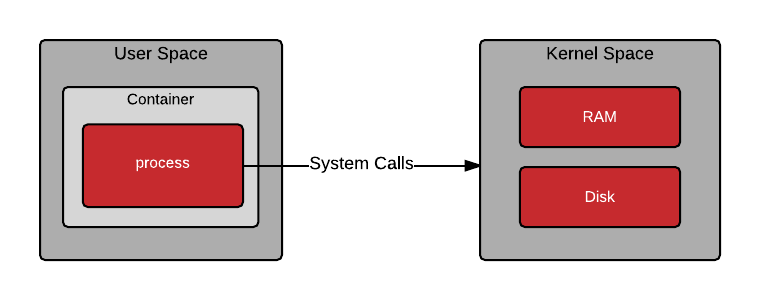
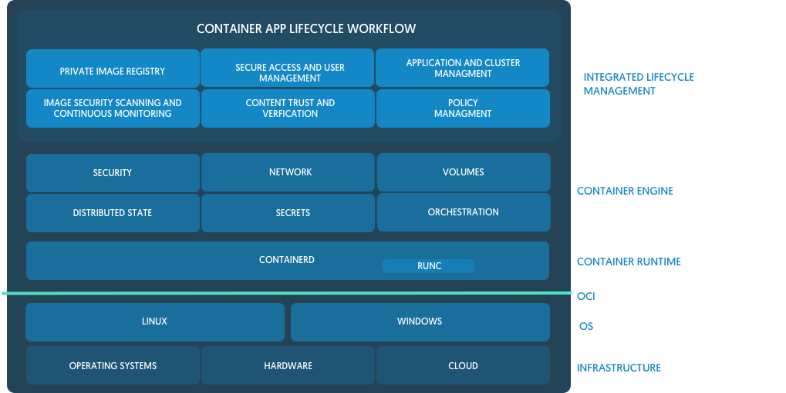
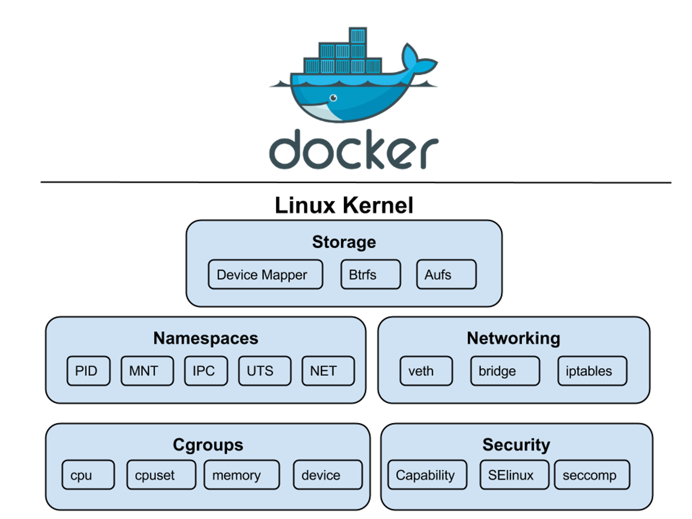

# 컨테이너 톺아보기

- [컨테이너 톺아보기](#컨테이너-톺아보기)
  - [거두절미](#거두절미)
  - [참고 자료](#참고-자료)
  - [리눅스 컨테이너](#리눅스-컨테이너)
    - [컨테이너 엔진](#컨테이너-엔진)
    - [컨테이너 런타임](#컨테이너-런타임)
    - [컨테이너 오케스트레이션](#컨테이너-오케스트레이션)
  - [컨테이너를 만드는 리눅스 커널 기능](#컨테이너를-만드는-리눅스-커널-기능)
    - [네임스페이스: What you can see](#네임스페이스-what-you-can-see)
    - [컨트롤 그룹: What you can use](#컨트롤-그룹-what-you-can-use)
      - [Control Group 드라이버](#control-group-드라이버)
      - [cgroupfs (컨트롤 그룹 파일 시스템)](#cgroupfs-컨트롤-그룹-파일-시스템)
      - [Control Group v1 컨트롤러](#control-group-v1-컨트롤러)
      - [Control Group v2](#control-group-v2)
    - [루트 파일시스템](#루트-파일시스템)
    - [유니온 마운트](#유니온-마운트)
    - [리눅스 캐퍼빌리티](#리눅스-캐퍼빌리티)
  - [샌드박싱 솔루션](#샌드박싱-솔루션)

## 거두절미

생각보다 컨테이너는 간단한 게 아닙니다.
컨테이너를 쉽게 생성하고 삭제할 수 있었던 이유는
도커와 같은 컨테이너 관리 도구가 복잡한 것들을 꽁꽁 감췄기 때문입니다.
컨테이너를 공부하면 할수록 알아야 할 게 더 늘어나고 있지만
이쯤에서 유익했던 자료들을 모아 보려 합니다.

## 참고 자료

- 👍 필수
  - 책 - [컨테이너 보안](https://www.hanbit.co.kr/store/books/look.php?p_code=B8383749156), Liz Rice
  - katacoda - [An Introduction to Containers for Go programmers](https://www.katacoda.com/lizrice/courses/containers-and-go), Liz Rice
- 컨테이너
  - [A Practical Introduction to Container Terminology](https://developers.redhat.com/blog/2018/02/22/container-terminology-practical-introduction/), Scott McCarty
  - [Build Your Own Container Using Less than 100 Lines of Go](https://www.infoq.com/articles/build-a-container-golang/), Julian Friedman
  - [Implementing Container Runtime Shim: runc](https://iximiuz.com/en/posts/implementing-container-runtime-shim/), Ivan Velichko
- 컨테이너 런타임
  - [리눅스 컨테이너란?](https://www.44bits.io/ko/keyword/linux-container), Daegwon Nacyot Kim
  - [흔들리는 도커(Docker)의 위상: OCI와 CRI 중심으로 재편되는 컨테이너 생태계](https://www.samsungsds.com/kr/insights/docker.html), 김준석
  - [Podman and Buildah for Docker users](https://developers.redhat.com/blog/2019/02/21/podman-and-buildah-for-docker-users/), Red Hat
  - [Selecting a container runtime for use with Kubernetes](https://joejulian.name/post/kubernetes-container-engine-comparison/), Joe Julian
  - [Introduction to containerd](https://www.youtube.com/watch?v=q0xt_JrJiIg), Phil Estes (IBM) & Derek McGowan (Docker)
- 컨테이너 오케스트레이션
  - [컨테이너 오케스트레이션이란?](https://www.redhat.com/ko/topics/containers/what-is-container-orchestration), Red Hat
- 네임스페이스
  - [리눅스 네임스페이스란?](https://www.44bits.io/ko/keyword/linux-namespace), Daegwon Nacyot Kim
  - [네임스페이스](http://jake.dothome.co.kr/namespace/), 문영일
  - [Using Linux Namespaces to Isolate Processes](https://windsock.io/using-linux-namespaces-to-isolate-processes/), Scott McCarty
  - [What’s Next for Containers? User Namespaces](https://www.redhat.com/en/blog/whats-next-containers-user-namespaces), Scott McCarty
  - [Evolving Container Security With Linux User Namespaces](https://netflixtechblog.com/evolving-container-security-with-linux-user-namespaces-afbe3308c082), Netflix
  - [Improving Kubernetes and container security with user namespaces](https://kinvolk.io/blog/2020/12/improving-kubernetes-and-container-security-with-user-namespaces/), Alban Crequy
- 컨트롤 그룹
  - [Cgroup Documentation](https://github.com/torvalds/linux/blob/v5.10/Documentation/admin-guide/cgroup-v1/)
  - [Red Hat Resource Management Guide](https://access.redhat.com/documentation/en-us/red_hat_enterprise_linux/6/html/resource_management_guide/)
  - [Cgroup Driver 선택하기](https://tech.kakao.com/2020/06/29/cgroup-driver/), ssup
  - [사라진 800MB를 찾아서](https://b.luavis.kr/server/missing-800mb), Luavis
- 루트 파일세스템
  - [Linux Kernel Documentation - ramfs, rootfs and initramfs](https://www.kernel.org/doc/Documentation/filesystems/ramfs-rootfs-initramfs.txt)
  - [chroot를 사용한 프로세스의 루트 디렉터리 격리](https://www.44bits.io/ko/post/change-root-directory-by-using-chroot), Daegwon Nacyot Kim
- 유니온 마운트
  - [Building container images in Go](https://markruler.github.io/posts/container/building-container-images-in-go/), Ahmet Alp Balkan
  - [도커 이미지 빌드 원리와 OverlayFS](https://www.44bits.io/ko/post/how-docker-image-work), Daegwon Nacyot Kim
  - [A Practical Introduction to Docker Container Terminology](https://developers.redhat.com/blog/2016/01/13/a-practical-introduction-to-docker-container-terminology/), Scott McCarty / Joe Brockmeier
  - [투명 셀로판지 이론을 통한 Overlay FS 사용 방법과 유니온 마운트 이해하기](https://blog.naver.com/alice_k106/221530340759), 최용호
  - [Union Mount, AUFS, Docker Image Layer](https://ssup2.github.io/theory_analysis/Union_Mount_AUFS_Docker_Image_Layer/), ssup2
  - [Use the AUFS storage driver](https://docs.docker.com/storage/storagedriver/aufs-driver), Docker
  - [Unifying filesystems with union mounts](https://lwn.net/Articles/312641/)
- 캐퍼빌리티
  - [capabilities(7)](https://man7.org/linux/man-pages/man7/capabilities.7.html), Linux manual page
  - [What is a Capability, Anyway?](https://archive.is/20130112225523/http://www.eros-os.org/essays/capintro.html), Jonathan Shapiro
  - [권한을 최소화시키는 리눅스 커널 자격](http://www.epnc.co.kr/news/articleView.html?idxno=43405), 이혜원
  - [Linux Capabilities: Why They Exist and How They Work](https://blog.container-solutions.com/linux-capabilities-why-they-exist-and-how-they-work), Adrian Mouat
  - [Linux Capabilities In Practice](https://blog.container-solutions.com/linux-capabilities-in-practice), Adrian Mouat
- 컨테이너 네트워크
  - [Kubernetes Networking](../container-networking/README.md)
  - [UTS 네임스페이스를 사용한 호스트네임 격리 - 컨테이너 네트워크 기초 1편](https://www.44bits.io/ko/post/container-network-1-uts-namespace), Daegwon Nacyot Kim
  - [ip로 직접 만들어보는 네트워크 네임스페이스와 브리지 네트워크 - 컨테이너 네트워크 기초 2편](https://www.44bits.io/ko/post/container-network-2-ip-command-and-network-namespace), Daegwon Nacyot Kim

## 리눅스 컨테이너

> "A Linux container is a set of 1 or more processes that are isolated from the rest of the system."
> [Red Hat](https://www.redhat.com/en/topics/containers/whats-a-linux-container)

리눅스 컨테이너(Linux Container)는 시스템의 다른 부분과 격리된 하나 이상의 프로세스 집합입니다.
즉, 어떤 응용 프로그램이나 프로세스를 일컫는 것이 아니라 그저 리눅스 자원이 격리된 것입니다(‼️).



_출처: [레드햇 블로그 "Architecting Containers Part 1: Why Understanding User Space vs. Kernel Space Matters" - Scott McCarty (fatherlinux)](https://www.redhat.com/en/blog/architecting-containers-part-1-why-understanding-user-space-vs-kernel-space-matters)_


_출처: [레드햇 블로그 "Architecting Containers Part 2: Why the User Space Matters" - Scott McCarty (fatherlinux)](https://www.redhat.com/en/blog/architecting-containers-part-2-why-user-space-matters)_

### 컨테이너 엔진

[컨테이너 엔진(Container Engine)](https://developers.redhat.com/blog/2018/02/22/container-terminology-practical-introduction/#h.6yt1ex5wfo3l)은
컨테이너를 관리하기 위한 API나 CLI 도구를 제공하는 소프트웨어입니다.
`도커 엔진(docker-ce)`부터 레드햇의 `파드맨(Podman)`, 로켓 컴퍼니의 `rkt` 등이
컨테이너 엔진에 해당합니다. 컨테이너 엔진은 사용자 입력을 받고, 컨테이너
이미지를 꺼내고(pull), 컨테이너 실행 방법을 명시한 메타데이터를 만든 다음,
컨테이너 런타임에 이 정보들을 전달합니다.

### 컨테이너 런타임

컨테이너 런타임(Container Runtime)은 루트 파일시스템과 메타 데이터(spec file)를
받아 컨테이너를 실행하는 도구입니다. 가장 일반적으로 쓰이는 런타임은 OCI를 준수하는
[`runC`](https://github.com/opencontainers/runc)입니다.
흔히 쓰이는 [`컨테이너-디 (containerd)`](https://github.com/containerd/containerd/blob/master/pkg/process/init.go#L64),
[`크라이-오 (cri-o)`](https://github.com/cri-o/cri-o/blob/master/pkg/config/config.go#L38-L40)도 실제로는 `runC`에 의존합니다.



_출처: [Docker Leads OCI Release of v1.0 Runtime and Image Format Specifications](https://www.docker.com/blog/oci-release-of-v1-0-runtime-and-image-format-specifications/)_


_출처: [Kubernetes Containerd Integration Goes GA](https://kubernetes.io/blog/2018/05/24/kubernetes-containerd-integration-goes-ga/)_

> 최근 쿠버네티스 블로그에 업로드된 Dockershim 제거에 대한 글[^1][^2]로
> 도커를 못 쓰게 된 건지 혼란이 있었습니다. 도커가 워낙 만능이다보니
> "컨테이너 엔진==컨테이너 런타임==CRI==도커"라는 오해에서 비롯되었습니다.
> 자세한 내용은 [서비큐라님 글](https://subicura.com/k8s/2020/12/19/deprecate-docker),
> [조훈님과 심근우님 글](https://www.slideshare.net/JoHoon1/the-myths-of-deprecating-docker-in-kubernetes)을 참고해주세요.

[^1]: [Don't Panic: Kubernetes and Docker](https://kubernetes.io/blog/2020/12/02/dont-panic-kubernetes-and-docker/)
[^2]: [Dockershim Deprecation FAQ](https://kubernetes.io/blog/2020/12/02/dockershim-faq/)


_출처: [Linux Container Internals - Scott McCarty](https://www.katacoda.com/fatherlinux/courses/subsystems/container-internals-lab-2-0-part-1)_

### 컨테이너 오케스트레이션

컨테이너 오케스트레이션(Container Orchestration)은 컨테이너 배포, 관리, 확장, 네트워킹 등을 자동화합니다.
대표적으로 CNCF에서 관리하고 있는 [쿠버네티스](https://kubernetes.io/)가 있습니다.

## 컨테이너를 만드는 리눅스 커널 기능

처음에는 리눅스 커널까지 깊게 알아야 하나 싶었는데
[사라진 메모리를 찾아가는 Luavis님 글](https://b.luavis.kr/server/missing-800mb)을
읽어보니 반드시 알아야겠다고 생각이 들었습니다.
대표적으로 쓰이는 리눅스 커널 기능은 네임스페이스와 컨트롤 그룹 등이 있습니다.



_출처: [educative](https://www.educative.io/edpresso/what-are-kernel-namespaces)_

### 네임스페이스: What you can see

리눅스 네임스페이스(Namespace)는 프로세스 실행 시 시스템 자원을 격리시켜주는 기능입니다.

> [`namespaces`(7)](https://man7.org/linux/man-pages/man7/namespaces.7.html)

- 네임스페이스 유형

| 네임스페이스            | 플래그            | 경로                                                  | 매뉴얼                                                                                   | 격리 대상                            |
| ----------------------- | ----------------- | ----------------------------------------------------- | ---------------------------------------------------------------------------------------- | ------------------------------------ |
| Cgroup                  | `CLONE_NEWCGROUP` | /proc/[pid]/ns/cgroup                                 | [cgroup_namespaces(7)](https://man7.org/linux/man-pages/man7/cgroup_namespaces.7.html)   | Cgroup root directory                |
| IPC                     | `CLONE_NEWIPC`    | /proc/[pid]/ns/ipc                                    | [ipc_namespaces(7)](https://man7.org/linux/man-pages/man7/ipc_namespaces.7.html)         | System V IPC, POSIX message queues   |
| Network                 | `CLONE_NEWNET`    | /proc/[pid]/ns/net                                    | [network_namespaces(7)](https://man7.org/linux/man-pages/man7/network_namespaces.7.html) | Network devices, stacks, ports, etc. |
| Mount                   | `CLONE_NEWNS`     | /proc/[pid]/ns/mnt                                    | [mount_namespaces(7)](https://man7.org/linux/man-pages/man7/mount_namespaces.7.html)     | Mount points                         |
| PID                     | `CLONE_NEWPID`    | /proc/[pid]/ns/pid, /proc/[pid]/ns/pid_for_children   | [pid_namespaces(7)](https://man7.org/linux/man-pages/man7/pid_namespaces.7.html)         | Process IDs                          |
| Time                    | `CLONE_NEWTIME`   | /proc/[pid]/ns/time, /proc/[pid]/ns/time_for_children | [time_namespaces(7)](https://man7.org/linux/man-pages/man7/time_namespaces.7.html)       | Boot and monotonic clocks            |
| User                    | `CLONE_NEWUSER`   | /proc/[pid]/ns/user                                   | [user_namespaces(7)](https://man7.org/linux/man-pages/man7/user_namespaces.7.html)       | User and group IDs                   |
| UTS (UNIX Time Sharing) | `CLONE_NEWUTS`    | /proc/[pid]/ns/uts                                    | [uts_namespaces(7)](https://man7.org/linux/man-pages/man7/uts_namespaces.7.html)         | Hostname and NIS domain name         |

- 네임스페이스 관련 API

| 시스템 호출                                                     | 설명                                                                                                           |
| --------------------------------------------------------------- | -------------------------------------------------------------------------------------------------------------- |
| [clone](https://man7.org/linux/man-pages/man2/clone.2.html)     | 새로운 자식 프로세스를 생성합니다. 위의 표에서 `CLONE_NEW*` 플래그를 인수로 지정합니다.                        |
| [setns](https://man7.org/linux/man-pages/man2/setns.2.html)     | 시스템 호출한 프로세스가 `/proc/[pid]/ns`를 참조해 기존 네임스페이스에 할당됩니다.                             |
| [unshare](https://man7.org/linux/man-pages/man2/unshare.2.html) | 시스템 호출한 프로세스가 새로운 네임스페이스에 할당됩니다. 마찬가지로 `CLONE_NEW*` 플래그를 인수로 지정합니다. |
| [ioctl](https://man7.org/linux/man-pages/man2/ioctl.2.html)     | 네임스페이스 관련 정보를 찾기 위한 다양한 기능을 제공합니다. 기본적으로 디바이스 제어 API입니다.               |

- `clone`과 `unshare`는 `CAP_SYS_ADMIN` [캐퍼빌리티](#리눅스-캐퍼빌리티linux-capabilities)가 필요합니다.

- [네임스페이스 호환성 문제](https://github.com/torvalds/linux/blob/v5.10/Documentation/admin-guide/namespaces/compatibility-list.rst)

### 컨트롤 그룹: What you can use

> 보통 `씨-그룹`이나 `컨트롤-그룹`이라고 발음합니다.

컨트롤 그룹(cgroup, control group)은 프로세스에서 사용 가능한 CPU, 메모리, 네트워크 대역폭, 디스크 I/O 등을
그룹 단위로 제어하는 리눅스 커널의 기능입니다.
원래는 [프로세스 컨테이너](https://lwn.net/Articles/236038/)라는
이름으로 제안되었지만, 나중에 컨트롤 그룹이 되었습니다.
컨트롤 그룹은 컨테이너에서만 사용되는 기능은 아니고
리눅스 시스템에서 프로세스 관리를 위해 일반적으로 사용되고 있습니다.

#### [Control Group 드라이버](https://kubernetes.io/ko/docs/setup/production-environment/container-runtimes/#cgroup-%EB%93%9C%EB%9D%BC%EC%9D%B4%EB%B2%84)

- cgroupfs
- systemd

```bash
sudo docker info -f '{{json .}}' | jq '. | .CgroupDriver'
# "cgroupfs"
```

#### cgroupfs (컨트롤 그룹 파일 시스템)

- `memory` 중에서도 [일부분만 갈무리](https://www.kernel.org/doc/html/latest/admin-guide/cgroup-v1/memory.html#benefits-and-purpose-of-the-memory-controller)해봤습니다.

| tasks                              | attach a task(thread) and show list of threads      |
| ---------------------------------- | --------------------------------------------------- |
| cgroup.procs                       | show list of processes                              |
| cgroup.event_control               | an interface for event_fd()                         |
| memory.stat                        | show various statistics                             |
| memory.limit_in_bytes              | set/show limit of memory usage                      |
| memory.usage_in_bytes              | show current usage for memory (See 5.5 for details) |
| memory.max_usage_in_bytes          | show max memory usage recorded                      |
| memory.numa_stat                   | show the number of memory usage per numa node       |
| memory.kmem.tcp.max_usage_in_bytes | show max tcp buf memory usage recorded              |
| ...                                | ...                                                 |

#### Control Group v1 컨트롤러

| 컨트롤러                                                                                                          | 커널 설정 옵션              | 설명                                                                                                  |
| ----------------------------------------------------------------------------------------------------------------- | --------------------------- | ----------------------------------------------------------------------------------------------------- |
| [blkio](https://github.com/torvalds/linux/blob/v5.10/Documentation/admin-guide/cgroup-v1/blkio-controller.rst)    | `CONFIG_BLK_CGROUP`         | 블록 IO 제어                                                                                          |
| [cpuacct](https://github.com/torvalds/linux/blob/v5.10/Documentation/admin-guide/cgroup-v1/cpuacct.rst)           | `CONFIG_CGROUP_CPUACCT`     | 프로세스 그룹 CPU 사용량 계산                                                                         |
| [cpuset](https://github.com/torvalds/linux/blob/v5.10/Documentation/admin-guide/cgroup-v1/cpusets.rst)            | `CONFIG_CPUSETS`            | 특정 CPU나 NUMA 노드 할당                                                                             |
| [devices](https://github.com/torvalds/linux/blob/v5.10/Documentation/admin-guide/cgroup-v1/devices.rst)           | `CONFIG_CGROUP_DEVICE`      | [`mknod`](https://man7.org/linux/man-pages/man2/mknod.2.html)를 통해 디바이스를 관리할 수 있는지 결정 |
| [freezer](https://github.com/torvalds/linux/blob/v5.10/Documentation/admin-guide/cgroup-v1/freezer-subsystem.rst) | `CONFIG_CGROUP_FREEZER`     | 프로세스 일시 정지-재개                                                                               |
| [memory](https://github.com/torvalds/linux/blob/v5.10/Documentation/admin-guide/cgroup-v1/memory.rst)             | `CONFIG_MEMCG`              | 사용중인 프로세스 메모리, 커널 메모리, 스왑 메모리 관리                                               |
| [net_cls](https://github.com/torvalds/linux/blob/v5.10/Documentation/admin-guide/cgroup-v1/net_cls.rst)           | `CONFIG_CGROUP_NET_CLASSID` | 트래픽 제어에 쓰이는 classid 관리                                                                     |
| [net_prio](https://github.com/torvalds/linux/blob/v5.10/Documentation/admin-guide/cgroup-v1/net_prio.rst)         | `CONFIG_CGROUP_NET_PRIO`    | 네트워크 인터페이스 우선순위(priorities) 관리                                                         |
| [pids](https://github.com/torvalds/linux/blob/v5.10/Documentation/admin-guide/cgroup-v1/pids.rst)                 | `CONFIG_CGROUP_PIDS`        | 생성할 수 있는 프로세스 수 관리                                                                       |
| ...                                                                                                               | ...                         | ...                                                                                                   |

#### Control Group v2

cgroups v2가 Linux 커널 4.5부터 공식적으로 포함되었습니다. 자세한 내용은
[Akihiro Suda의 글](https://medium.com/nttlabs/cgroup-v2-596d035be4d7)과
[커널 문서](https://www.kernel.org/doc/html/latest/admin-guide/cgroup-v2.html)를
참고해주세요.

### 루트 파일시스템

루트 파일시스템(Root File System)이란 `ramfs`나 `tmpfs`의 특수 인스턴스로
루트 디렉토리(`/`)에 마운트되는 파일 시스템을 말합니다.
`rootfs`은 커널이 동작하기 위한 필수 파일들이 있기 때문에 마운트를 해제할 수 없습니다.
`chroot`나 `pivot_root` 명령어로 `rootfs` 경로를 변경(chroot jail)하여 파일 시스템을 격리할 수 있습니다.

### 유니온 마운트

유니온 마운트(Union Mount)란 여러 파일 시스템을 단일 포인트로 마운트하는 것을 말합니다.
컨테이너에 필수적인 기능은 아니지만 이미지 레이어 구현에 사용되면서 필수적인
기능으로 자리잡았습니다. 예를 들면 도커가 사용하는 [AUFS](https://docs.docker.com/storage/storagedriver/aufs-driver/), [OverlayFS](https://docs.docker.com/storage/storagedriver/overlayfs-driver/) 등이 있습니다.


출처: [Use the AUFS storage driver - docker docs](https://docs.docker.com/storage/storagedriver/aufs-driver/)


_출처: [Use the OverlayFS storage driver - docker docs](https://docs.docker.com/storage/storagedriver/overlayfs-driver/#how-the-overlay-driver-works)_

### [리눅스 캐퍼빌리티](https://man7.org/linux/man-pages/man7/capabilities.7.html)

[POSIX capabilities](https://en.wikipedia.org/wiki/Capability-based_security#POSIX_capabilities)
개념으로 루트 프로세스 권한을 세부적으로 제어하기 위한 속성입니다. '자격', '능력' 등으로 번역됩니다.

캐퍼빌리티가 없을 때 프로세스는 두 가지로만 나뉘었습니다.

- (User ID가 0인, superuser라 불리는) 루트 사용자가 소유한 특권(privileged) 프로세스
- (User ID가 0이 아닌) 일반 사용자가 소유한 비특권(unprivileged) 프로세스.

이 중 루트 권한을 세분화해서 프로세스마다 다르게 적용할 수 있도록 만든 기능이 바로 리눅스 캐퍼빌리티입니다.
컨테이너 런타임에서 루트 권한 일부분만 필요할 경우 리눅스 캐퍼빌리티를 사용합니다.

## 샌드박싱 솔루션

> 샌드박싱이란? 자원 접근이 제한되도록 응용 프로그램을 격리하는 것 - <컨테이너 보안> 참조

- seccomp
- AppArmor
- SELinux
