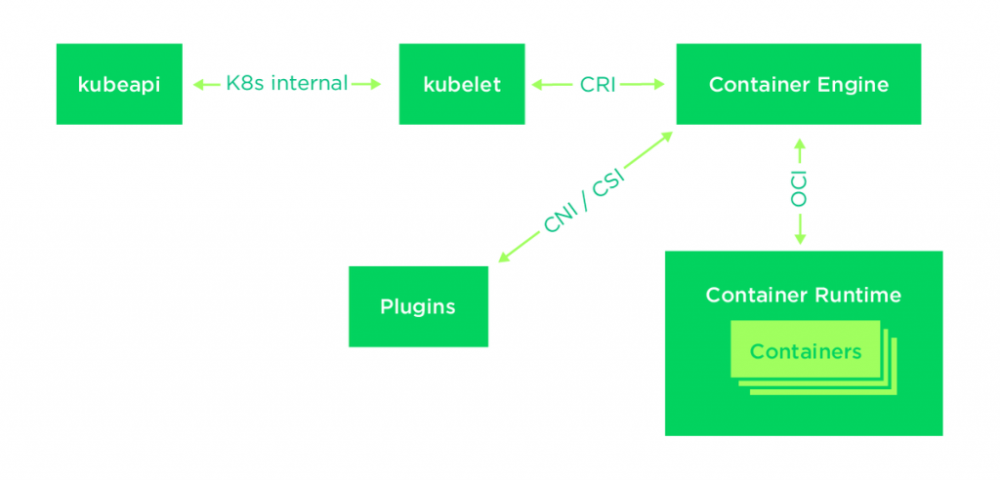
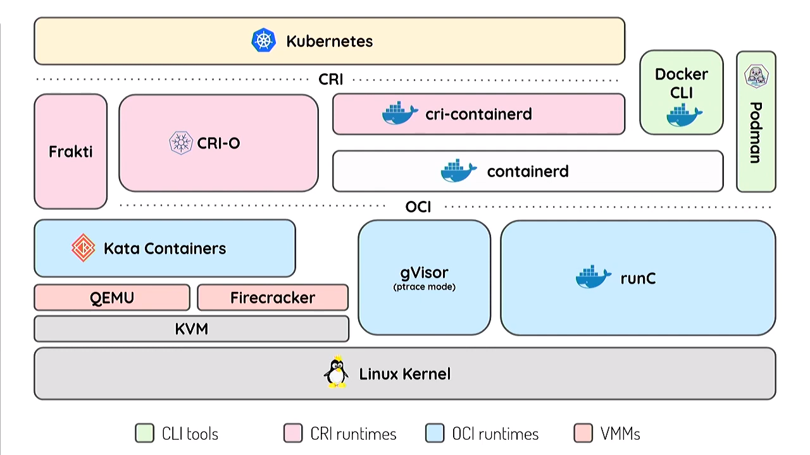

# Container Runtime Interface (for Kubernetes)

## References

- [kubernetes/cri-api](https://github.com/kubernetes/cri-api)
  - [godoc](https://pkg.go.dev/k8s.io/cri-api)
  - TODO: [API v0.21.0](https://github.com/kubernetes/cri-api/blob/v0.21.0/pkg/apis/runtime/v1/api.proto) markdown 형식으로 정리 및 번역하기
- [Getting Started with Kubernetes | Kubernetes Container Runtime Interface](https://www.alibabacloud.com/blog/getting-started-with-kubernetes-%7C-kubernetes-container-runtime-interface_596339) - Alibaba Cloud
- [흔들리는 도커(Docker)의 위상: OCI와 CRI 중심으로 재편되는 컨테이너 생태계](https://www.samsungsds.com/kr/insights/docker.html) - Samsung SDS

## Architecture

_출처: [Technical Deep-Dive of Container Runtimes](https://www.suse.com/c/technical-deep-dive-of-container-runtimes/) - Andrew Gracey_

_출처: [Below Kubernetes: Demystifying container runtimes](https://youtu.be/MDsjINTL7Ek) - Thierry Carrez_
