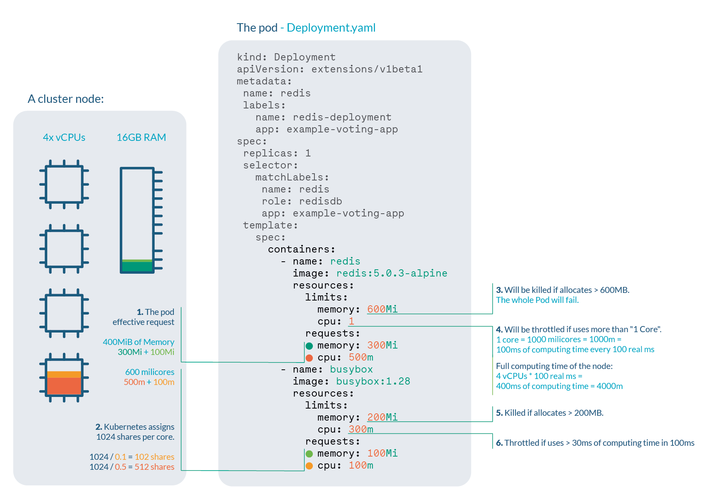

# Resource Requests, Limits

- [Resource Requests, Limits](#resource-requests-limits)
  - [개요](#개요)
    - [QoS](#qos)
  - [설정](#설정)
    - [Pod Level](#pod-level)
    - [Namespace Level](#namespace-level)
      - [`ResourceQuota`](#resourcequota)
      - [`LimitRange`](#limitrange)
  - [References](#references)

## 개요

- 공식 문서를 봐도 이해가 안 되는 QoS와 리소스 Request, Limit을 정리합니다.
- OS 커널은 노드의 메모리가 부족할 때 OOM Killer를 호출합니다.
- kubelet이 메모리 부족을 즉각적으로 관측하지 못할 수 있습니다.


_출처: [How to waste money using Kubernetes](https://brennerm.github.io/posts/wasting-money-with-kubernetes.html) - Max Brenner_

### QoS

> QoS(Quality of Service)는 다른 응용 프로그램, 사용자, 데이터 흐름 등에 우선 순위를 정하여, 데이터 전송에 특정 수준의 성능을 보장하기 위한 능력을 말한다. [위키백과](https://ko.wikipedia.org/wiki/QoS)

| Priority    | Class Name   | Description                                                                                                                                                                                                                   |
| ----------- | ------------ | ----------------------------------------------------------------------------------------------------------------------------------------------------------------------------------------------------------------------------- |
| 1 (highest) | `Guaranteed` | `requests`, `limits`가 0이 아닌 값으로 **서로 똑같이** 설정되었을 경우 설정됩니다. `limits` 값을 초과할 경우 파드가 종료됩니다. 메모리 사용량이 높을 경우(memory pressure) 우선순위가 낮은 컨테이너부터 축출됩니다.           |
| 2           | `Burstable`  | `Guaranteed` 클래스 기준을 만족하지 못하면서 `requests`, `limits`가 0이 아닌 값으로 **서로 다르게** 설정되었을 경우 설정됩니다. 시스템의 메모리가 부족할 경우(out of memory) `requests` 값을 초과한 해당 파드들은 종료됩니다. |
| 3 (lowest)  | `BestEffort` | `requests`, `limits`가 **설정되지 않았을** 경우 설정됩니다. 노드의 남은 리소스를 마음껏 사용할 수 있습니다. 시스템에 OOM이 발생하면 해당 파드를 종료합니다.                                                                   |

## 설정

### Pod Level



_출처: [Understanding Kubernetes limits and requests by example](https://sysdig.com/blog/kubernetes-limits-requests/) - sysdig_

```bash
kubectl get nodes --no-headers | awk '{print $1}' | xargs -I {} sh -c 'echo {}; kubectl describe node {} | grep Allocated -A 5 | grep -ve Event -ve Allocated -ve percent -ve -- ; echo'
# edge1
#   Resource           Requests     Limits
#   cpu                1900m (47%)  1300m (32%)
#   memory             820Mi (10%)  1120Mi (14%)

# edge2
#   Resource           Requests    Limits
#   cpu                850m (21%)  1300m (32%)
#   memory             520Mi (6%)  1120Mi (14%)

# edge3
#   Resource           Requests    Limits
#   cpu                750m (18%)  1300m (32%)
#   memory             450Mi (5%)  950Mi (12%)
```

### Namespace Level

#### `ResourceQuota`

네임스페이스 전체에 적용

#### `LimitRange`

네임스페이스에 생성되지만 `ResourceQuota`와 달리 각각의 컨테이너에 적용

## References

- [Kubernetes best practices: Resource requests and limits](https://cloud.google.com/blog/products/containers-kubernetes/kubernetes-best-practices-resource-requests-and-limits) - Google Cloud
- [Resource Quality of Service in Kubernetes](https://github.com/kubernetes/community/blob/f7a96973a4a1944f406d1661fd3f4d52ecfbdf41/contributors/design-proposals/node/resource-qos.md) - kubernetes/community (Design Proposal)
- [Kubernetes Resources Management – QoS, Quota, and LimitRange](https://www.cncf.io/blog/2020/06/10/kubernetes-resources-management-qos-quota-and-limitrangeb/) - CNCF Blog
- [파드에 대한 서비스 품질(QoS) 구성](https://kubernetes.io/ko/docs/tasks/configure-pod-container/quality-service-pod/) - Kubernetes Docs
- [Configure Out of Resource Handling](https://kubernetes.io/docs/tasks/administer-cluster/out-of-resource/) - Kubernetes Docs
- [How to troubleshoot Kubernetes OOM and CPU Throttle](https://sysdig.com/blog/troubleshoot-kubernetes-oom/) - sysdig
- [Understanding Kubernetes limits and requests by example](https://sysdig.com/blog/kubernetes-limits-requests/) - sysdig
