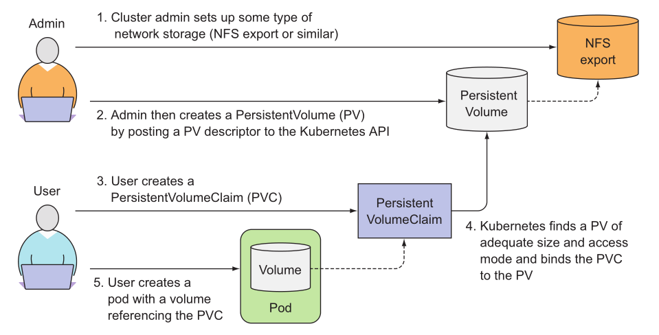

# 컨테이너 스토리지 톺아보기

- [컨테이너 스토리지 톺아보기](#컨테이너-스토리지-톺아보기)
  - [참고 자료](#참고-자료)
  - [Kubernetes Storage API](#kubernetes-storage-api)
    - [Volume Plugins](#volume-plugins)
    - [PersistentVolume (PV)](#persistentvolume-pv)
    - [PersistentVolumeClaim (PVC)](#persistentvolumeclaim-pvc)
    - [StorageClass (SC)](#storageclass-sc)
    - [Container Storage Interface (CSI)](#container-storage-interface-csi)
  - [ReplicaSet과의 관계](#replicaset과의-관계)
  - [스토리지(Storage)와 볼륨(Volume)의 차이](#스토리지storage와-볼륨volume의-차이)
  - [스토리지 종류](#스토리지-종류)

## 참고 자료

- [Container Storage Interface (CSI) for Kubernetes GA](https://kubernetes.io/blog/2019/01/15/container-storage-interface-ga/)
- [CSI Driver List](https://kubernetes-csi.github.io/docs/drivers.html)
- [CSI NFS Driver](https://github.com/kubernetes-csi/csi-driver-nfs)
- [Understanding persistent storage](https://docs.openshift.com/container-platform/latest/storage/understanding-persistent-storage.html) - Red Hat OpenShift
- [Kubernetes Storage: Dynamic Volumes and the Container Storage Interface](https://platform9.com/blog/kubernetes-storage-dynamic-volumes-and-the-container-storage-interface/) - Platform9
- [Getting Started with Kubernetes | Storage Architecture and Plug-ins](https://www.alibabacloud.com/blog/getting-started-with-kubernetes-%7C-storage-architecture-and-plug-ins_596307) - Kan Junbao
- [What Is Kubernetes Storage? How Persistent Storage Works](https://www.enterprisestorageforum.com/cloud/kubernetes-storage/) - Sean Michael Kerner
- [Introduction to Kubernetes Storage and NVMe-oF Support](https://01.org/kubernetes/blogs/qwang10/2019/introduction-kubernetes-storage-and-nvme-support) - Shane Wang
- [CSI](https://github.com/kodekloudhub/certified-kubernetes-administrator-course/blob/master/docs/08-Storage/05-Container.Storage-Interface.md) - KodeKloud

## Kubernetes Storage API

_출처: [Kubernetes Patterns](https://developers.redhat.com/blog/2020/05/11/top-10-must-know-kubernetes-design-patterns/) - Red Hat_

### Volume Plugins

- `emptyDir`: 파드가 노드에 할당될 때 처음 생성되며, 해당 노드에서 파드가 실행되는 동안에만 존재합니다.
  일시적인 데이터를 저장하는 데 사용되는 비어있는 단순한 디렉터리입니다.
  동일한 파드 내부에서 싫행 중인 컨테이너 간에 파일을 공유할 때 특히 유용합니다.
- `hostPath`: 호스트 노드의 파일시스템에 있는 파일이나 디렉터리를 파드에 마운트 합니다.
- `local`: 디스크, 파티션 또는 디렉터리 같은 마운트된 로컬 스토리지 장치를 나타냅니다. 정적으로 생성된 PV로만 사용할 수 있습니다. `hostPath` 볼륨에 비해 수동으로 파드를 노드에 예약하지 않고도 내구성과 휴대성을 갖춘 방식으로 사용된다.
- `persistentVolumeClaim`: 사전 또는 동적으로 프로비저닝된 영구 스토리지를 사용하는 방법입니다.
- `nfs`: 기존 NFS (네트워크 파일 시스템) 볼륨을 파드에 마운트 할수 있습니다. 파드를 제거할 때 지워지는 `emptyDir` 와는 다르게 `nfs` 볼륨의 내용은 유지되고, 볼륨은 그저 마운트 해제만 됩니다.
- `configMap`, `secret`, `downwardAPI`: 특정 쿠버네티스 리소스 및 클러스터 정보를 파드에 노출하는 데 사용되는 특수한 유형의 볼륨입니다.
- `cinder`, `cephfs`, `iscsi`, `glusterfs`, `vsphere-Volume`, `...`: 다른 유형의 네트워크 스토리지를 마운트하는 데 사용됩니다.
- ...

### PersistentVolume (PV)

- 관리자가 프로비저닝하거나 스토리지 클래스를 사용하여 동적으로 프로비저닝한 클러스터의 스토리지입니다.
- 파드에 마운트된 모든 볼륨을 백업하는 디스크로 볼 수 있습니다.
- 노드가 클러스터 리소스인 것처럼 PV도 클러스터 리소스입니다.
- PV는 Volumes와 같은 볼륨 플러그인이지만, PV를 사용하는 개별 파드와는 별개의 라이프사이클을 가집니다.
- 이 API 오브젝트는 NFS, iSCSI 또는 클라우드 공급자별 스토리지 시스템 등 스토리지 구현에 대한 세부 정보를 담아냅니다.

### PersistentVolumeClaim (PVC)

- 사용자의 스토리지에 대한 요청입니다.
- 파드가 노드 리소스를 사용한다면 PVC는 PV 리소스를 사용합니다.
- 파드는 특정 수준의 리소스(CPU 및 메모리)를 요청할 수 있습니다.
- PVC는 특정 크기 및 접근 모드를 요청할 수 있습니다.
  - 예를 들어, `AccessModes` 필드에 `ReadWriteOnce`, `ReadOnlyMany` 또는 `ReadWriteMany`라고 지정해서 마운트 할 수 있습니다.

### StorageClass (SC)

- 스토리지클래스는 관리자가 제공하는 스토리지의 `classes`를 설명할 수 있는 방법을 제공합니다.
- 다른 클래스는 서비스의 품질 수준 또는 백업 정책, 클러스터 관리자가 정한 임의의 정책에 매핑될 수 있습니다.
- 쿠버네티스 자체는 클래스가 무엇을 나타내는지에 대해 상관하지 않습니다. 다른 스토리지 시스템에서는 이 개념을 `profiles`이라고도 합니다.
- 동적 볼륨 프로비저닝의 구현은 storage.k8s.io API 그룹의 StorageClass API 오브젝트를 기반으로 합니다.

> _static provisioning_

_출처: [Kubernetes in Action (1/E)](https://www.manning.com/books/kubernetes-in-action)_ - 2021 여름에 2판 예정

> _dynamic provisioning_

### Container Storage Interface (CSI)

- 스토리지 벤더가 플러그인을 한 번만 개발해도 수많은 컨테이너 오케스트레이션 시스템에서 동작할 수 있는 산업 표준 컨테이너 스토리지 인터페이스를 정의합니다.

## ReplicaSet과의 관계

- `replicas`가 3이고, PVC 정의를 갖춘 ReplicaSet는 3개의 Pod가 동일한 PV에 연결됩니다.

## 스토리지(Storage)와 볼륨(Volume)의 차이

- [Volume](<https://en.wikipedia.org/wiki/Volume_(computing)>): In computer data storage, a volume or logical drive is a single accessible storage area with a single file system, typically (though not necessarily) resident on a single partition of a hard disk.
- [Storage](https://en.wikipedia.org/wiki/Computer_data_storage): Computer data storage is a technology consisting of computer components and recording media that are used to retain digital data.

## 스토리지 종류

- [파일 스토리지, 블록 스토리지, 오브젝트 스토리지](https://www.redhat.com/ko/topics/data-storage/file-block-object-storage) - RedHat
- [파일 스토리지, 오브젝트 스토리지, 블록 스토리지의 차이](https://www.alibabacloud.com/ko/knowledge/difference-between-object-storage-file-storage-block-storage) - Alibaba Cloud
