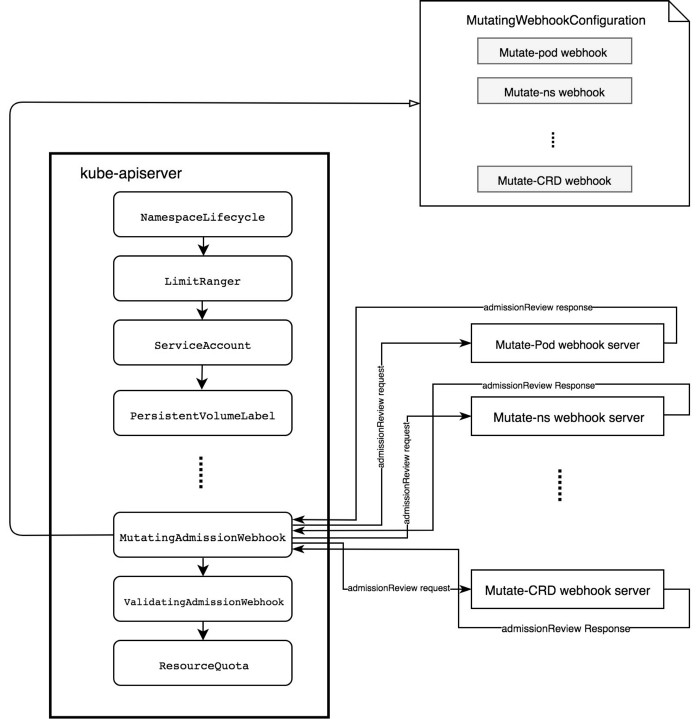

# Kubernetes API 요청 프로세스

- [Kubernetes API 요청 프로세스](#kubernetes-api-요청-프로세스)
  - [참고 자료](#참고-자료)
  - [개요](#개요)
    - [용어](#용어)
    - [이벤트 체인](#이벤트-체인)
  - [인증](#인증)
  - [인가](#인가)
  - [어드미션 컨트롤러](#어드미션-컨트롤러)
    - [표준(standard) 어드미션 컨트롤러](#표준standard-어드미션-컨트롤러)
      - [기본적으로 활성화되는 어드미션 컨트롤러](#기본적으로-활성화되는-어드미션-컨트롤러)
      - [추가할 수 있는 어드미션 컨트롤러](#추가할-수-있는-어드미션-컨트롤러)
    - [동적(dynamic) 어드미션 컨트롤러](#동적dynamic-어드미션-컨트롤러)
      - [`MutatingAdmissionWebhook` 기능에 필요한 오브젝트 3가지](#mutatingadmissionwebhook-기능에-필요한-오브젝트-3가지)
      - [Admission Webhook - Webhook Configuration 헷갈리지 마세요](#admission-webhook---webhook-configuration-헷갈리지-마세요)
      - [예시](#예시)
    - [어드미션 컨트롤러의 일반적인 용도](#어드미션-컨트롤러의-일반적인-용도)
    - [어드미션 컨트롤러 모범 사례 (Best Practice)](#어드미션-컨트롤러-모범-사례-best-practice)
  - [etcd](#etcd)

## 참고 자료

- 책 <쿠버네티스 모범 사례> - 브렌던 번스, 에디 비얄바, 데이브 스트레벨, 라클런 이븐슨
- [Diving into Kubernetes MutatingAdmissionWebhook](https://medium.com/ibm-cloud/diving-into-kubernetes-mutatingadmissionwebhook-6ef3c5695f74) - IBM Cloud Blog
  - [source code](https://github.com/morvencao/kube-mutating-webhook-tutorial)
- [Admission Controller의 이해 및 Python으로 Mutate Webhook 작성 예제](https://m.blog.naver.com/alice_k106/221546328906) - alice
- [Kubernetes API Concepts](https://kubernetes.io/docs/reference/using-api/api-concepts/) - Kubernetes Docs
- [A Guide to Kubernetes Admission Controllers](https://kubernetes.io/blog/2019/03/21/a-guide-to-kubernetes-admission-controllers/) - Kubernetes Blog
- [Using Admission Controllers](https://kubernetes.io/docs/reference/access-authn-authz/admission-controllers/) - Kubernetes Docs
- [Extending Kubernetes — Part 2 — Mutating Webhook](https://medium.com/swlh/extending-kubernetes-part-2-mutating-webhook-54076097afeb) - Krishnaraj Varma
- [Kubernetes Deep Dive: API Server – Part 2](https://www.openshift.com/blog/kubernetes-deep-dive-api-server-part-2) - Red Hat Openshift Blog

## 개요

Kubernetes API는 HTTP를 통해 제공되는 리소스 기반 (RESTful) 프로그래밍 인터페이스입니다.

### 용어

- **리소스 타입(resource type)** 은 URL(`pods`, `namespaces`, `services`)에 사용되는 이름입니다.
- 리소스 타입의 단일 인스턴스를 **리소스(resource)** 라고 합니다.
- 리소스 타입의 인스턴스 목록을 **컬렉션(collection)** 이라고 합니다.
- 모든 리소스 타입에는 JSON 형식으로 된 구체적인 표현(해당 오브젝트 스키마)을 가지고 있으며 이를 **kind**라고 합니다.

### 이벤트 체인


_출처: [쿠버네티스 API 접근 제어하기](https://kubernetes.io/ko/docs/concepts/security/controlling-access/)_


> API Server에 요청이 들어오면 바로 etcd에 오브젝트 데이터를 저장하는 것이 아니라 위와 같은 단계(Phase)를 거치게 됩니다.

| #   | Phase                         | Description                                                                                                                                                                                                                                                                                                                                                                                                                                                                          |
| --- | ----------------------------- | ------------------------------------------------------------------------------------------------------------------------------------------------------------------------------------------------------------------------------------------------------------------------------------------------------------------------------------------------------------------------------------------------------------------------------------------------------------------------------------ |
| 1   | **인증** (Authentication)     | 신원 증명. 인증 모듈은 클라이언트 인증서, 암호 및 일반 토큰, 부트스트랩 토큰, 서비스 어카운트에 사용되는 JWT 토큰을 포함합니다. 여러 개의 인증 모듈을 지정할 수 있으며, 이 경우 하나의 인증 모듈이 성공할 때까지 각 모듈을 순차적으로 시도합니다. 인증할 수 없는 경우 요청이 거부됩니다(HTTP 상태 코드 401 Unauthorized).                                                                                                                                                      |
| 2   | **인가** (Authorization)      | 권한 부여. 쿠버네티스는 ABAC 모드, RBAC 모드, 웹훅 모드와 같은 여러 개의 인가 모듈을 지원합니다. 인가 모듈이 2개 이상 구성되면 쿠버네티스가 각 모듈을 확인하고, 어느 모듈이 요청을 승인하면 요청을 진행할 수 있습니다. 모든 모듈이 요청을 거부하면 요청이 거부됩니다(HTTP 상태 코드 403 Forbidden).                                                                                                                                                                                  |
| 3   | **변환** (Mutation)           | 오브젝트를 변경시킬(mutate) 수 있는 어드미션 웹훅(`MutatingAdmissionWebhook`)이 동작합니다.                                                                                                                                                                                                                                                                                                                                                                                          |
| 4   | **유효성 검사** (Validation)  | 오브젝트 스키마가 올바른 형식인지 검증합니다. 예를 들어 [kube-openapi](https://github.com/kubernetes/kube-openapi)(Open API)를 따르는지, CRD 형식을 따르는지, 필수 필드가 설정되어 있는지 등등 ([apimachinery](https://github.com/kubernetes/apimachinery/blob/v0.21.0/pkg/api/validation/objectmeta.go), [apiextensions-apiserver](https://github.com/kubernetes/kubernetes/blob/v1.21.0/staging/src/k8s.io/apiextensions-apiserver/pkg/apiserver/schema/objectmeta/validation.go)) |
| 5   | **유효성 검사 어드미션 웹훅** | `ValidatingAdmissionWebhook`을 통해 추가적인 검증을 수행                                                                                                                                                                                                                                                                                                                                                                                                                             |
| 6   | **etcd**                      | 오브젝트 데이터 저장                                                                                                                                                                                                                                                                                                                                                                                                                                                                 |

## 인증

- [Kubernetes Docs](https://kubernetes.io/docs/reference/access-authn-authz/authentication/)

## 인가

| Mode    | Description                                                                                                                                   |
| ------- | --------------------------------------------------------------------------------------------------------------------------------------------- |
| Node    | Kubelet의 요청에 권한을 부여하는 특수 권한 모드                                                                                               |
| ABAC    | 속성 기반 접근 제어(Attribute-based access control)는 속성과 결합한 정책의 사용을 통해 사용자에게 접근 권한을 부여                            |
| RBAC    | 역할 기반 접근 제어(RBAC, Role-based access control)는 기업 내 개별 사용자의 역할을 기반으로 컴퓨터나 네트워크 리소스에 대한 접근 권한을 부여 |
| Webhook | 원격 REST 엔드포인트를 통해 요청의 권한 처리                                                                                                  |

- [Kubernetes Docs](https://kubernetes.io/docs/reference/access-authn-authz/authorization/)
- 각 마스터 노드의 파일 시스템에 ABAC 정책을 배치하고 동기화합니다.
  따라서 일반적으로 다중 마스터 클러스터에서 ABAC를 사용하지 않을 것을 권장합니다.
- 웹훅 모드는 강력하지만 잠재적으로 매우 위험합니다.
  모든 요청이 인가 단계의 대상임을 생각하면 웹훅 서비스에 생기는 문제는 클러스터 장애로 이어집니다.

## 어드미션 컨트롤러

어드미션 컨트롤러는 오브젝트가 영속(persistence)되기 전에 Kubernetes API 서버에 대한 요청을 가로채는 강력한 도구입니다.
API 서버를 다시 컴파일하지 않고도 리소스에 대한 (`CREATE`, `UPDATE` 및 `DELETE`와 같은 작업의)
요청 승인 제어 방식을 수정할 수 있는 유연성을 제공합니다.
(예를 들어, 앞으로는 루트(root) 사용자로 컨테이너에 접근할 수 없게끔 변경)

### [표준(standard) 어드미션 컨트롤러](https://kubernetes.io/docs/reference/access-authn-authz/admission-controllers/#what-does-each-admission-controller-do)

API 서버와 함께 컴파일되며 각 쿠버네티스 릴리스와 함께 플러그인으로 제공됩니다.
또한 API 서버가 시작될 때 설정해야 합니다.
[공식 문서](https://kubernetes.io/docs/reference/access-authn-authz/admission-controllers/#is-there-a-recommended-set-of-admission-controllers-to-use)에 따르면
권장되는 어드미션 컨트롤러는 [기본적으로 활성화](https://kubernetes.io/docs/reference/command-line-tools-reference/kube-apiserver/#options)되어 있으므로 명시적으로 지정할 필요가 없습니다.
`--admission-control` 플래그를 사용하여 기본적인 컨트롤러 이외의 추가 어드미션 컨트롤러를 활성화 할 수 있습니다.
전달 인자의 순서는 상관 없습니다.

```bash
docker run -it --rm k8s.gcr.io/kube-apiserver:v1.19.10 kube-apiserver -h | grep admission-control
# --admission-control strings              Admission is divided into two phases. In the first phase, only mutating admission plugins run. In the second phase, only validating admission plugins run. The names in the below list may represent a validating plugin, a mutating plugin, or both. The order of plugins in which they are passed to this flag does not matter. Comma-delimited list of: AlwaysAdmit, AlwaysDeny, AlwaysPullImages, CertificateApproval, CertificateSigning, CertificateSubjectRestriction, DefaultIngressClass, DefaultStorageClass, DefaultTolerationSeconds, DenyEscalatingExec, DenyExecOnPrivileged, EventRateLimit, ExtendedResourceToleration, ImagePolicyWebhook, LimitPodHardAntiAffinityTopology, LimitRanger, MutatingAdmissionWebhook, NamespaceAutoProvision, NamespaceExists, NamespaceLifecycle, NodeRestriction, OwnerReferencesPermissionEnforcement, PersistentVolumeClaimResize, PersistentVolumeLabel, PodNodeSelector, PodPreset, PodSecurityPolicy, PodTolerationRestriction, Priority, ResourceQuota, RuntimeClass, SecurityContextDeny, ServiceAccount, StorageObjectInUseProtection, TaintNodesByCondition, ValidatingAdmissionWebhook. (DEPRECATED: Use --enable-admission-plugins or --disable-admission-plugins instead. Will be removed in a future version.)
```

위 출력에서 보이는 바와 같이 `--enable-admission-plugins`와 `--disable-admission-plugins`는 deprecated 되었습니다.

TODO: 컨트롤러 정리

#### 기본적으로 활성화되는 어드미션 컨트롤러

- `CertificateApproval`
- `CertificateSigning`
- `CertificateSubjectRestriction`
- `DefaultIngressClass`
- `DefaultStorageClass`
- `DefaultTolerationSeconds`
- `LimitRanger`: 파드의 리소스 `limits`를 자동으로 설정해줍니다.
- `MutatingAdmissionWebhook`:
  요청에 맞는 모든 변환 웹훅(Mutating Webhook)을 호출합니다.
  해당하는 웹훅은 직렬(serial)로 호출됩니다.
  필요한 경우 각자 오브젝트를 변경시킬 수 있습니다.
- `NamespaceLifecycle`
- `PersistentVolumeClaimResize`
- `Priority`
- `ResourceQuota`: 파드의 리소스 `requests`를 자동으로 설정해줍니다.
- `RuntimeClass`
- `ServiceAccount`
- `StorageObjectInUseProtection`
- `TaintNodesByCondition`
- [`ValidatingAdmissionWebhook`](https://kubernetes.io/docs/reference/access-authn-authz/admission-controllers/#validatingadmissionwebhook):
  요청에 맞는 모든 유효성 검사 웹훅을 호출합니다.
  해당하는 웹훅들은 병렬(parallel)로 호출됩니다.
  웹훅 중 하나라도 요청을 거부하면 요청이 실패합니다.
  Mutating 웹훅과 달리 오브젝트를 변경시키지 않을 수도 있습니다.

#### 추가할 수 있는 어드미션 컨트롤러

- `AlwaysAdmit`
- `AlwaysDeny`
- `AlwaysPullImages`
- `DenyServiceExternalIPs`
- `EventRateLimit`
- `ExtendedResourceToleration`
- `ImagePolicyWebhook`
- `LimitPodHardAntiAffinityTopology`
- `NamespaceAutoProvision`
- `NamespaceExists`
- `NodeRestriction`
- `OwnerReferencesPermissionEnforcement`
- `PersistentVolumeLabel`
- `PodNodeSelector`
- [`PodSecurityPolicy`](https://kubernetes.io/ko/docs/concepts/policy/pod-security-policy/):
  특권(privileged)을 가진 컨테이너를 실행시킬 경우 요청을 거부하는 등
  설정된 파드의 보안 정책을 통해 요청 승인 여부를 결정할 수 있습니다.
- `PodTolerationRestriction`
- `SecurityContextDeny`

```bash
# /etc/kubernetes/manifests/kube-apiserver.yaml
kube-apiserver --enable-admission-plugins=NodeRestriction
```

### 동적(dynamic) 어드미션 컨트롤러

- 표준 어드미션 컨트롤러와 달리 런타임 시점에 설정할 수 있습니다.
- 핵심 쿠버네티스 코드베이스 외부에서 개발됩니다.
- HTTP 콜백을 통해 어드미션 요청을 받는 `MutatingAdmissionWebhook`과 `ValidatingAdmissionWebhook`이 있습니다.
- `MutatingAdmissionWebhook`은 어드미션 웹훅에서 요청 객체를 수정해서 반환할 수 있지만 `ValidatingAdmissionWebhook`은 수정하지 않습니다.
- `MutatingWebhookConfiguration`과 `ValidatingWebhookConfiguration` 오브젝트에 대한 어드미션 요청은 `MutatingAdmissionWebhook`과 `ValidatingAdmissionWebhook`을 호출하지 않습니다.

#### `MutatingAdmissionWebhook` 기능에 필요한 오브젝트 3가지

- `MutatingWebhookConfiguration`
  - [Kubernetes Docs](https://kubernetes.io/docs/reference/access-authn-authz/extensible-admission-controllers/#webhook-configuration)
- `MutatingAdmissionWebhook`
  - `MutatingAdmissionWebhook`은 `MutatingWebhookConfiguration`을 통해 API 서버에 등록됩니다.
- Webhook Admission Server
  - Kubernetes API를 준수하는 일반 http 서버입니다.
  - and sends back a admissionReview response including AdmissionResponse whose Allowed and Result fields are filled with the admission decision and optional Patch to mutate the resoures.
  - `MutatingAdmissionWebhook`은 `admissionReview`를 관련 웹훅 승인 서버로 보냅니다.
  - 웹훅 승인 서버는 `admissionReview`에서 `object`, `oldobject` 및 `userInfo`와 같은 정보를 수집하고
    `Allowed`, `Result` 또는 `Patch` 필드가 채워진 `AdmissionResponse`를 포함한 `admissionReview`를 다시 보냅니다.



_출처: [Diving into Kubernetes MutatingAdmissionWebhook](https://medium.com/ibm-cloud/diving-into-kubernetes-mutatingadmissionwebhook-6ef3c5695f74) - IBM Cloud Blog_

#### Admission Webhook - Webhook Configuration 헷갈리지 마세요

```yaml
# v1.16+
apiVersion: admissionregistration.k8s.io/v1
kind: ValidatingWebhookConfiguration
metadata:
  name: "pod-policy.example.com"
webhooks:
  - name: "pod-policy.example.com"
    rules:
      - apiGroups: [""]
        apiVersions: ["v1"]
        operations: ["CREATE"]
        resources: ["pods"]
        scope: "Namespaced"
    clientConfig:
      service:
        namespace: "example-namespace"
        name: "example-service"
      caBundle: "Ci0tLS0tQk...<`caBundle` is a PEM encoded CA bundle which will be used to validate the webhook's server certificate.>...tLS0K"
    admissionReviewVersions: ["v1", "v1beta1"]
    sideEffects: None
    timeoutSeconds: 5
```

```yaml
# v1.17+
apiVersion: apiserver.config.k8s.io/v1
kind: AdmissionConfiguration
plugins:
  - name: ValidatingAdmissionWebhook
    configuration:
      apiVersion: apiserver.config.k8s.io/v1
      kind: WebhookAdmissionConfiguration
      kubeConfigFile: "<path-to-kubeconfig-file>"
  - name: MutatingAdmissionWebhook
    configuration:
      apiVersion: apiserver.config.k8s.io/v1
      kind: WebhookAdmissionConfiguration
      kubeConfigFile: "<path-to-kubeconfig-file>"
```

#### 예시

- [Istio](https://istio.io/latest/docs/ops/configuration/mesh/webhook/)
  - `injection=true` 레이블이 있는 네임스페이스의 모든 파드는 변환 단계에서 sidecar proxy가 추가됩니다.
- [Cert Manager](https://cert-manager.io/docs/concepts/webhook/)
  - [CA Injector](https://cert-manager.io/docs/concepts/ca-injector/)는
    `ValidatingWebhookConfiguration`, `MutatingWebhookConfiguration`, `CustomResourceDefinition`의
    어노테이션을 확인한 후 변환 단계에서 caBundle 필드를 채워줍니다.
- `PersistentVolumeClaim` 오브젝트 생성 시 `storageClassName` 필드가 없다면 default 스토리지 클래스를 주입합니다.
- 유효성 검사 웹훅을 통해 사용자가 만든 CRD 오브젝트를 검증합니다.

### 어드미션 컨트롤러의 일반적인 용도

- 정책과 거버넌스
  - 모든 인그레스 리소스는 HTTPS만 사용해야 합니다.
  - etc.
- 보안
  - 호스트 파일 시스템의 특정 경로를 사용하려 할 때 거부합니다.
  - etc.
- 리소스 관리
  - 파드의 모든 컨테이너에는 resource limits가 존재해야 합니다.
  - etc.

### 어드미션 컨트롤러 모범 사례 (Best Practice)

- **동일한 필드를 변경하면 안 됩니다**.
  Mutating 웹훅 사이에서는 요청 처리 순서를 정할 수 없기 때문에 구성할 때 문제가 생깁니다.
  일반적으로 여러 개의 Mutating 웹훅이 존재할 때 Validating 웹훅으로
  변환 후의 리소스 매니페스트에 문제가 없는지 검증하는 것이 좋습니다.
- NamespaceSelector를 이용해 AdmissionWebhook의 범위를 지정합니다.
  - `kube-system` 네임스페이스에 AdmissionWebhook을 실행하지 않습니다.
- **민감한 데이터를 보내지 마세요.**
  AdmissionWebhook은 근본적으로 AdmissionRequests를 입력 받아 AdmissionResponses를 출력하는 블랙박스입니다.
  어떻게 요청을 저장하고 조작하는지는 사용자에게 보이지 않습니다.
  AdmissionWebhook으로 전송하는 요청 페이로드가 무엇인지 고려하는 것이 중요합니다.
  쿠버네티스 Secret 또는 ConfigMap의 경우 민감한 정보를 포함할 수 있습니다.
  그러한 정보가 저장되고 공유되는 방법에 대한 강력한 보장이 필요합니다.
  AdmissionWebhook과 이러한 리소스를 공유하면 민감한 정보가 유출될 수 있습니다.
  따라서 Mutating과 Validating에 필요한 최소한의 리소스 규칙 범위를 정해야 합니다.

## etcd

- [etcd.md](etcd.md)
