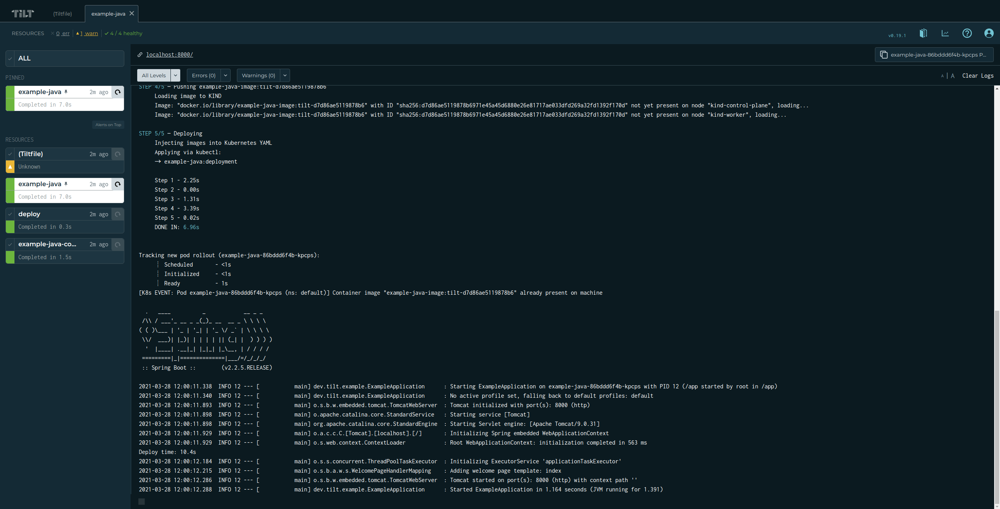

# Tilt

- [Tilt](#tilt)
  - [틸트 `Tilt` 란?](#틸트-tilt-란)
  - [Quickstart](#quickstart)
    - [Install Tilt Command Tool](#install-tilt-command-tool)
    - [Example (Java)](#example-java)

## 틸트 `Tilt` 란?

특정 이벤트를 **watch** 하다가 트리거되었을 때
[Tiltfile](https://docs.tilt.dev/tiltfile_concepts.html)에 정의된 방식에 따라
컨테이너 이미지를 다시 빌드하고 쿠버네티스 클러스터에 배포할 수 있습니다.
여기서 특정 이벤트는 대표적으로 3가지가 있습니다.

- Tiltfile에서 해당 리소스 정의가 변경될 경우
- 사용자가 수동으로 해당 리소스를 실행할 경우
- 해당 리소스와 관련된 파일이 변경되었을 경우: Tiltfile에 특정 파일이나 디렉터리를 종속시켜 리소스와 관련된 파일이란 것을 명시합니다.

Tiltfile은 Python의 dialect인 [Starlark](https://github.com/bazelbuild/starlark/blob/master/spec.md)로 작성합니다.
다양한 [Tiltfile API](https://docs.tilt.dev/api.html)를 통해 사용자가 원하는 동작 방식으로 작성할 수 있습니다.
Tiltfile 자체는 클러스터에서 아무 것도 실행 하지 않습니다.
리소스에 대한 모든 정보를 연결하여 YAML 형식으로 리소스를 패키징한 후 Tilt 엔진에 전달합니다.
그 후 Tilt 엔진이 쿠버네티스 클러스터에서 리소스를 실행시킵니다.


_~~Tilt Magic~~ [Tilt의 Control Loop](https://docs.tilt.dev/controlloop.html)_

## Quickstart

- [Tutorial](https://docs.tilt.dev/tutorial.html)
- [Example: Go](https://docs.tilt.dev/example_go.html)
- [Example: Java](https://docs.tilt.dev/example_java.html)

### [Install](https://docs.tilt.dev/install.html) Tilt Command Tool

```bash
curl -fsSL https://raw.githubusercontent.com/tilt-dev/tilt/master/scripts/install.sh | bash
# sudo mv ~/.local/bin/tilt /usr/local/bin
```

### Example (Java)

Java가 가장 극단적인 속도 차이를 보입니다.

| Languages          | Naive        | Local Compile | Optimized Dockerfile | live_update |
| ------------------ | ------------ | ------------- | -------------------- | ----------- |
| Go + gorilla/mux   | 4.2s         | 3.5s          | -                    | 1.5s        |
| Java + Spring Boot | 87.7s        | 13.4s         | 6.5s                 | 4.8s        |
| NodeJS + Express   | 11.31-14.21s | -             | 3.25-4.12s           | 1.1-1.8s    |
| Python + Flask     | 10-11s       | -             | 2.5-3.1s             | 1-2s        |
| C#                 | 10.4s        | 8.2s          | -                    | 4.8s        |

```bash
git clone https://github.com/tilt-dev/tilt-example-java
cd tilt-example-java/0-base
sudo tilt up
```

```bash
sudo kubectl get all
```


