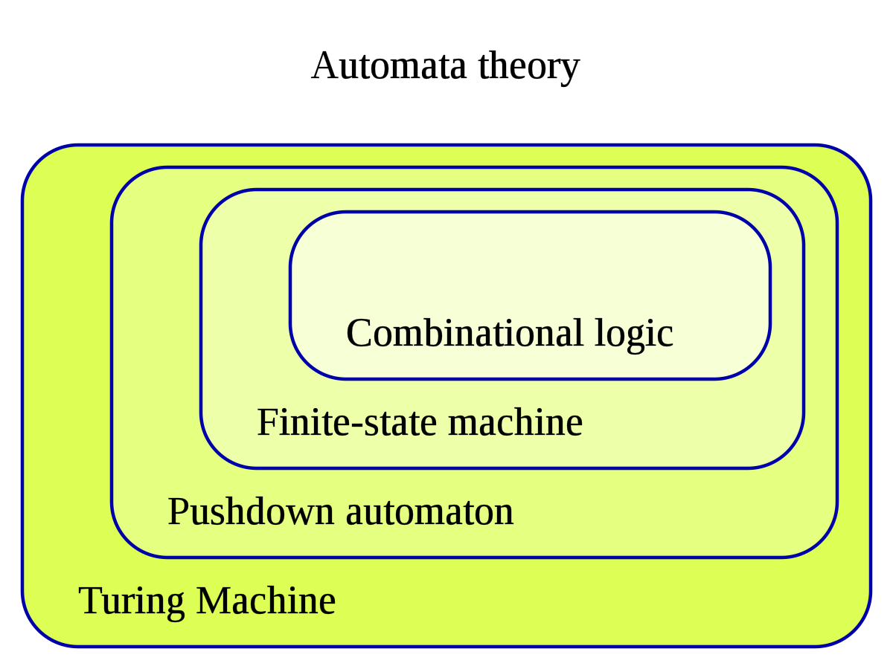

# Kubernets Operator

- [Kubernets Operator](#kubernets-operator)
  - [참고 자료](#참고-자료)
    - [Best Practices](#best-practices)
    - [더 읽을 거리](#더-읽을-거리)
  - [오퍼레이터 패턴](#오퍼레이터-패턴)
  - [오퍼레이터 사용 동기](#오퍼레이터-사용-동기)
    - [Helm](#helm)
    - [Operator](#operator)
  - [오퍼레이터는 상태 머신이 아니다](#오퍼레이터는-상태-머신이-아니다)
    - [상태 머신](#상태-머신)
    - [쿠버네티스 오퍼레이터](#쿠버네티스-오퍼레이터)
  - [오퍼레이터 개발 방법](#오퍼레이터-개발-방법)
  - [오퍼레이터 철학](#오퍼레이터-철학)
    - [성공적인 오퍼레이터의 7가지 습관 - CoreOS](#성공적인-오퍼레이터의-7가지-습관---coreos)

[출처: 애플리케이션 자동화를 위한 쿠버네티스 오퍼레이터 개발 - 한우형](https://www.youtube.com/watch?v=abHOcr-HTI4)

## 참고 자료

- [kubernetes-sigs/cluster-api](https://github.com/kubernetes-sigs/cluster-api)
- [오퍼레이터 허브](https://operatorhub.io/)
- [<쿠버네티스 오퍼레이터>](http://www.acornpub.co.kr/book/kubernetes-operators) - 제이슨 도비스, 조슈아 우드
- [The Kubebuilder Book](https://book.kubebuilder.io/)
- [Write a Kubernetes Operator in Go with Ellen Körbes](https://youtu.be/85dKpsFFju4) - Kinvolk
- [Kubernetes Kubebuilder를 이용한 Operator 개발](https://ssup2.github.io/programming/Kubernetes_Kubebuilder/) - ssup2
- [Kubernetes Controller 구현해보기](https://getoutsidedoor.com/2020/05/09/kubernetes-controller-%EA%B5%AC%ED%98%84%ED%95%B4%EB%B3%B4%EA%B8%B0/) - zeroFruit
- [Exploring Kubernetes Operator Pattern](https://iximiuz.com/en/posts/kubernetes-operator-pattern/) - Ivan Velichko

### Best Practices

- [Kubernetes Operators Best Practices](https://www.openshift.com/blog/kubernetes-operators-best-practices) - Raffaele Spazzoli
- [Best practices for building Kubernetes Operators and stateful apps](https://cloud.google.com/blog/products/containers-kubernetes/best-practices-for-building-kubernetes-operators-and-stateful-apps) - Google Cloud
- [7 Best Practices for Writing Kubernetes Operators: An SRE Perspective](https://www.openshift.com/blog/7-best-practices-for-writing-kubernetes-operators-an-sre-perspective) - Red Hat
- [Operator Best Practices](https://github.com/operator-framework/community-operators/blob/master/docs/best-practices.md) - operator-framework/community-operators
- [애플리케이션 자동화를 위한 쿠버네티스 오퍼레이터 개발](https://youtu.be/abHOcr-HTI4) - 한우형
- [OpenShift Container Platform Operators](https://access.redhat.com/documentation/en-us/openshift_container_platform/4.3/html-single/operators/index) - Red Hat
- [Introducing Operators: Putting Operational Knowledge into Software](https://web.archive.org/web/20170129131616/https://coreos.com/blog/introducing-operators.html) - CoreOS
- [10 Kubernetes Operators Every DevOps needs to know about](https://www.replex.io/blog/10-kubernetes-operators-every-devops-needs-to-know-about) - Hasham Haider

### 더 읽을 거리

- [Kubernetes Operators in Depth](https://www.infoq.com/articles/kubernetes-operators-in-depth/)
- [Kubernetes operators for resource management](https://www.stephenzoio.com/kubernetes-operators-for-resource-management/)
- [Tutorial: Deep Dive into the Operator Framework for...](https://youtu.be/8_DaCcRMp5I) - Melvin Hillsman, Michael Hrivnak, & Matt Dorn
- [Learning Concurrent Reconciling](http://openkruise.io/en-us/blog/blog2.html) - FEI GUO
- [Deep analysis of Kubebuilder: making writing CRD easier](https://laptrinhx.com/deep-analysis-of-kubebuilder-making-writing-crd-easier-3037683434/) - Liu Yang
- [Building an operator for Kubernetes with kubebuilder](https://itnext.io/building-an-operator-for-kubernetes-with-kubebuilder-17cbd3f07761) - Philippe Martin
- [Writing a Kubernetes operator using Kubebuilder](https://youtu.be/Fp0QUf0Bwm0) - Velocity London 2018
- [Under the hood of Kubebuilder framework](https://itnext.io/under-the-hood-of-kubebuilder-framework-ff6b38c10796) - CloudARK
- [Building Cloud-Native Applications with Kubebuilder and Kind](https://caylent.com/building-cloud-native-applications-with-kubebuilder-and-kind) - Gabriel Garrido
- [Building your own kubernetes CRDs](https://itnext.io/building-your-own-kubernetes-crds-701de1c9a161) - Pongsatorn Tonglairoum
- [Kubebuilder v2 User Guide](https://www.programmersought.com/article/13635893077/)
- [Writing and testing Kubernetes webhooks using Kubebuilder v2](https://ymmt2005.hatenablog.com/entry/2019/08/10/Writing_and_testing_Kubernetes_webhooks_using_Kubebuilder_v2)
- [Kubernetes CRD Development Guide](https://developpaper.com/kubernetes-crd-development-guide/)
- [Getting Started with Kubernetes | Operator and Operator Framework](https://www.alibabacloud.com/blog/getting-started-with-kubernetes-%7C-operator-and-operator-framework_596320) - Alibaba Cloud

## 오퍼레이터 패턴

- [Controller](https://kubernetes.io/docs/concepts/architecture/controller/) - Kubernetes Docs
- [Operator](https://kubernetes.io/docs/concepts/extend-kubernetes/operator/) - Kubernetes Docs

- 컨트롤러
  - 현재 상태를 사용자의 desired state에 일치시키는 프로그램
- 오퍼레이터
  - 컨트롤러 + 관리자(operator)의 운영 지식
  - 컨트롤러 패턴을 애플리케이션의 자동화에 사용하면 오퍼레이터

> 모든 오퍼레이터는 컨트롤러지만, 모든 컨트롤러는 오퍼레이터가 아니다.

## 오퍼레이터 사용 동기

### Helm

- stateless 앱 배포에 적합 (항상은 아님)
- 비즈니스 로직이 모두 컨테이너 내부에 포함

### Operator

- stateful 앱 배포에 적합
- 배포 + 운영 + 원하는 모든 자동화
- Helm으로도 관리하기 힘들 정도로 선언적 파일들이 복잡해졌다면 오퍼레이터를 통해 한층 더 자동화를 해야 한다.
- 대신 오퍼레이터를 개발해야 하는 만큼 학습비용이 들어간다.
- 오퍼레이터도 단순하지만은 않다.

## 오퍼레이터는 상태 머신이 아니다

[상태 머신](https://en.wikipedia.org/wiki/Finite-state_machine)? A finite-state machine (FSM) or finite-state automaton (FSA, plural: automata), finite automaton, or simply a state machine, is a mathematical model of computation. It is an abstract machine that can be in exactly one of a finite number of states at any given time. The FSM can change from one state to another in response to some inputs; the change from one state to another is called a transition. An FSM is defined by a list of its states, its initial state, and the inputs that trigger each transition. Finite-state machines are of two types—deterministic finite-state machines and non-deterministic finite-state machines. A deterministic finite-state machine can be constructed equivalent to any non-deterministic one.

### 상태 머신

- f(now_state, input) = next_state
- 상태의 종류가 정확히 정의되어 있다.
- 상태에 따른 입력도 정의되어 있다.

### 쿠버네티스 오퍼레이터

- 현재 상태는 항상 관측을 통해 얻는다.
- 저장된 상태는 성능을 위해 존재한다.

## 오퍼레이터 개발 방법

- 라이브러리를 이용해서 밑바닥부터 개발
  - [client-go](https://github.com/kubernetes/client-go)
  - [controller-runtime](https://github.com/kubernetes-sigs/controller-runtime)
- Operator SDK
  - [kubebuilder](https://github.com/kubernetes-sigs/kubebuilder)
  - [Operator Framework](https://operatorframework.io/)
    - [operator-sdk](https://github.com/operator-framework/operator-sdk)
      - [Helm Operator](https://sdk.operatorframework.io/docs/building-operators/helm/)
      - [Ansible Operator](https://sdk.operatorframework.io/docs/building-operators/ansible/tutorial/)
      - [Go Operator](https://sdk.operatorframework.io/docs/building-operators/golang/)
  - [KUDO](https://kudo.dev/) (Kubernetes Universal Declarative Operator)
  - [Metacontroller](https://metacontroller.github.io/metacontroller/)
  - [Helm Operator](https://github.com/fluxcd/helm-operator) - Flux CD

> 영상에선 operator-sdk를 추천하지만 저는 [kubernetes-sigs/cluster-api](https://github.com/kubernetes-sigs/cluster-api)를 사용하면서 kubebuilder를 공부해야 했기 때문에 kubebuilder를 사용했습니다.

- Operator Capability Level

_출처: [Operator Framework](https://sdk.operatorframework.io/docs/overview/)_

## 오퍼레이터 철학

- 쿠버네티스의 SRE
- 자동화 가능한 것: 당신의 컴퓨터가 할 작업

### 성공적인 오퍼레이터의 7가지 습관 - CoreOS

> <쿠버네티스 오퍼레이터> 발췌

- 오퍼레이터는 하나의 쿠버네티스 디플로이먼트로 실행돼야 한다.
- 오퍼레이터는 클러스터에 새로운 CRD를 정의해야 한다.
- 오퍼레이터는 가능할 때마다 적절하게 쿠버네티스 추상화를 사용해야 한다.
- 오퍼레이터 종료가 오퍼랜드에 영향을 미쳐서는 안 된다.
- 오퍼레이터는 이전 버전에서 생성된 리소스 타입을 지원해야 한다.
- 오퍼레이터는 애플리케이션 업그레이드를 중재해야 한다.
