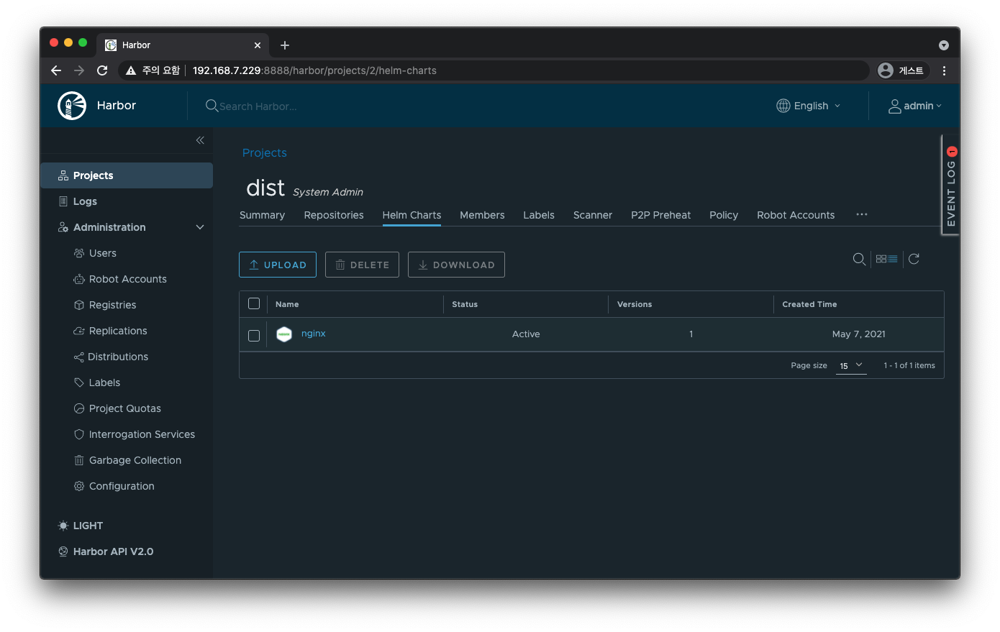
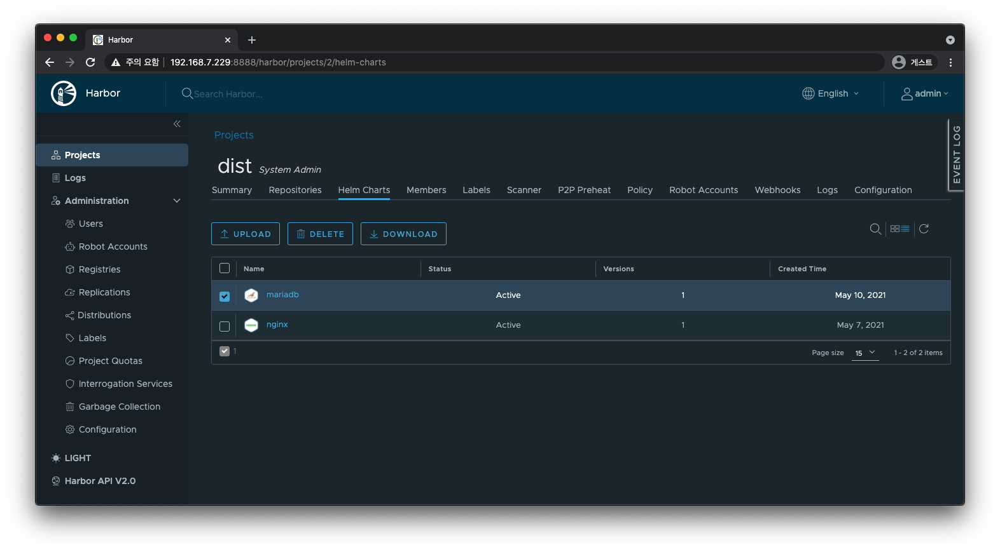

# Harbor

- [Harbor](#harbor)
  - [참고](#참고)
  - [설치](#설치)
    - [Prerequisite](#prerequisite)
      - [Hardware](#hardware)
      - [Software](#software)
    - [Installation](#installation)
  - [LDAP 설정](#ldap-설정)
  - [Project](#project)
    - [Docker Image](#docker-image)
    - [Helm Chart](#helm-chart)
  - [Clean up](#clean-up)

## 참고

- [Harbor 홈페이지](https://goharbor.io/)
- [Private Docker Registry를 구축하기 위한 오픈소스 Harbor 도입기](https://engineering.linecorp.com/ko/blog/harbor-for-private-docker-registry/) - Line

## [설치](https://goharbor.io/docs/2.2.0/install-config/)

### [Prerequisite](https://goharbor.io/docs/latest/install-config/installation-prereqs/)

#### Hardware

| Resource | Minimum | Recommended |
| -------- | ------- | ----------- |
| CPU      | 2 CPU   | 4 CPU       |
| Mem      | 4 GB    | 8 GB        |
| Disk     | 40 GB   | 160 GB      |

#### Software

| Software       | Version                       | Description                                                              |
| -------------- | ----------------------------- | ------------------------------------------------------------------------ |
| Docker engine  | Version 17.06.0-ce+ or higher | [Docker Engine documentation](https://docs.docker.com/engine/install/)   |
| Docker Compose | Version 1.18.0 or higher      | [Docker Compose documentation](https://docs.docker.com/compose/install/) |
| Openssl        | Latest is preferred           | Used to generate certificate and keys for Harbor                         |

### [Installation](https://goharbor.io/docs/latest/install-config/download-installer/)

```bash
# online
curl -LO https://github.com/goharbor/harbor/releases/download/v2.2.1/harbor-online-installer-v2.2.1.tgz
curl -LO https://github.com/goharbor/harbor/releases/download/v2.2.1/harbor-online-installer-v2.2.1.tgz.asc
```

```bash
# on Ubuntu
gpg --keyserver hkps://keyserver.ubuntu.com --receive-keys 644FF454C0B4115C

# on CentOS 7
gpg --keyserver hkps://keyserver.ubuntu.com --recv-keys 644FF454C0B4115C
# gpg: requesting key C0B4115C from hkps server keyserver.ubuntu.com
# gpg: /root/.gnupg/trustdb.gpg: trustdb created
# gpg: key C0B4115C: public key "Harbor-sign (The key for signing Harbor build) <jiangd@vmware.com>" imported
# gpg: Total number processed: 1
# gpg:               imported: 1  (RSA: 1)
```

```bash
ls
# harbor-online-installer-v2.2.1.tgz  harbor-online-installer-v2.2.1.tgz.asc

# .tgz 파일과 .tgz.asc 파일이 같은 경로에 있어야 합니다.
gpg -v --keyserver hkps://keyserver.ubuntu.com --verify harbor-online-installer-v2.2.1.tgz.asc
# gpg: assuming signed data in `harbor-online-installer-v2.2.1.tgz'
# gpg: Signature made 2021년 03월 26일 (금)  using RSA key ID C0B4115C
# gpg: using PGP trust model
# gpg: Good signature from "Harbor-sign (The key for signing Harbor build) <jiangd@vmware.com>"
# gpg: WARNING: This key is not certified with a trusted signature!
# gpg:          There is no indication that the signature belongs to the owner.
# Primary key fingerprint: 7722 D168 DAEC 4578 06C9  6FF9 644F F454 C0B4 115C
# gpg: binary signature, digest algorithm SHA512

tar zxvf harbor-online-installer-v2.2.1.tgz
cd harbor
```

```bash
cp harbor.yml.tmpl harbor.yml
vi harbor.yml
```

```bash
export HARBOR_HOST=192.168.7.229
```

```yaml
hostname: 192.168.7.229

http:
  port: 80

# https:
#  port: 443

harbor_admin_password: Harbor12345

data_volume: /data/harbor
```

처음 실행한다면 아래 명령어를 사용한다.
TLS를 지원한다면 OCI 표준을 지원하는 `helm chart push` 명령어를 사용할 수 있다.
반대로 TLS를 지원하지 않는다면 Helm 차트를 저장하기 위해 Chartmuseum을 같이 배포해야 한다.
`./prepare --with-chartmuseum` 명령을 사용하면 Chartmuseum 설정을 포함하는 매니페스트 파일들이 생성된다.
그러면 Harbor와 같이 배포된다.

```bash
sudo ./prepare --with-chartmuseum
sudo ./install.sh
```



한 번 설치한 이후에는 다음 명령어를 사용해서 실행하고 멈출 수 있다.

```bash
# Create and start containers
docker-compose up --detach
# Stop and remove resources
docker-compose down
```

```bash
# Start services
docker-compose start
# Stop services
docker-compose stop
# Pause services
docker-compose pause
```

```bash
docker-compose ps
#       Name                     Command                  State                 Ports
# ---------------------------------------------------------------------------------------------
# harbor-core         /harbor/entrypoint.sh            Up (healthy)
# harbor-db           /docker-entrypoint.sh            Up (healthy)
# harbor-jobservice   /harbor/entrypoint.sh            Up (healthy)
# harbor-log          /bin/sh -c /usr/local/bin/ ...   Up (healthy)   127.0.0.1:1514->10514/tcp
# harbor-portal       nginx -g daemon off;             Up (healthy)
# nginx               nginx -g daemon off;             Up (healthy)   0.0.0.0:80->8080/tcp
# redis               redis-server /etc/redis.conf     Up (healthy)
# registry            /home/harbor/entrypoint.sh       Up (healthy)
# registryctl         /home/harbor/start.sh            Up (healthy)

docker ps --size
# CONTAINER ID        IMAGE                                COMMAND                  CREATED             STATUS                    PORTS                       NAMES               SIZE
# 76fb2a94b29e        goharbor/nginx-photon:v2.2.1         "nginx -g 'daemon of…"   14 minutes ago      Up 14 minutes (healthy)   0.0.0.0:80->8080/tcp        nginx               2B (virtual 40.3MB)
# 5af0ac8829b2        goharbor/harbor-jobservice:v2.2.1    "/harbor/entrypoint.…"   14 minutes ago      Up 14 minutes (healthy)                               harbor-jobservice   1.64MB (virtual 165MB)
# 97186c1733df        goharbor/harbor-core:v2.2.1          "/harbor/entrypoint.…"   14 minutes ago      Up 14 minutes (healthy)                               harbor-core         1.64MB (virtual 149MB)
# 7daefbdb726e        goharbor/registry-photon:v2.2.1      "/home/harbor/entryp…"   14 minutes ago      Up 14 minutes (healthy)                               registry            1.64MB (virtual 78.9MB)
# d2d444e41e83        goharbor/harbor-registryctl:v2.2.1   "/home/harbor/start.…"   14 minutes ago      Up 14 minutes (healthy)                               registryctl         1.64MB (virtual 130MB)
# 5373bd72bd3a        goharbor/harbor-portal:v2.2.1        "nginx -g 'daemon of…"   14 minutes ago      Up 14 minutes (healthy)                               harbor-portal       2B (virtual 51MB)
# 08583263ba9b        goharbor/redis-photon:v2.2.1         "redis-server /etc/r…"   14 minutes ago      Up 14 minutes (healthy)                               redis               0B (virtual 68.9MB)
# f61895452b30        goharbor/harbor-db:v2.2.1            "/docker-entrypoint.…"   14 minutes ago      Up 14 minutes (healthy)                               harbor-db           59B (virtual 175MB)
# 15d128416b55        goharbor/harbor-log:v2.2.1           "/bin/sh -c /usr/loc…"   14 minutes ago      Up 14 minutes (healthy)   127.0.0.1:1514->10514/tcp   harbor-log          0B (virtual 108MB)
```

```bash
curl ${HARBOR_HOST}/api/v2.0/health
```

```json
{
  "status": "healthy",
  "components": [
    { "name": "chartmuseum", "status": "healthy" },
    { "name": "core", "status": "healthy" },
    { "name": "database", "status": "healthy" },
    { "name": "jobservice", "status": "healthy" },
    { "name": "portal", "status": "healthy" },
    { "name": "redis", "status": "healthy" },
    { "name": "registry", "status": "healthy" },
    { "name": "registryctl", "status": "healthy" }
  ]
}
```

## LDAP 설정

- `http://${HOSTNAME}/harbor/configs`
- `Administration`
- `Configuration`
- `Authentication` - `Auth Mode` - `LDAP`

## Project

```bash
export HARBOR_PROJECT=dist
docker login http://${HARBOR_HOST}/${HARBOR_PROJECT} -u admin -p Harbor12345
```

### Docker Image

```bash
# docker tag SOURCE_IMAGE[:TAG] ${HARBOR_HOST}/${HARBOR_PROJECT}/REPOSITORY[:TAG]
docker tag registry:2.7.1 ${HARBOR_HOST}/${HARBOR_PROJECT}/registry:2.7.1

# docker push ${HARBOR_HOST}/${HARBOR_PROJECT}/REPOSITORY[:TAG]
docker push ${HARBOR_HOST}/${HARBOR_PROJECT}/registry:2.7.1
```

```bash
docker pull ${HARBOR_HOST}/${HARBOR_PROJECT}/registry:2.7.1
```

### Helm Chart

먼저 Harbor를 리포지터리로 등록해주어야 한다.

```bash
helm repo add bitnami https://charts.bitnami.com/bitnami
helm repo add harbor http://${HARBOR_HOST}/chartrepo/${HARBOR_PROJECT}
helm repo list
# NAME          URL
# bitnami       https://charts.bitnami.com/bitnami
# harbor        http://192.168.7.229/chartrepo/dist/

helm repo update
```

테스트해 볼 차트를 받는다.

```bash
cd /tmp
helm pull bitnami/mariadb
ls
# mariadb-9.3.10.tgz
```

`helm push` 할 수 없다면 플러그인을 설치한다.

```bash
helm plugin install https://github.com/chartmuseum/helm-push.git
```

Chartmuseum을 통해 `push`, `pull`을 사용할 수 있다.

```bash
helm push mariadb-9.3.10.tgz harbor -u admin -p Harbor12345
# Pushing mariadb-9.3.10.tgz to harbor...
# Done.

helm repo update
helm search repo harbor
# NAME            CHART VERSION APP VERSION DESCRIPTION
# harbor/mariadb  9.3.10        10.5.9      Fast, reliable, scalable, and easy to use open-...
# harbor/nginx    8.9.0         1.19.10     Chart for the nginx server
```



```bash
# 아직 OCI 표준 기능은 HTTP에서 정상적으로 동작하지 않는다.
# https://github.com/helm/helm/issues/6324
# HELM_EXPERIMENTAL_OCI=1 helm chart save nginx-8.9.0.tgz ${HARBOR_HOST}/${PROJECT_REPO}/nginx:8.9.0
# HELM_EXPERIMENTAL_OCI=1 helm registry login ${HARBOR_HOST} --insecure
# HELM_EXPERIMENTAL_OCI=1 helm chart push ${HARBOR_HOST}/${PROJECT_REPO}/nginx:8.9.0 --debug
```

## Clean up

```bash
# docker-compose down --volumes
docker-compose down
```
