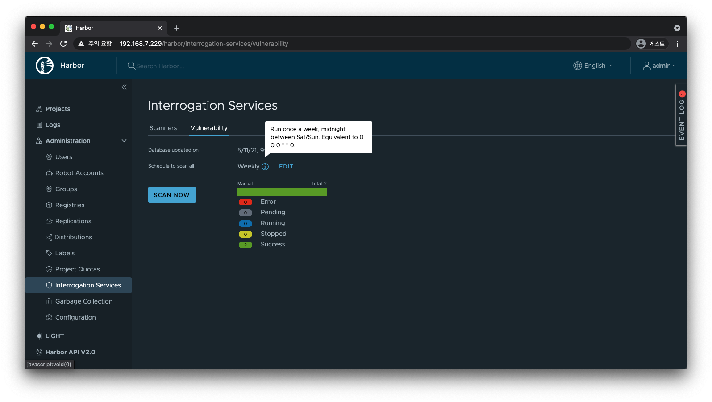
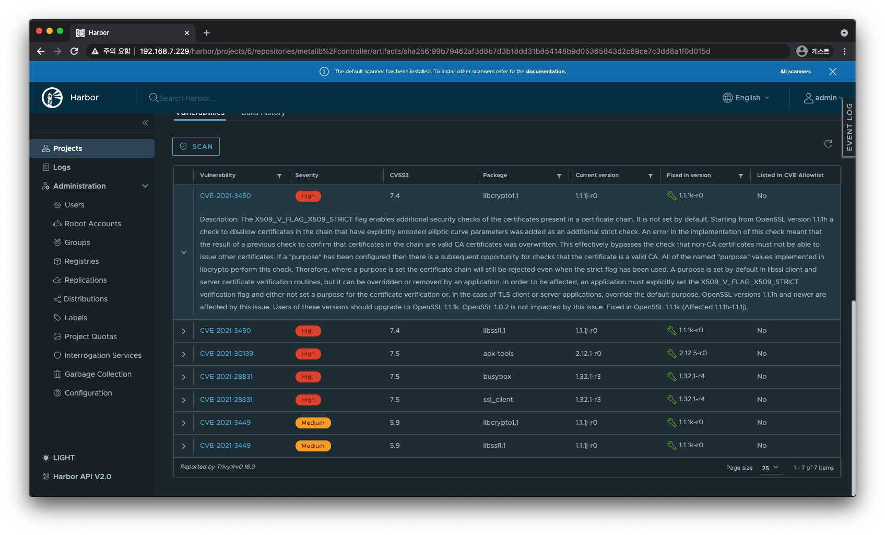
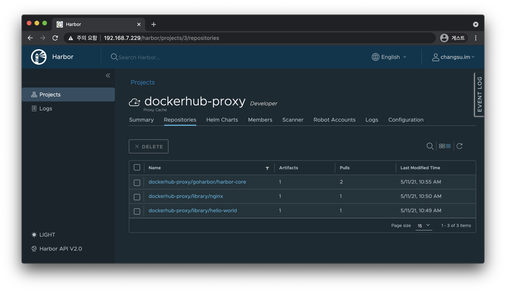

# Harbor

- [Harbor](#harbor)
  - [참고](#참고)
  - [개요](#개요)
  - [아키텍처](#아키텍처)
  - [설치](#설치)
    - [Prerequisite](#prerequisite)
      - [Hardware](#hardware)
      - [Software](#software)
    - [Installation](#installation)
    - [Clean up](#clean-up)
  - [Proxy](#proxy)
    - [포트 번호 변경](#포트-번호-변경)
  - [Identity Provider](#identity-provider)
    - [LDAP 설정](#ldap-설정)
    - [OIDC](#oidc)
  - [Project - Consumer](#project---consumer)
    - [Docker Image](#docker-image)
    - [Helm Chart](#helm-chart)
  - [Scan Provider](#scan-provider)
    - [Trivy](#trivy)
  - [프록시 캐시](#프록시-캐시)
  - [Replicated Registry Provider](#replicated-registry-provider)

## 참고

- [Harbor 홈페이지](https://goharbor.io/)
- [Private Docker Registry를 구축하기 위한 오픈소스 Harbor 도입기](https://engineering.linecorp.com/ko/blog/harbor-for-private-docker-registry/) - 이지현, LINE

## 개요

Harbor(하버)는 CNCF 컨테이너 레지스트리 프로젝트 중 유일하게 `Graduated` 성숙도를 갖고 있다.

## 아키텍처


_출처: [goharbor/harbor - wiki](https://github.com/goharbor/harbor/wiki/Architecture-Overview-of-Harbor)_

## [설치](https://goharbor.io/docs/2.2.0/install-config/)

### [Prerequisite](https://goharbor.io/docs/latest/install-config/installation-prereqs/)

#### Hardware

| Resource | Minimum | Recommended |
| -------- | ------- | ----------- |
| CPU      | 2 CPU   | 4 CPU       |
| Mem      | 4 GB    | 8 GB        |
| Disk     | 40 GB   | 160 GB      |

#### Software

| Software       | Version                       | Description                                                              |
| -------------- | ----------------------------- | ------------------------------------------------------------------------ |
| Docker engine  | Version 17.06.0-ce+ or higher | [Docker Engine documentation](https://docs.docker.com/engine/install/)   |
| Docker Compose | Version 1.18.0 or higher      | [Docker Compose documentation](https://docs.docker.com/compose/install/) |
| Openssl        | Latest is preferred           | Used to generate certificate and keys for Harbor                         |

### [Installation](https://goharbor.io/docs/latest/install-config/download-installer/)

`.tgz` 파일과 `.tgz.asc` 파일이 같은 경로에 있어야 합니다.

```bash
# online
curl -LO https://github.com/goharbor/harbor/releases/download/v2.2.1/harbor-online-installer-v2.2.1.tgz
curl -LO https://github.com/goharbor/harbor/releases/download/v2.2.1/harbor-online-installer-v2.2.1.tgz.asc
```

```bash
# on Ubuntu
gpg --keyserver hkps://keyserver.ubuntu.com --receive-keys 644FF454C0B4115C

# on CentOS 7
gpg --keyserver hkps://keyserver.ubuntu.com --recv-keys 644FF454C0B4115C
# gpg: requesting key C0B4115C from hkps server keyserver.ubuntu.com
# gpg: /root/.gnupg/trustdb.gpg: trustdb created
# gpg: key C0B4115C: public key "Harbor-sign (The key for signing Harbor build) <jiangd@vmware.com>" imported
# gpg: Total number processed: 1
# gpg:               imported: 1  (RSA: 1)
```

```bash
ls
# harbor-online-installer-v2.2.1.tgz
# harbor-online-installer-v2.2.1.tgz.asc

gpg -v --keyserver hkps://keyserver.ubuntu.com --verify harbor-online-installer-v2.2.1.tgz.asc
# gpg: assuming signed data in `harbor-online-installer-v2.2.1.tgz'
# gpg: Signature made 2021년 03월 26일 (금)  using RSA key ID C0B4115C
# gpg: using PGP trust model
# gpg: Good signature from "Harbor-sign (The key for signing Harbor build) <jiangd@vmware.com>"
# gpg: WARNING: This key is not certified with a trusted signature!
# gpg:          There is no indication that the signature belongs to the owner.
# Primary key fingerprint: 7722 D168 DAEC 4578 06C9  6FF9 644F F454 C0B4 115C
# gpg: binary signature, digest algorithm SHA512

tar zxvf harbor-online-installer-v2.2.1.tgz
cd harbor
```

처음 실행한다면 아래 명령어를 사용한다.
TLS를 지원한다면 OCI 표준을 지원하는 `helm chart push` 명령어를 사용할 수 있다.
반대로 TLS를 지원하지 않는다면 Helm 차트를 저장하기 위해 Chartmuseum을 같이 배포해야 한다.
`./prepare --with-chartmuseum` 스크립트를 사용하면 Chartmuseum 설정을 포함하는 매니페스트 파일들이 생성된다.
그러면 Harbor와 같이 배포된다.

설정 템플릿을 복사하고
테스트를 위해 `HTTPS` 프로토콜 지원은 생략한다.

```bash
cp harbor.yml.tmpl harbor.yml
```

```yaml
# harbor.yml
hostname: 192.168.7.229

http:
  port: 80

# https:
#  port: 443

harbor_admin_password: Harbor12345 # 대소문자를 구분한다.

data_volume: /data/harbor
```

아래 스크립트는 Docker가 설치되어 있는지 사전 검사부터 설정 파일 생성과 실행을 동시에 진행한다.

```bash
sudo ./install.sh \
  --with-chartmuseum \
  --with-trivy

# [Step 0]: checking if docker is installed ...
# [Step 1]: checking docker-compose is installed ...
# [Step 2]: preparing environment ...
# [Step 3]: preparing harbor configs ...
# Note: stopping existing Harbor instance ...
# [Step 4]: starting Harbor ...
# ✔ ----Harbor has been installed and started successfully.----
```

아래 스크립트는 설정 파일만 생성하고 실행을 별도로 진행한다.

```bash
sudo ./prepare \
  --with-chartmuseum \
  --with-trivy

sudo docker-compose up -d
```


한 번 설치한 이후에는 다음 명령어를 사용해서 실행하고 멈출 수 있다.

```bash
# Create and start containers
docker-compose up --detach
# Stop and remove resources
docker-compose down
```

```bash
# Start services
docker-compose start
# Stop services
docker-compose stop
# Pause services
docker-compose pause
```

```bash
docker-compose ps
#       Name                     Command                  State                 Ports
# ---------------------------------------------------------------------------------------------
# harbor-core         /harbor/entrypoint.sh            Up (healthy)
# harbor-db           /docker-entrypoint.sh            Up (healthy)
# harbor-jobservice   /harbor/entrypoint.sh            Up (healthy)
# harbor-log          /bin/sh -c /usr/local/bin/ ...   Up (healthy)   127.0.0.1:1514->10514/tcp
# harbor-portal       nginx -g daemon off;             Up (healthy)
# nginx               nginx -g daemon off;             Up (healthy)   0.0.0.0:80->8080/tcp
# redis               redis-server /etc/redis.conf     Up (healthy)
# registry            /home/harbor/entrypoint.sh       Up (healthy)
# registryctl         /home/harbor/start.sh            Up (healthy)

docker ps --size
# CONTAINER ID        IMAGE                                COMMAND                  CREATED             STATUS                    PORTS                       NAMES               SIZE
# 76fb2a94b29e        goharbor/nginx-photon:v2.2.1         "nginx -g 'daemon of…"   14 minutes ago      Up 14 minutes (healthy)   0.0.0.0:80->8080/tcp        nginx               2B (virtual 40.3MB)
# 5af0ac8829b2        goharbor/harbor-jobservice:v2.2.1    "/harbor/entrypoint.…"   14 minutes ago      Up 14 minutes (healthy)                               harbor-jobservice   1.64MB (virtual 165MB)
# 97186c1733df        goharbor/harbor-core:v2.2.1          "/harbor/entrypoint.…"   14 minutes ago      Up 14 minutes (healthy)                               harbor-core         1.64MB (virtual 149MB)
# 7daefbdb726e        goharbor/registry-photon:v2.2.1      "/home/harbor/entryp…"   14 minutes ago      Up 14 minutes (healthy)                               registry            1.64MB (virtual 78.9MB)
# d2d444e41e83        goharbor/harbor-registryctl:v2.2.1   "/home/harbor/start.…"   14 minutes ago      Up 14 minutes (healthy)                               registryctl         1.64MB (virtual 130MB)
# 5373bd72bd3a        goharbor/harbor-portal:v2.2.1        "nginx -g 'daemon of…"   14 minutes ago      Up 14 minutes (healthy)                               harbor-portal       2B (virtual 51MB)
# 08583263ba9b        goharbor/redis-photon:v2.2.1         "redis-server /etc/r…"   14 minutes ago      Up 14 minutes (healthy)                               redis               0B (virtual 68.9MB)
# f61895452b30        goharbor/harbor-db:v2.2.1            "/docker-entrypoint.…"   14 minutes ago      Up 14 minutes (healthy)                               harbor-db           59B (virtual 175MB)
# 15d128416b55        goharbor/harbor-log:v2.2.1           "/bin/sh -c /usr/loc…"   14 minutes ago      Up 14 minutes (healthy)   127.0.0.1:1514->10514/tcp   harbor-log          0B (virtual 108MB)
```

```bash
export HARBOR_HOST=192.168.7.229:8888
curl ${HARBOR_HOST}/api/v2.0/health
```

```json
{
  "status": "healthy",
  "components": [
    { "name": "chartmuseum", "status": "healthy" },
    { "name": "core", "status": "healthy" },
    { "name": "database", "status": "healthy" },
    { "name": "jobservice", "status": "healthy" },
    { "name": "portal", "status": "healthy" },
    { "name": "redis", "status": "healthy" },
    { "name": "registry", "status": "healthy" },
    { "name": "registryctl", "status": "healthy" }
  ]
}
```

### Clean up

```bash
# docker-compose down --volumes
docker-compose down
```

## Proxy

### 포트 번호 변경

`harbor.yaml` 파일에서 포트 번호를 변경한 후 prepare 스크립트로
`docker-compose.yaml` 파일을 다시 생성한다.

```yaml
# harbor.yml
http:
  port: 8888
```

```bash
sudo ./prepare --with-chartmuseum
```

```yaml
version: "2.3"
services:
  proxy:
    image: goharbor/nginx-photon:v2.2.1
    container_name: nginx
    networks:
      - harbor
    dns_search: .
    ports:
      - 8888:8080
```

## Identity Provider

### LDAP 설정

`http://${HOSTNAME}/harbor/configs`

> Administration > Configuration > Authentication > Auth Mode > LDAP

**연결할 LDAP 정보**를 입력하세요.
아래는 예시입니다.

| key                  | value                                    |
| -------------------- | ---------------------------------------- |
| LDAP URL             | ldap://192.168.55.221                    |
| LDAP Search DN       | uid=changsu,cn=users,dc=markruler,dc=com |
| LDAP Search Password | testpw                                   |
| LDAP Base DN         | dc=markruler,dc=com                      |
| LDAP UID             | cn                                       |
| LDAP Scope           | Subtree                                  |

`Save`하고 `Test LDAP Server`를 눌러서 정상적으로 연결되는지 확인한다.
이후 LDAP에 저장되어 있는 계정으로 로그인하면 해당 정보가 캐시되어
`Administration > Users`와 `Administration > Groups`에 표시된다.

### OIDC

- [OIDC Adapters](https://goharbor.io/docs/2.2.0/install-config/harbor-compatibility-list/#oidc-adapters)

TODO: Keycloak

## Project - Consumer

먼저 Harbor 웹에서 `Project`를 생성하고 LDAP 멤버를 추가해야
해당 프로젝트 이름으로 접근할 수 있다.

```json
// /etc/docker/daemon.json
{
  "insecure-registries": ["192.168.7.229"]
}
```

```bash
export HARBOR_PROJECT=dist
docker login http://${HARBOR_HOST}/${HARBOR_PROJECT} -u admin -p Harbor12345
```

### Docker Image

```bash
# docker tag SOURCE_IMAGE[:TAG] ${HARBOR_HOST}/${HARBOR_PROJECT}/REPOSITORY[:TAG]
docker tag registry:2.7.1 ${HARBOR_HOST}/${HARBOR_PROJECT}/registry:2.7.1

# docker push ${HARBOR_HOST}/${HARBOR_PROJECT}/REPOSITORY[:TAG]
docker push ${HARBOR_HOST}/${HARBOR_PROJECT}/registry:2.7.1
```

```bash
docker pull ${HARBOR_HOST}/${HARBOR_PROJECT}/registry:2.7.1
```

### Helm Chart

먼저 Harbor를 리포지터리로 등록해주어야 한다.

```bash
helm repo add bitnami https://charts.bitnami.com/bitnami
helm repo add harbor http://${HARBOR_HOST}/chartrepo/${HARBOR_PROJECT} --username markruler --password ${my_password}
helm repo list
# NAME          URL
# bitnami       https://charts.bitnami.com/bitnami
# harbor        http://192.168.7.229/chartrepo/dist/

helm repo update
```

테스트해 볼 차트를 받는다.

```bash
cd /tmp
helm pull bitnami/mariadb
ls
# mariadb-9.3.10.tgz
```

`helm push` 할 수 없다면 플러그인을 설치한다.

```bash
helm plugin install https://github.com/chartmuseum/helm-push.git
```

Chartmuseum을 통해 `push`, `pull`을 사용할 수 있다.

```bash
helm push mariadb-9.3.10.tgz harbor
# Pushing mariadb-9.3.10.tgz to harbor...
# Done.

helm repo update
helm search repo harbor
# NAME            CHART VERSION APP VERSION DESCRIPTION
# harbor/mariadb  9.3.10        10.5.9      Fast, reliable, scalable, and easy to use open-...
# harbor/nginx    8.9.0         1.19.10     Chart for the nginx server

helm pull harbor/mariadb
```


```bash
# 아직 OCI 표준 기능은 HTTP에서 정상적으로 동작하지 않는다.
# https://github.com/helm/helm/issues/6324
# HELM_EXPERIMENTAL_OCI=1 helm chart save nginx-8.9.0.tgz ${HARBOR_HOST}/${PROJECT_REPO}/nginx:8.9.0
# HELM_EXPERIMENTAL_OCI=1 helm registry login ${HARBOR_HOST} --insecure
# HELM_EXPERIMENTAL_OCI=1 helm chart push ${HARBOR_HOST}/${PROJECT_REPO}/nginx:8.9.0 --debug
```

## Scan Provider

- [Scanner Adapters](https://goharbor.io/docs/2.2.0/install-config/harbor-compatibility-list/#scanner-adapters)

### Trivy

Harbor에서 [Trivy](../container-runtime/trivy.md)를 사용해 이미지 취약점에 대한 정적 분석을 할 수 있다.
Trivy를 사용하려면 설정 파일 생성 시 `--with-trivy` 옵션을 추가해야 한다.
이 외의 취약점 스캐너를 사용하려면 [공식 문서](https://goharbor.io/docs/2.2.0/administration/vulnerability-scanning/pluggable-scanners/)를 참고한다.

[모든 아티팩트 스캔](https://goharbor.io/docs/2.2.0/administration/vulnerability-scanning/scan-all-artifacts/).
[Garbage Collection](https://goharbor.io/docs/2.2.0/administration/garbage-collection/) 기능과 마찬가지로 Cron을 활성화할 수 있다.



[개별 아티팩트 스캔](https://goharbor.io/docs/2.2.0/administration/vulnerability-scanning/scan-individual-artifact/).



이 외에도 개별 프로젝트마다 `Deployment security`를 설정하면 취약점 정도에 따라 아티팩트 배포를 막을 수 있다.

## 프록시 캐시

- [공식 문서](https://goharbor.io/docs/2.2.0/administration/configure-proxy-cache/)

Harbor v2.1.1부터 프록시 캐시 기능이
[Docker Hub의 이미지 풀(pull) 제한 정책](https://www.docker.com/blog/scaling-docker-to-serve-millions-more-developers-network-egress/)에 맞게 업데이트 되었다.
해당 제한 정책을 피하려면 v2.1.1 이상을 사용하는 것이 좋다.
리포지터리를 통째로 복제해오는 것이 아니라 사용자가 이미지를 가져올 때 해당 이미지만 저장(캐싱)한다.
정해진 Retention 기간(기본값 7일) 동안 이미지를 Harbor에서 사용할 수 있다.
프록시 캐싱이 지원되는 레지스트리는 다음과 같다.

- Harbor
- Docker Hub
- AWS Elastic Container Registry
- Azure Container Registry
- Google Container Registry
- Quay

먼저 레지스트리 [엔드포인트를 추가](https://goharbor.io/docs/2.2.0/administration/configuring-replication/create-replication-endpoints/)한다.

> Administration > Registries > `NEW ENDPOINT`

| key           | value                    |
| ------------- | ------------------------ |
| Provider      | Docker Hub               |
| Name          | dockerhub                |
| Endpoint URL  | `https://hub.docker.com` |
| Access ID     | ${Docker Hub ID}         |
| Access Secret | ${Docker Hub Password}   |

그 후 새로운 Project를 생성하면서 프록시 캐시를 설정한다.
(마찬가지로 멤버도 추가해준다)

| key          | value                              |
| ------------ | ---------------------------------- |
| Project Name | dockerhub-proxy                    |
| Public       | `true`                             |
| Proxy Cache  | `dockerhub-https://hub.docker.com` |

```bash
docker login 192.168.7.229/dockerhub-proxy -u markruler

# docker pull ${harbor_server_name}/${proxy_project_name}/goharbor/harbor-core:dev
docker pull 192.168.7.229/dockerhub-proxy/goharbor/harbor-core:dev

# 공식 이미지는 `library` 네임스페이스를 사용한다.
docker pull 192.168.7.229/dockerhub-proxy/library/hello-world:latest
```

pull 하면 이미지가 캐시되는 것이 확인된다.



`public`이 `false`라면 아래와 같은 에러가 발생하는데 원인은 모른다.

```bash
# Error response from daemon: unauthorized: unauthorized to access repository: dockerhub-proxy/hello-world, action: pull: unauthorized to access repository: dockerhub-proxy/hello-world, action: pull
```

## Replicated Registry Provider

- [Replication Adapters](https://goharbor.io/docs/2.2.0/install-config/harbor-compatibility-list/#replication-adapters)
- [공식 문서](https://goharbor.io/docs/2.2.0/administration/configuring-replication/)

> Administration > Replications > `New Replication Rule`

| key                    | value                              |
| ---------------------- | ---------------------------------- |
| Name                   | calico                             |
| Replication mode       | Pull-based                         |
| Source registry        | `dockerhub-https://hub.docker.com` |
| Source resource filter | calico/\*\*                        |

공개 레지스트리에 있는 리포지터리를 통째로 [복제한다](https://goharbor.io/docs/2.2.0/administration/configuring-replication/manage-replications/).
복제하려면 프록시 캐시와 마찬가지로 복제할 레지스트리의 엔드포인트를 등록한다.
Docker Hub는 한번에 많이 요청하면 앞에서 언급한 image pull rate 제한 정책에 걸려 복제할 수 없다.


1개 성공하자마자 줄줄이 실패해서 로그를 확인했더니 `You have reached your pull rate limit. You may increase the limit by authenticating and upgrading: https://www.docker.com/increase-rate-limit`
라고 나와서 바로 `STOP`했다...
